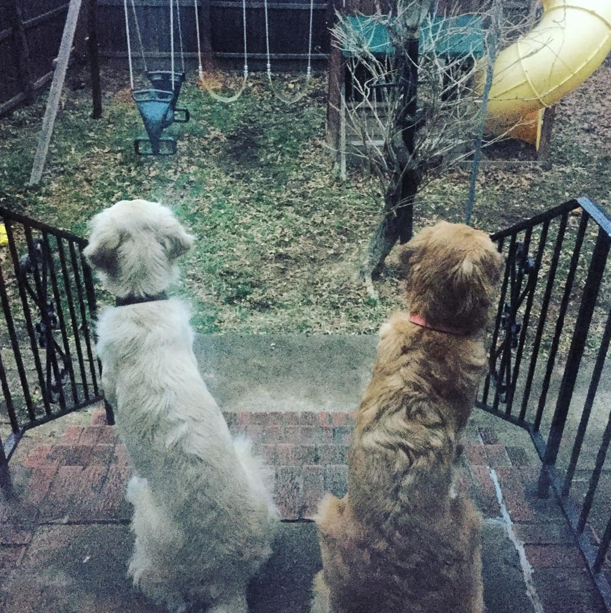
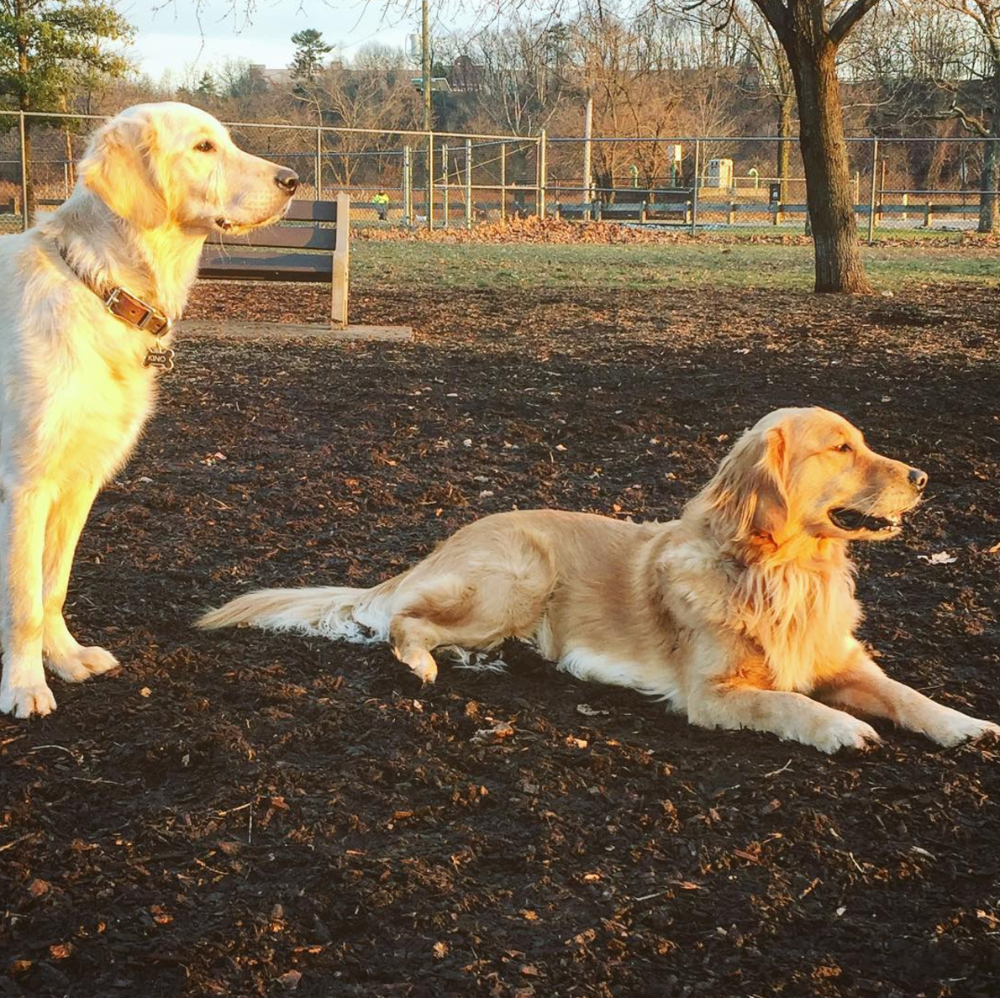
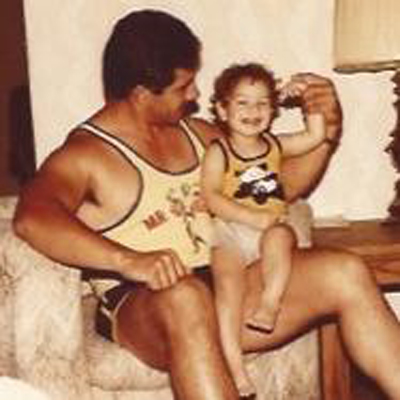
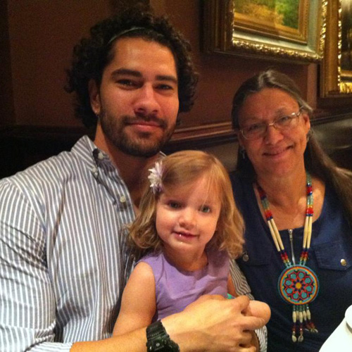
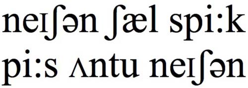
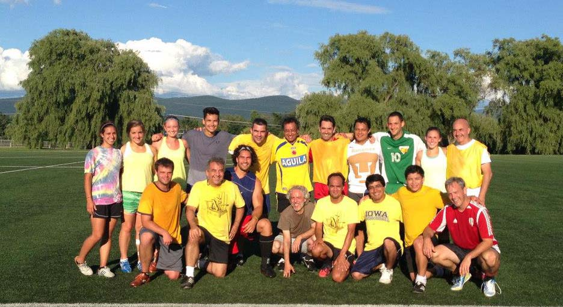
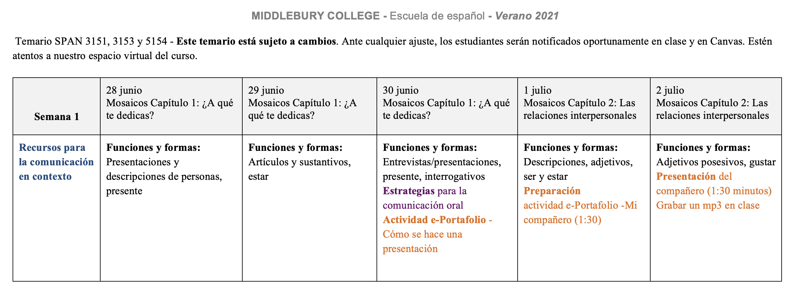
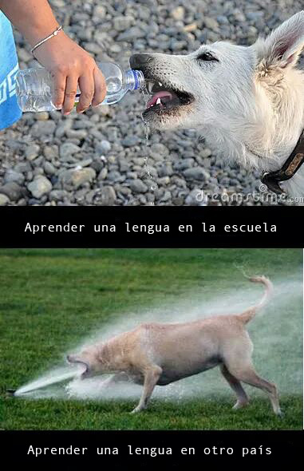

```{r setup, include=FALSE, cache=FALSE}
options(htmltools.dir.version = FALSE)
```

class: inverse, center, middle

# Acerca del profe

---
background-image: url("./assets/img/yo1.png")
background-size: contain

# Mi nombre es Joseph Casillas.

---
background-image: url("./assets/img/az.png")
background-size: contain
class: inverse

# .RUred[Soy de Arizona.]

---
class: title-slide-section-grey

# Tengo dos perros.

<div>
  
  
</div>

---
class: title-slide-section-grey
background-image: url("./assets/img/perros1.png")
background-size: contain

---
background-image: url("./assets/img/ali.png")
background-size: contain
class: title-slide-section-grey

# .white[Soy padre]

---
background-image: url("./assets/img/ali2.png")
background-size: contain
class: title-slide-section-grey

# .white[Soy padre]

---
background-image: url("./assets/img/niko.png")
background-size: contain
class: title-slide-section-grey

# .white[Soy padre]

---

# Mi Padre.

<div align="center">
  
</div>

---
background-image: url("./assets/img/world.png")
background-size: contain

---
background-image: url("./assets/img/mexico.png"), url("./assets/img/espana.gif")
background-size: 400px, 500px
background-position: 20% 50%, 80% 50%

---
class: title-slide-section-blue

# Mi madre.

<div align="center">
  
</div>

---
background-image: url("./assets/img/eeuu.png")
background-size: contain
class: title-slide-section-grey

---
background-image: url("./assets/img/lena.png")
background-size: contain
class: title-slide-section-grey

---
background-image: url(https://raw.githubusercontent.com/jvcasillas/ru_xaringan/master/img/logo/ru_shield.png), url("./assets/img/ua.png")
background-size: 120px, 150px
background-position: 33% 90%, 66% 90%

# Soy lingüista.

<div align="center">
  
  
</div>

---
background-color: black

# Estudio el bilingüismo y la adquisición de segundas lenguas.

<div align="center">
  
</div>

---
background-image: url(./assets/img/sd.png)
background-size: contain
class: title-slide-section-grey

# .RUred[Es mi verano \#12 en Middlebury.]

---

# Me gusta el fútbol. 

<div align="center">
  
</div>

---
class: inverse, middle, center

# Introducción al curso

---

# El plan

- ¿Qué vais a aprender?

--

- ¿Cómo lo vamos a hacer? El programa.

--

- Sugerencias para tener éxito.

---

# Objetivos

- Desarrollar y controlar las estructuras básicas de gramática

--

- Ampliar el vocabuario

--

- Consolidar la habilidad de negociar situaciones básicas en español dentro de 
un contexto cultural 

--

- Preparación para estudiar la lengua independientemente

---
background-image: url("./assets/img/toolbox1.png")
background-size: contain

---
background-image: url("./assets/img/toolbox2.png")
background-size: contain

---
background-image: url("./assets/img/toolbox3.png")
background-size: contain

---

# Objetivos

- describir experiencias de la vida diaria (rutinas, actividades, etc.)

- describir personas (familia, amigos, etc.) y lugares

- narrar eventos en los tiempos del presente y del futuro

- describir y reflexionar sobre los contrastes culturales

- hacer preguntas para solicitar información 

- presentar a la clase temas investigados y contestar preguntas

- dar instrucciones y direcciones

---

# El programa

.left-column[
- **Materiales**
- Materiales recomendados
- Normas del curso
]

.right-column[

## Texto:

- Mosaicos: Spanish as a World Language (ebook with access to MySpanishLab/online homework. ISBN-13: 9780135595046, Edition: 7th edition (2020)  
Authors: Elizabeth Guzmán, Paloma Lapuerta, Judith Liskin-Gasparro, Matilde Castells

## Online Materials: 

- Materiales en internet a través de go.middlebury.edu/hub
]

---

# El programa

.left-column[
- Materiales
- **Materiales recomendados**
- Normas del curso 
]

.right-column[

- Un diccionario bilingüe como por ejemplo: Diccionario Oxford Compacto 

- Un diccionario monolingüe dictionary como por ejemplo: Diccionario Larousse 
del español moderno 

- Una gramática de referencia como por ejemplo: **A New Reference Grammar of 
Modern Spanish**. John Butt & Carmen Benjamin

- Un libro de conjugaciones verbales como por ejemplo: **Bescherelle - El arte 
de conjugar en español**.  Mateo & Rojo Sastre

- Herramientas de Microsoft Word en español
]

---

# El programa

.left-column[
- Materiales
- Materiales recomendados
- **Normas del curso**
]

.right-column[

### Normas del curso (p. 2)

]

---

# Las notas

</br>
</br>


|         |        |        |       |
|:--------|-------:|:-------|------:|
|  **A**  | 93-100 | **C+** | 77-79 |
|  **A-** | 90-92  | **C**  | 73-76 |
|  **B+** | 87-89  | **C-** | 70-72 |
|  **B**  | 83-86  | **D**  | 60-69 |
|  **B-** | 80-82  | **F**  | 0-59  |


</br>
</br>

- La evaluación (p. 3)

---

# Esquema de la semana

- Cada semana vais a recibir un esquema

<div align="center">
  
</div>

---

# 

<div align="center">
  
</div>

---

# 

</br>
</br>

<div align="center">
  
</div>

---
class: center, middle

# Apender una lengua en línea

# .Large[?]

---
class: center, middle

# ~~Apender una lengua en línea~~

# .Large[?]

---

# Hablemos de los detalles...

### Zoom

### Canvas

### myLab

---

# Algunas sugerencias

- Habla siempre español 

- Haz muchas preguntas. 

- No tengas miedo de hacer errores; lo que importa es la comunicación. 

- Pide ayuda cuando estés confundido/a.

- Ven a clase con la tarea preparada. 

- No asumas nada, pídele al profesor que confirme las expectativas. 

- Participa activamente en clase; procura hablar por lo menos 10 minutos en 
cada clase. 

---

# Más sugerencias

- Lee mucho en español. La lectura es muy buena para desarrollar la producción 
oral. 

- Escucha la radio en español. 

- Escucha música en español. 

- Ve a todas las películas de la escuela española. 

- **Participa en muchas actividades co-curriculares.**

- Habla con otros profesores y con estudiantes de todos los niveles.

- ¡Diviértete!

---

# Aun más sugerencias

<div style="float: right">
  
</div>

- [Actividades cocurriculares](https://schoolofspanish.middcreate.net/elboletin/actividades-co-curriculares/)  
	- el teatro
	- el baile
	- **la clínica de pronunciación**

- Madrinos/padrinos  
	- hacer amigos con más nivel
	- hablar con estudiantes del MA

- **NO** tener miedo  
	- de hablar
	- de hacer preguntas
	- de intentar

- Estudiar (pero ¡no demasiado!)

---

# Tutores

#### ¿Quién?

- ¡Hay muchos!
- Estudiantes graduados
- Ex alumnos
- Profesores

#### ¿Cuándo?

- Ver horarios en el boletín o la página de la escuela

#### ¿Qué más?

- Turnos de 20 minutos
- Hay que tener dudas concretas 

---
background-image: url(https://raw.githubusercontent.com/jvcasillas/media/master/teaching/gifs/partner.gif)
background-position: 95% 50%

# Con un compañero...

- Contesta las siguientes preguntas  
	- ¿De dónde es el profe?

	- ¿Cómo se llaman sus perros?

	- ¿Qué estudió?

	- ¿Dónde trabaja?

---
background-image: url(https://raw.githubusercontent.com/jvcasillas/media/master/teaching/gifs/partner2.gif), url(./assets/img/rompehielos.png)
background-position: 95% 50%, 20% 80%
background-size: 400px, 500px

# Con un compañero nuevo...

### Rompehielos

---
background-image: url(./assets/img/rompehielos.png)
background-position: 95% 50%
background-size: 500px

# Con un compañero nuevo...

### Rompehielos

1. Comparte tu información con un compañero/a.  
Escribe las cosas que tenéis en común. 

2. Algo interesante que aprendí es...

3. Quiero saber más sobre... 🤔

---
background-image: url(https://raw.githubusercontent.com/jvcasillas/media/master/teaching/img/tired.png)
background-position: 95% 50%
class: inverse, center, middle

# Descanso (10 minutos)
