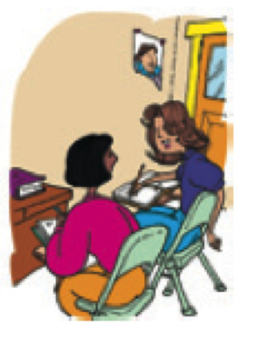

```{r setup, include=FALSE, cache=FALSE}
options(htmltools.dir.version = FALSE)
```

# Cosas de clase

### Canvas

- go.middlebury.edu/hub
- se está actualizando

--

### MyLab

- Código de canvas
- Acceso temporal es gratis

--

### El libro

- No hay!
- Usad la versión electrónica de MyLab
- Se puede comprar la versión anterior (posiblemente) por Amazon

???

Repaso, recordatorio de ayer

---
background-image: url(./assets/img/clase.png)
background-size: 650px

# Vocabulario útil de la clase 

???

Discutir imagen, se entiende?, qué falta?

---

# Instrucciones básicas

- **Abran/Cierren** el libro en la página...

- **Trabajad** con un compañero.

- **Escuchen** a la profesora.

- **Leed** la información.

- **Contesten** en español.

- **Escribid** vuestros nombres.

---
background-image: url(https://raw.githubusercontent.com/jvcasillas/media/master/teaching/img/confused.png)
background-position: 95% 30%
background-size: 300px

# Para hablar con la gente (1)

- ¿Cómo se dice... ?

- Con permiso/Perdón.

- Gracias... De nada.

- Sí/No

---
background-image: url(https://raw.githubusercontent.com/jvcasillas/media/master/teaching/img/frustration.png)
background-position: 95% 30%
background-size: 300px

# Para hablar con la gente (2)

- Más despacio, por favor.

- ¿Puede repetir, por favor?

- ¿Qué quiere decir... ?

- ¿En qué página?

- Tengo una pregunta.

---
background-image: url(./assets/img/vc1.png)
background-size: 650px
background-position: 50% 70%
exclude: true

# Vocabulario útil de la clase (versión zoom)

### ¿Qué palabras, frases, expresiones son importantes para nuestra clase virtual?

---
exclude: true
background-image: url(./assets/img/vc2.png)
background-size: contain

---
exclude: true
background-image: url(./assets/img/vc3.png)
background-size: contain

---
exclude: true

# Vocabulario útil de la clase (versión zoom)

### Con un compañero/a, pensad en vocabulario útil para nuestro ambiente en línea

???

White board para dibujar objetos, escribir palabras
Breakout rooms para conversar

---
class: middle, center

# Saludos

# Presentarse, despedirse

???

actividad en whiteboard, 
lluvia de ideas, 
buscar lo que tienen en común (buscar ser)

---

# El verbo ser para describir

### ser + adjetivo

- Soy responsable
- Eres tímido
- Somos divertidos

--

### Sirve para identificar y describir a las personas

- ¿De dónde eres?
- ¿Cuál es tu dirección?

(profesor, estudiante, militar, hombre, mujer, padre, madre, simpático)

--

|    |    | Singular             |    | Plural                      |
|:-- | :- | :------------------- | :- | :-------------------------- |
| 1a |    | yo **soy**           |    | nosotros/as **somos**       |
| 2a |    | tú **eres**          |    | vosotros/as **sois**        |
| 3a |    | él/ella/usted **es** |    | ellos/ellas/ustedes **son** |
| | &nbsp; &nbsp; &nbsp; | | &nbsp; &nbsp; &nbsp; | |

---
background-image: url(./assets/img/kino.png)
background-size: contain

<!--
<iframe src="https://www.instagram.com/p/BlgS05eh2AP/" height="200" width="300"></iframe>
-->

---

# Los pronombres personales

### El paradigma tradicional

|    |    |  Singular      |    | Plural              |
|:---| :- | :--------------| :- | :------------------ |
| 1a |    |  yo            |    | nosotros/as         |
| 2a |    |  tú            |    | vosotros/as         |
| 3a |    |  él/ella/usted |    | ellos/ellas/ustedes |
| | &nbsp; &nbsp; &nbsp; | | &nbsp; &nbsp; &nbsp; | |

--

### Pronombres no binarios novedosos

- elle, elles

---
exclude: true
class: inverse, center, middle

# Práctica extra

### Para sobrevivir

---
exclude: true
# Plan

- Para presentarnos
- Instrucciones básicas
- Para hablar con la gente

<!-- p5 -->

---

# Para presentarnos

|            |                                 |
|:-----------|:--------------------------------|
| SARA:      | “Hola. ***Me llamo*** Sara.”    |
| AMANDA:    | “Hola, Sara. ***Soy*** Amanda.” |
| SARA:      | “Mucho gusto.”                  |
| AMANDA:    | “Mucho gusto.”                  |


</br>

<div style="float: right">
  
</div>

- ¿Sabéis otras opciones?

--

- Mi nombre es Sara

--

- ~~Me llamo es Sara~~

---
exclude: true

# ¿Qué se dice?

- Con un compañero, crea un diálogo corto usando este vocabuario 
útil. 

- Pensad en situaciones típicas que puedan pasar aquí en Middlebury.

---

# La clase

<div align="center">
  
</div>  

<!-- actividad ¿qué ves? ¿qué es? -->

---
background-image: url(https://raw.githubusercontent.com/jvcasillas/media/master/teaching/img/tired.png)
background-position: 95% 50%
class: inverse, middle, center

# Descanso (10 minutos)

---
background-image: url(./assets/img/num_1_20.png)
background-size: 800px
background-position: 95%

# Los números

---
background-image: url(./assets/img/num_10_100.png)
background-size: 800px
background-position: 95%

# Los números

---
background-image: url(./assets/img/sala2.png)
background-size: 700px
background-position: 95% 80%

# ¿Cuántos objetos hay en la sala de clase?

.pull-left[

- ¿Cuántos libros hay? 

- ¿Cuántas mochilas hay?

- ¿Cuántos pupitres hay? 

- ¿Cuántos bolígrafos hay?

- ¿Cuántos estudiantes hay? 

- ¿Cuántas sillas hay?

]

---
background-image: url(./assets/img/abc.png)
background-size: contain
background-position: 120%
class: title-slide-section-blue

# El abecedario

---
background-image: url(./assets/img/sala1.png)
background-size: 750px
background-position: 50% 80%

# ¿Qué es esto? ¿Cómo se escribe?

---
background-image: url(./assets/img/ahorcado.gif)
background-size: contain
background-position: 120%
class: title-slide-section-blue

# El ahorcado

---
background-image: url(./assets/img/viki.png)
background-size: 550px
background-position: 90% 40%

# Intercambiar información básica

### Con un/a compañero/a

- ¿Cómo te llamas?

- ¿Dónde vives?

- ¿Cuál es tu número de teléfono?

- ¿Cuál es tu dirección de correo electrónico?

---
class: inverse, middle, center

# Repaso

---

# Lo que hemos visto...

- Vocabulario

- Repaso general

- El abecedario

- Los números

--

## Lo que hemos usado...

- El presente

---

# La tarea

- Comprar mylab
- Repasar el programa
- Explorar la página canvas (go.middlebury.edu/hub)
- Estudiar el vocabulario

