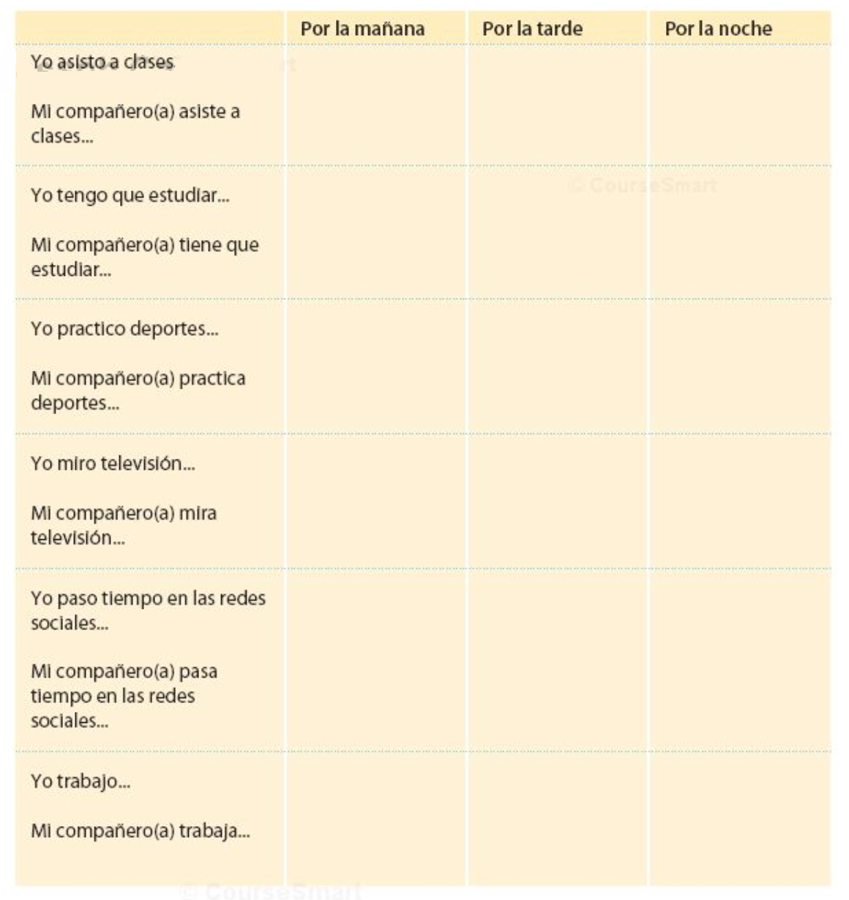

```{r setup, include=FALSE, cache=FALSE}
options(htmltools.dir.version = FALSE)
```

# Objetivos

.Large[
- describir elementos de su identidad (lo físico, grupos sociales y cualidades personales)
]

--
.Large[- comparar elementos de su identidad con otros para identificar similitudes y diferencias]

--
.Large[- describir actividades]

--
.Large[- preguntar y responder]

--
.Large[- expresar el estado de ánimo y la ubicación]

--
.Large[- reconocer y usar la concordancia de género y número]

---


class: title-slide-section-grey, middle

<!-- articulos, sustantivos y la concordancia --> 

# .white[Un poco sobre la concordancia]

---

# Los sustantivos

.Large[
- **Los sustantivos** son personas, lugares o cosas.
- El español tiene **género** y **número**
- ¿Puedes pensar en algunos sustantivos?
]

<div align="center">


</div>

---
background-image: url(https://raw.githubusercontent.com/jvcasillas/media/master/teaching/img/frustration.png)
background-size: 300px
background-position: 95% 50%

# Género

### Normalmente...

.Large[
- **el** libr**o**

- **la** mes**a**
]

--

### Pero a veces...

.Large[
- **el/la** estudiant**e**

- **el** pupitr**e**

- **la** clas**e**

- **el** relo**j**
]

---
background-image: url(https://raw.githubusercontent.com/jvcasillas/media/master/teaching/img/happy.png)
background-size: 300px
background-position: 95% 50%

# Número

.Large[
- el libro/los libros

- la mesa/las mesas

**¡Es FÁCIL!**
]

---
background-image: url(https://raw.githubusercontent.com/jvcasillas/media/master/teaching/img/confused.png)
background-size: 300px
background-position: 95% 50%

# Los artículos

### Los sustantivos tienen **artículos**.

.Large[
Hay dos tipos:

- Definidos

- Indefinidos
]

---
background-image: url(https://raw.githubusercontent.com/jvcasillas/media/master/teaching/img/happy.png)
background-size: 300px
background-position: 95% 50%

# Los artículos definidos

.Large[
- **el** libro, **los** libros

- **la** página, **las** páginas

- **la** mochila, **las** mochilas

- **el** cuaderno, **los** cuadernos
]

---
background-image: url(https://raw.githubusercontent.com/jvcasillas/media/master/teaching/img/happy2.png)
background-size: 300px
background-position: 95% 50%

# Los artículos indefinidos

.Large[
- **un** mapa, **unos** mapas

- **una** mesa, **unas** mesas

- **un** pupitre, **unos** pupitres

- **un**(a) estudiante **unos**(as) estudiantes
]

---
background-image: url(https://raw.githubusercontent.com/jvcasillas/media/master/teaching/gifs/partner.gif)
background-size: 300px
background-position: 95% 50%

# Con un compañero...

.pull-left[
.large[
1. Hay (un/una) profesora. Es (el/la) señora Martínez.
2. (Los/Las) estudiantes están en (el/la) clase de español.
3. Hay (una/unas) ventana en (el/la) puerta.
4. Hay (un/una) mapa de España en (el/la) sala de clase.
5. (Un/Una) estudiante usa (el/la) teléfono celular.
6. Hay (unos/unas) borradores en (el/la) silla.
7. (Un/Una) estudiante escribe mensajes de texto en (el/la) teléfono celular.
8. Hay (un/una) libro en (el/la) mesa de la profesora.
]
]

---
background-image: url(https://raw.githubusercontent.com/jvcasillas/media/master/teaching/gifs/partner.gif)
background-size: 300px
background-position: 95% 50%

# Con un compañero...

.pull-left[
.large[
1. Hay **una** profesora. Es **la** señora Martínez.
2. **Los**/**Las** estudiantes están en **la** clase de español.
3. Hay **una** ventana en **la** puerta.
4. Hay **un** mapa de España en **la** sala de clase.
5. **Un** estudiante usa **el** teléfono celular.
6. Hay **unos** borradores en **la** silla.
7. **Un** estudiante escribe mensajes de texto en **el** teléfono celular.
8. Hay **un** libro en **la** mesa de la profesora.
]
]

---

# Con un compañero...

### Completa la tabla con el singular y plural de las palabras.

.Large[
|     Singular     |       Plural       |
| :--------------- | :----------------- |
| **la profesora** |                    |
|                  | **los bolígrafos** |
|                  | **los pupitres**   |
| **el papel**     |                    |
|                  | **unas mochilas**  |
| **una ventana**  |                    |
| **un reloj**     |                    |
|                  | **unos carteles**  |
]

---

# Con un compañero...

### Completa la tabla con el singular y plural de las palabras.

.Large[
|          Singular         |            Plural           |
| :------------------------ | :-------------------------- |
| **la profesora**          | <blue>las profesoras</blue> |
| <blue>el bolígrafo</blue> | **los bolígrafos**          |
| <blue>el pupitre</blue>   | **los pupitres**            |
| **el papel**              | <blue>los papeles</blue>    |
| <blue>una mochila</blue>  | **unas mochilas**           |
| **una ventana**           | <blue>unas ventanas</blue>  |
| **un reloj**              | <blue>unos relojes</blue>   |
| <blue>un cartel</blue>    | **unos carteles**           |
]


---
class: inverse, center, middle

# El verbo .RUred[ESTAR]

---

# ¿Cómo estás?: Los estados y el verbo estar

## **Yo estoy \_\_\_\_**  

.Large[
|                      |              |
| :------------------- | :----------- |
| de maravilla         | cansado/a    |
| (bastante, muy) bien | contento/a   |
| regular              | efermo/a     |
| (bastante, muy) mal  | enojado/a    |
| de buen humor        | nervioso/a   |
| de mal humor         | ocupado/a    |
| triste               | preocupado/a |
]

--

<br>

.Large[.center[...¿qué más?]]

---

# Los pronombres personales

</br>

.Large[
|    |    |  Singular      |    | Plural              |
|:---| :- | :--------------| :- | :------------------ |
| 1a |    |  yo            |    | nosotros/as         |
| 2a |    |  tú            |    | vosotros/as         |
| 3a |    |  él/ella/usted |    | ellos/ellas/ustedes |
| | &nbsp; &nbsp; &nbsp; | | &nbsp; &nbsp; &nbsp; | |
]

--

.Large[Pronombres no binarios: elle, elles, nosotres, vosotres]

---

# El verbo estar

</br>

.Large[
|    |    |  Singular              |    | Plural                        |
|:---| :- | :--------------------- | :- | :---------------------------- |
| 1a |    | yo **estoy**           |    | nosotros/as **estamos**       |
| 2a |    | tú **estás**           |    | vosotros/as **estáis**        |
| 3a |    | él/ella/usted **está** |    | ellos/ellas/ustedes **están** |
| | &nbsp; &nbsp; &nbsp; | | &nbsp; &nbsp; &nbsp; | |
]

---
background-image: url(https://raw.githubusercontent.com/jvcasillas/media/master/teaching/gifs/confused.gif)
background-size: contain
background-position: 110% 50%

# ¿Cómo está(n)?

---
background-image: url(./assets/img/esta1.png)
background-size: 600px
background-position: 50% 60%

# ¿Cómo está(n)?

---
background-image: url(./assets/img/esta2.png)
background-size: 600px
background-position: 50% 70%

# ¿Cómo está(n)?

---
background-image: url(./assets/img/esta3.png)
background-size: contain
background-position: 100%

# ¿Cómo está(n)?

---
background-image: url(./assets/img/esta4.png)
background-size: contain
background-position: 100%

# ¿Cómo está(n)?

---
background-image: url(./assets/img/esta5.png)
background-size: contain
background-position: 100%

# ¿Cómo está(n)?

---
background-image: url(./assets/img/esta6.png)
background-size: contain
background-position: 100%

# ¿Cómo está(n)?

---
background-image: url(./assets/img/esta7.png)
background-size: contain
background-position: 100%

# ¿Cómo está(n)?

---
background-image: url(./assets/img/esta8.png)
background-size: contain
background-position: 100%

# ¿Cómo está(n)?


---
class: inverse, center, middle

# Los interrogativos

---

# Las preguntas

### Dos tipos

.Large[
1. sí/no

2. de información
]

---

# Preguntas de sí/no

### Inversión del sujeto/verbo

.Large[
| Verbo         | Sujeto              | Otros elementos      |
|:------------- |:------------------- |:---------------------|
| ¿**Llegaron** | .RUred[mis amigos]? |                      |
| ¿**Vive**     | .RUred[Martín]      | en Madrid?           |
| ¿**Comes**    | (.RUred[tú])        | fruta todos los días?|
]

</br>

.Large[No, no **llegaron**.]

--

.Large[Sí, .RUred[Martín] **vive** en Madrid.]

--

.Large[Sí, .RUred[yo] **como** fruta todos los días.]

---
background-image: url(./assets/img/interrogativa_sino.png)
background-size: contain

---

# Preguntas de información

### Requieren una expressión interrogativa

.Large[
| Expression interrogativa | Verbo    |  Sujeto     |
|:-------------------------|:---------|:------------|
| ¿Cuándo                  | llegaron | mis amigos? |
| ¿Dónde                   | vive     | Martín?     |
| ¿Qué                     | comes    | (tú)?       |
]

---
background-image: url(./assets/img/interrogativa_info.png)
background-size: contain

---

# Con un compañero

<div align="center">
  
</div>

</br>

.Large[
- Haced una lista de 4 preguntas (2 sí/no, 2 de información)

- Tened en cuenta la entonación
]

---
class: title-slide-section-blue

---


class: inverse, middle, center

# Los verbos .RUred[regulares]

---

# Los verbos regulares

### Estamos muy ocupados entre semana.

<div align="center">
  
</div>

---

# Los verbos regulares

### Paso la semana en la universidad.

<div align="center">
  
</div>

---

# ¿Cómo es tu rutina?

.pull-left[

</br>
</br>
</br>

- Normalmente yo...  

- A veces yo... 

]

.pull-right[

</br>

- paso mucho tiempo en el facebook.

- voy al gimnasio por la mañana/por la tarde.

- escucho música/mi iPod.

- limpio el cuarto/el apartamento.

- preparo la comida.

- tomo café con mis amigos.

]

---

<!-- act 1-26 -->
<div align="center">
  
</div>

---

# El tiempo presente expresa...

</br>

### ...una rutina

--

- Estudio en la biblioteca todos los días.

--

### ...una acción continua

--

- Mi amiga vive en una residencia este semestre.

--

### ...una acción en el futuro

--

- Mis compañeros van a una fiesta mañana.

---

# Los verbos regulares

### Hay tres tipos de infinitivos: -ar, -er, -ir

.Large[
|                     |    | -ar         |    | -er         |    | -ir           |
| :------------------ | :- | :---------- | :- | :---------- | :- | :------------ |
|                     |    | **tomar**   |    | **comer**   |    | **asistir**   |
| yo                  |    | tom**o**    |    | com**o**    |    | asist**o**    |
| tú                  |    | tom**as**   |    | com**es**   |    | asist**es**   |
| él/ella/usted       |    | tom**a**    |    | com**e**    |    | asist**e**    |
| nosotro(as)         |    | tom**amos** |    | com**emos** |    | asist**imos** |
| vosotros(as)        |    | tom**áis**  |    | com**éis**  |    | asist**ís**   |
| ellos/ellas/ustedes |    | tom**an**   |    | com**en**   |    | asist**en**   |
| | &nbsp; &nbsp; &nbsp; | | &nbsp; &nbsp; &nbsp; | | &nbsp; &nbsp; &nbsp; | |
]

---

# A practicar

### Usa los verbos en el presente para hablar de...

.Large[
- .black[Tu rutina]  
.grey[Normalmente desayuno a las 8, voy al gimnasio a las 9, trabajo a las 10, etc.]
]

--

.Large[
- .black[Una acción continua]  
.grey[Veo la televisión todos los días.]
]

--

.Large[
- .black[Una acción en el futuro] (ir a + inf.)  
.grey[Mañana voy a viajar.]
]

---

# Algunos verbos regulares

.pull-left[

  **-ar**  
  Adivinar  
  Gastar  
  Amar  
  Apagar  
  Ayudar  
  Invitar  
  Bailar  
  Jugar  
  Besar  
  Lavar  
  Cambiar  
  Levantar  
  Despertar  
  Pasear  

]

.pull-right[

  Dibujar  
  Pensar  
  Disfrutar  
  Pintar  
  Durar  
  Practicar  
  Echar  
  Preguntar  
  Empezar  
  Prestar  

]

---

# Algunos verbos regulares

.pull-left[

  **-er**  
  Agradecer  
  Llover  
  Beber  
  Nacer  
  Caber  
  Ofrecer  
  Caer  
  Perder  
  Comer  
  Prometer  
  Comprender   

]

.pull-right[

  **-ir**  
  Abrir  
  Partir  
  Construir  
  Pedir  
  Corregir  
  Prohibir  
  Decidir  
  Recibir  
  Despedir  
  Seguir  
  Discutir  

]


---
class: inverse, middle, center

# ¿Qué es .RUred[el portafolio]?


---
class: inverse, middle, center

# ¿Cómo se hace una .RUred[presentación]?

---

# Cómo elaborar un discurso

### En la elaboración de un discurso se distinguen 5 etapas o pasos:

--

.Large[
- **INVENCIÓN**: Búsqueda de documentación, argumentos y pruebas. Identificar el público oyente.
]

--

.Large[
- **DISPOSICIÓN**: Estructuración y organización del material recogido.
]

--

.Large[
- **ELOCUCIÓN**: Exposición o estilo del discurso mediante la búsqueda de vocabulario.
]

--

.Large[
- **MEMORIA**: Retención en la memoria de todo lo previamente preparado. No se lee.
]

--

.Large[
- **ACCIÓN**: Uso de gestos y tono de voz adecuados, la dramatización más conveniente/relevante al discurso en cuestión.
]

---

# Cómo elaborar un discurso

### Más consejos para una presentación oral

--

.Large[
- ¡Ensayar! ¡Ensayar! ¡Ensayar!
]

--

.Large[
- Hablar lentamente
]

--

.Large[
- Vocales puras
]

--

.Large[
- Tensión bucal
]

--

.Large[
- Practicad palabras largas por sílabas
]

---

# Cómo hacer una entrevista

.Large[

- **PREGUNTA**: haz preguntas que te dan información interesante

- **ESCUCHA**: cuando tu compañero te da una respuesta interesante

- **ENFOCA**: enfoca en esa respuesta y pregúntale más detalles sobre ese asunto

- **AUMENTA**: sigue buscando información sobre el tema y otros temas relacionados

- **DESARROLLA**: desarollo tu discurso sobre esta información

]

---


---
class: inverse, center, middle
exclude: true


# El verbo SER
---
exclude: true


# El verbo ser para describir

### ser + adjetivo

- Soy responsable
- Eres tímido
- Somos divertidos

--
exclude: true


### Sirve para identificar y describir a las personas

- ¿De dónde eres?
- ¿Cuál es tu dirección?

(profesor, estudiante, militar, hombre, mujer, padre, madre, simpático)

--
exclude: true


|    |    | Singular             |    | Plural                      |
|:-- | :- | :------------------- | :- | :-------------------------- |
| 1a |    | yo **soy**           |    | nosotros/as **somos**       |
| 2a |    | tú **eres**          |    | vosotros/as **sois**        |
| 3a |    | él/ella/usted **es** |    | ellos/ellas/ustedes **son** |
| | &nbsp; &nbsp; &nbsp; | | &nbsp; &nbsp; &nbsp; | |

---
background-image: url(./assets/img/kino.png)
background-size: contain
exclude: true


<!--
<iframe src="https://www.instagram.com/p/BlgS05eh2AP/" height="200" width="300"></iframe>
-->

---
exclude: true

# Los pronombres personales

### El paradigma tradicional

|    |    |  Singular      |    | Plural              |
|:---| :- | :--------------| :- | :------------------ |
| 1a |    |  yo            |    | nosotros/as         |
| 2a |    |  tú            |    | vosotros/as         |
| 3a |    |  él/ella/usted |    | ellos/ellas/ustedes |
| | &nbsp; &nbsp; &nbsp; | | &nbsp; &nbsp; &nbsp; | |

--
exclude: true


### Pronombres no binarios novedosos

- elle, elles

---
exclude: true
class: inverse, center, middle

# Práctica extra

### Para sobrevivir

---
exclude: true
# Plan

- Para presentarnos
- Instrucciones básicas
- Para hablar con la gente

<!-- p5 -->

---
exclude: true

# Para presentarnos

|            |                                 |
|:-----------|:--------------------------------|
| SARA:      | “Hola. ***Me llamo*** Sara.”    |
| AMANDA:    | “Hola, Sara. ***Soy*** Amanda.” |
| SARA:      | “Mucho gusto.”                  |
| AMANDA:    | “Mucho gusto.”                  |


</br>

<div style="float: right">
  
</div>

- ¿Sabéis otras opciones?

--
exclude: true

- Mi nombre es Sara

--
exclude: true

- ~~Me llamo es Sara~~

---
exclude: true

# ¿Qué se dice?

- Con un compañero, crea un diálogo corto usando este vocabuario 
útil. 

- Pensad en situaciones típicas que puedan pasar aquí en Middlebury.

---
exclude: true

# La clase

<div align="center">
  
</div>  

<!-- actividad VEO VEO -->

---
background-image: url(https://raw.githubusercontent.com/jvcasillas/media/master/teaching/img/tired.png)
background-position: 95% 50%
class: inverse, middle, center
exclude: true

# Descanso (10 minutos)

---
background-image: url(./assets/img/abc.png)
background-size: contain
background-position: 120%
class: title-slide-section-blue
exclude: true

# El abecedario

---
background-image: url(./assets/img/sala1.png)
background-size: 750px
background-position: 50% 80%
exclude: true

# ¿Qué es esto? ¿Cómo se escribe?

---
background-image: url(./assets/img/ahorcado.gif)
background-size: contain
background-position: 120%
class: title-slide-section-blue
exclude: true

# El ahorcado

---
background-image: url(./assets/img/viki.png)
background-size: 550px
background-position: 90% 40%
exclude: true

# Intercambiar información básica

### Con un/a compañero/a

- ¿Cómo te llamas?

- ¿Dónde vives?

- ¿Cuál es tu número de teléfono?

- ¿Cuál es tu dirección de correo electrónico?

---
class: inverse, middle, center
exclude: true

# Repaso

---
exclude: true

# Lo que hemos visto...

- Vocabulario

- Repaso general

- El abecedario

- Los números

--
exclude: true

## Lo que hemos usado...

- El presente

---
class: inverse, middle, center
count: false
exclude: true

# ¿Quieres un poco más?

---
class: inverse, middle, center
count: false
exclude: true

# Los números

---
background-image: url(./assets/img/num_1_20.png)
background-size: 800px
background-position: 95%
exclude: true

# Los números

---
background-image: url(./assets/img/num_10_100.png)
background-size: 800px
background-position: 95%
exclude: true

# Los números

---
background-image: url(./assets/img/sala2.png)
background-size: 700px
background-position: 95% 80%
exclude: true

# ¿Cuántos objetos hay en la sala de clase?

.pull-left[

- ¿Cuántos libros hay? 

- ¿Cuántas mochilas hay?

- ¿Cuántos pupitres hay? 

- ¿Cuántos bolígrafos hay?

- ¿Cuántos estudiantes hay? 

- ¿Cuántas sillas hay?

]

---
class: inverse, middle, center
count: false
exclude: true

# Vocabulario de la clase

---
background-image: url(./assets/img/clase.png)
background-size: 650px
exclude: true

# Vocabulario útil de la clase 

???

Discutir imagen, se entiende?, qué falta?

---
exclude: true

# Instrucciones básicas

- **Abran/Cierren** el libro en la página...

- **Trabajad** con un compañero.

- **Escuchen** a la profesora.

- **Leed** la información.

- **Contesten** en español.

- **Escribid** vuestros nombres.

---
background-image: url(https://raw.githubusercontent.com/jvcasillas/media/master/teaching/img/confused.png)
background-position: 95% 30%
background-size: 300px
exclude: true

# Para hablar con la gente (1)

- ¿Cómo se dice... ?

- Con permiso/Perdón.

- Gracias... De nada.

- Sí/No

---
background-image: url(https://raw.githubusercontent.com/jvcasillas/media/master/teaching/img/frustration.png)
background-position: 95% 30%
background-size: 300px
exclude: true

# Para hablar con la gente (2)

- Más despacio, por favor.

- ¿Puede repetir, por favor?

- ¿Qué quiere decir... ?

- ¿En qué página?

- Tengo una pregunta.

---
background-image: url(./assets/img/vc1.png)
background-size: 650px
background-position: 50% 70%
exclude: true

# Vocabulario útil de la clase (versión zoom)

### ¿Qué palabras, frases, expresiones son importantes para nuestra clase virtual?

---
exclude: true
background-image: url(./assets/img/vc2.png)
background-size: contain

---
exclude: true
background-image: url(./assets/img/vc3.png)
background-size: contain

---
exclude: true

# Vocabulario útil de la clase (versión zoom)

### Con un compañero/a, pensad en vocabulario útil para nuestro ambiente en línea

???

White board para dibujar objetos, escribir palabras
Breakout rooms para conversar

---
class: middle, center
exclude: true

# Saludos

# Presentarse, despedirse

???

actividad en whiteboard, 
lluvia de ideas, 
buscar lo que tienen en común (buscar ser)

---
exclude: true

# Estrategias para aprender vocabulario

### Es importante: 

- Reconocer cognados (pero también hay cognados falsos)
- Usarlas en la vida real
- Hacer mapas mentales (asociasiones) y familias de palabras 
- No traducir
- Identificar maneras de aprendizaje
- Poner las palabras en contexto
- Crear ambiente de aprendizaje
- Usarlas interactivamente
- Memorízalas
