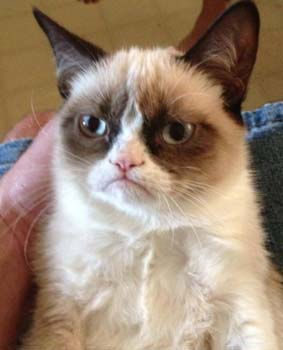
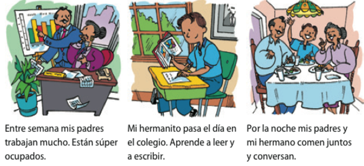

```{r setup, include=FALSE, cache=FALSE}
options(htmltools.dir.version = FALSE)
```

```{r}
#| label: xaringan-extra-all-the-things
#| echo: false
xaringanExtra::use_xaringan_extra(
  c("tile_view", "freezeframe")
)
```

exclude: true
class: inverse, center, middle
count: false

# Descarga en formato PDF [aquí](https://www.midd.jvcasillas.com/slides/1/index.pdf)

<!--
pagedown::chrome_print(
  input = here::here("1", "index.html"), 
  output = here::here("1", "index.pdf")
  )
--> 

---
count: false
class: center, middle
background-color: #2f5cb4

<iframe src="https://wall.sli.do/event/ng7byAEiVzgE7SuPTnfFjv?section=aa253b27-de87-4610-9b0c-f4d442ae1d99" width="1000" height="600" style="border:none;"></iframe>

---

# Objetivos

.Large[
- describir elementos de su identidad (lo físico, grupos sociales y cualidades personales)
]

--
.Large[- comparar elementos de su identidad con otros para identificar similitudes y diferencias]

--
.Large[- describir actividades]

--
.Large[- preguntar y responder]

--
.Large[- expresar el estado de ánimo y la ubicación]

--
.Large[- reconocer y usar la concordancia de género y número]

---


class: title-slide-section-grey, middle

<!-- articulos, sustantivos y la concordancia --> 

# .white[Un poco sobre la concordancia]

---

# Los sustantivos

.Large[
- **Los sustantivos** son personas, lugares o cosas.
- El español tiene **género** y **número**
- ¿Puedes pensar en algunos sustantivos?
]

<div align="center">



</div>

---
background-image: url(https://raw.githubusercontent.com/jvcasillas/media/master/teaching/img/frustration.png)
background-size: 300px
background-position: 95% 50%

# Género

### Normalmente...

.Large[
- **el** libr**o**

- **la** mes**a**
]

--

### Pero a veces...

.Large[
- **el/la** estudiant**e**

- **el** pupitr**e**

- **la** clas**e**

- **el** relo**j**
]

---
background-image: url(https://raw.githubusercontent.com/jvcasillas/media/master/teaching/img/happy.png)
background-size: 300px
background-position: 95% 50%

# Número

.Large[
- el libro/los libros

- la mesa/las mesas

**¡Es FÁCIL!**
]

---
background-image: url(https://raw.githubusercontent.com/jvcasillas/media/master/teaching/img/confused.png)
background-size: 300px
background-position: 95% 50%

# Los artículos

### Los sustantivos tienen **artículos**.

.Large[
Hay dos tipos:

- Definidos

- Indefinidos
]

---
background-image: url(https://raw.githubusercontent.com/jvcasillas/media/master/teaching/img/happy.png)
background-size: 300px
background-position: 95% 50%

# Los artículos definidos

.Large[
- **el** libro, **los** libros

- **la** página, **las** páginas

- **la** mochila, **las** mochilas

- **el** cuaderno, **los** cuadernos
]

---
background-image: url(https://raw.githubusercontent.com/jvcasillas/media/master/teaching/img/happy2.png)
background-size: 300px
background-position: 95% 50%

# Los artículos indefinidos

.Large[
- **un** mapa, **unos** mapas

- **una** mesa, **unas** mesas

- **un** pupitre, **unos** pupitres

- **un**(a) estudiante **unos**(as) estudiantes
]

---
background-image: url(https://raw.githubusercontent.com/jvcasillas/media/master/teaching/gifs/partner.gif)
background-size: 300px
background-position: 95% 50%

# Con un compañero...

.pull-left[
.large[
1. Hay (un/una) profesora. Es (el/la) señora Martínez.
2. (Los/Las) estudiantes están en (el/la) clase de español.
3. Hay (una/unas) ventana en (el/la) puerta.
4. Hay (un/una) mapa de España en (el/la) sala de clase.
5. (Un/Una) estudiante usa (el/la) teléfono celular.
6. Hay (unos/unas) borradores en (el/la) silla.
7. (Un/Una) estudiante escribe mensajes de texto en (el/la) teléfono celular.
8. Hay (un/una) libro en (el/la) mesa de la profesora.
]
]

---
background-image: url(https://raw.githubusercontent.com/jvcasillas/media/master/teaching/gifs/partner.gif)
background-size: 300px
background-position: 95% 50%

# Con un compañero...

.pull-left[
.large[
1. Hay **una** profesora. Es **la** señora Martínez.
2. **Los**/**Las** estudiantes están en **la** clase de español.
3. Hay **una** ventana en **la** puerta.
4. Hay **un** mapa de España en **la** sala de clase.
5. **Un** estudiante usa **el** teléfono celular.
6. Hay **unos** borradores en **la** silla.
7. **Un** estudiante escribe mensajes de texto en **el** teléfono celular.
8. Hay **un** libro en **la** mesa de la profesora.
]
]

---

# Con un compañero...

### Completa la tabla con el singular y plural de las palabras.

.Large[
|     Singular     |       Plural       |
| :--------------- | :----------------- |
| **la profesora** |                    |
|                  | **los bolígrafos** |
|                  | **los pupitres**   |
| **el papel**     |                    |
|                  | **unas mochilas**  |
| **una ventana**  |                    |
| **un reloj**     |                    |
|                  | **unos carteles**  |
]

---

# Con un compañero...

### Completa la tabla con el singular y plural de las palabras.

.Large[
|          Singular         |            Plural           |
| :------------------------ | :-------------------------- |
| **la profesora**          | <blue>las profesoras</blue> |
| <blue>el bolígrafo</blue> | **los bolígrafos**          |
| <blue>el pupitre</blue>   | **los pupitres**            |
| **el papel**              | <blue>los papeles</blue>    |
| <blue>una mochila</blue>  | **unas mochilas**           |
| **una ventana**           | <blue>unas ventanas</blue>  |
| **un reloj**              | <blue>unos relojes</blue>   |
| <blue>un cartel</blue>    | **unos carteles**           |
]


---
class: inverse, center, middle

# El verbo .RUred[ESTAR]

---

# ¿Cómo estás?: Los estados y el verbo estar

## **Yo estoy \_\_\_\_**  

.Large[
|                      |              |
| :------------------- | :----------- |
| de maravilla         | cansado/a    |
| (bastante, muy) bien | contento/a   |
| regular              | efermo/a     |
| (bastante, muy) mal  | enojado/a    |
| de buen humor        | nervioso/a   |
| de mal humor         | ocupado/a    |
| triste               | preocupado/a |
]

--

<br>

.Large[.center[...¿qué más?]]

---

# Los pronombres personales

</br>

.Large[
|    |    |  Singular      |    | Plural              |
|:---| :- | :--------------| :- | :------------------ |
| 1a |    |  yo            |    | nosotros/as         |
| 2a |    |  tú            |    | vosotros/as         |
| 3a |    |  él/ella/usted |    | ellos/ellas/ustedes |
| | &nbsp; &nbsp; &nbsp; | | &nbsp; &nbsp; &nbsp; | |
]

--

.Large[Pronombres no binarios: elle, elles, nosotres, vosotres]

---

# El verbo estar

</br>

.Large[
|    |    |  Singular              |    | Plural                        |
|:---| :- | :--------------------- | :- | :---------------------------- |
| 1a |    | yo **estoy**           |    | nosotros/as **estamos**       |
| 2a |    | tú **estás**           |    | vosotros/as **estáis**        |
| 3a |    | él/ella/usted **está** |    | ellos/ellas/ustedes **están** |
| | &nbsp; &nbsp; &nbsp; | | &nbsp; &nbsp; &nbsp; | |
]

---
background-image: url(https://raw.githubusercontent.com/jvcasillas/media/master/teaching/gifs/confused.gif)
background-size: contain
background-position: 110% 50%

# ¿Cómo está(n)?

---
count: false
background-image: url(./assets/img/esta1.png)
background-size: 600px
background-position: 50% 60%

# ¿Cómo está(n)?

---
count: false
background-image: url(./assets/img/esta2.png)
background-size: 600px
background-position: 50% 70%

# ¿Cómo está(n)?

---
count: false
background-image: url(./assets/img/esta3.png)
background-size: contain
background-position: 100%

# ¿Cómo está(n)?

---
count: false
background-image: url(./assets/img/esta4.png)
background-size: contain
background-position: 100%

# ¿Cómo está(n)?

---
count: false
background-image: url(./assets/img/esta5.png)
background-size: contain
background-position: 100%

# ¿Cómo está(n)?

---
count: false
background-image: url(./assets/img/esta6.png)
background-size: contain
background-position: 100%

# ¿Cómo está(n)?

---
count: false
background-image: url(./assets/img/esta7.png)
background-size: contain
background-position: 100%

# ¿Cómo está(n)?

---
count: false
background-image: url(./assets/img/esta8.png)
background-size: contain
background-position: 100%

# ¿Cómo está(n)?

---
class: title-slide-section-blue
count: false

---


class: inverse, middle, center

# Los verbos .RUred[regulares]

---

# Los verbos regulares

### Estamos muy ocupados entre semana.

<div align="center">
  
</div>

---

# Los verbos regulares

### Paso la semana en la universidad.

<div align="center">
  
</div>

---

# ¿Cómo es tu rutina?

.pull-left[

</br>
</br>
</br>

- Normalmente yo...  

- A veces yo... 

]

.pull-right[

</br>

- paso mucho tiempo en el facebook.

- voy al gimnasio por la mañana/por la tarde.

- escucho música/mi iPod.

- limpio el cuarto/el apartamento.

- preparo la comida.

- tomo café con mis amigos.

]

---

<!-- act 1-26 -->
<div align="center">
  
</div>

---

# El tiempo presente expresa...

</br>

### ...una rutina

--

- Estudio en la biblioteca todos los días.

--

### ...una acción continua

--

- Mi amiga vive en una residencia este semestre.

--

### ...una acción en el futuro

--

- Mis compañeros van a una fiesta mañana.

---

# Los verbos regulares

### Hay tres tipos de infinitivos: -ar, -er, -ir

.Large[
|                     |    | -ar         |    | -er         |    | -ir           |
| :------------------ | :- | :---------- | :- | :---------- | :- | :------------ |
|                     |    | **tomar**   |    | **comer**   |    | **asistir**   |
| yo                  |    | tom**o**    |    | com**o**    |    | asist**o**    |
| tú                  |    | tom**as**   |    | com**es**   |    | asist**es**   |
| él/ella/usted       |    | tom**a**    |    | com**e**    |    | asist**e**    |
| nosotro(as)         |    | tom**amos** |    | com**emos** |    | asist**imos** |
| vosotros(as)        |    | tom**áis**  |    | com**éis**  |    | asist**ís**   |
| ellos/ellas/ustedes |    | tom**an**   |    | com**en**   |    | asist**en**   |
| | &nbsp; &nbsp; &nbsp; | | &nbsp; &nbsp; &nbsp; | | &nbsp; &nbsp; &nbsp; | |
]

---

# A practicar

### Usa los verbos en el presente para hablar de...

.Large[
- .black[Tu rutina]  
.grey[Normalmente desayuno a las 8, voy al gimnasio a las 9, trabajo a las 10, etc.]
]

--

.Large[
- .black[Una acción continua]  
.grey[Veo la televisión todos los días.]
]

--

.Large[
- .black[Una acción en el futuro] (ir a + inf.)  
.grey[Mañana voy a viajar.]
]

---

# Algunos verbos regulares

.pull-left[

  **-ar**  
  Adivinar  
  Gastar  
  Amar  
  Apagar  
  Ayudar  
  Invitar  
  Bailar  
  Jugar  
  Besar  
  Lavar  
  Cambiar  
  Levantar  
  Despertar  
  Pasear  

]

.pull-right[

  Dibujar  
  Pensar  
  Disfrutar  
  Pintar  
  Durar  
  Practicar  
  Echar  
  Preguntar  
  Empezar  
  Prestar  

]

---

# Algunos verbos regulares

.pull-left[

  **-er**  
  Agradecer  
  Llover  
  Beber  
  Nacer  
  Caber  
  Ofrecer  
  Caer  
  Perder  
  Comer  
  Prometer  
  Comprender   

]

.pull-right[

  **-ir**  
  Abrir  
  Partir  
  Construir  
  Pedir  
  Corregir  
  Prohibir  
  Decidir  
  Recibir  
  Despedir  
  Seguir  
  Discutir  

]

---
class: title-slide-section-blue
count: false

---


class: inverse, center, middle

# Los interrogativos

---

# Las preguntas

### Dos tipos

.Large[
1. sí/no

2. de información
]

---

# Preguntas de sí/no

### Inversión del sujeto/verbo

.Large[
| Verbo         | Sujeto              | Otros elementos      |
|:------------- |:------------------- |:---------------------|
| ¿**Llegaron** | .RUred[mis amigos]? |                      |
| ¿**Vive**     | .RUred[Martín]      | en Madrid?           |
| ¿**Comes**    | (.RUred[tú])        | fruta todos los días?|
]

</br>

.Large[No, no **llegaron**.]

--

.Large[Sí, .RUred[Martín] **vive** en Madrid.]

--

.Large[Sí, .RUred[yo] **como** fruta todos los días.]

---
background-image: url(./assets/img/interrogativa_sino.png)
background-size: contain

---

# Preguntas de información

### Requieren una expressión interrogativa

.Large[
| Expression interrogativa | Verbo    |  Sujeto     |
|:-------------------------|:---------|:------------|
| ¿Cuándo                  | llegaron | mis amigos? |
| ¿Dónde                   | vive     | Martín?     |
| ¿Qué                     | comes    | (tú)?       |
]

---
background-image: url(./assets/img/interrogativa_info.png)
background-size: contain

---

# Con un compañero

<div align="center">
  
</div>

</br>

.Large[
- Haced una lista de 4 preguntas (2 sí/no, 2 de información)

- Tened en cuenta la entonación
]

---
class: title-slide-section-blue
count: false


---
exclude: true
class: inverse, middle, center

# ¿Qué es .RUred[el portafolio]?

---
exclude: true
class: inverse, middle, center

# ¿Cómo se hace una .RUred[presentación]?

---
exclude: true

# Cómo elaborar un discurso

### En la elaboración de un discurso se distinguen 5 etapas o pasos:

--
exclude: true

.Large[
- **INVENCIÓN**: Búsqueda de documentación, argumentos y pruebas. Identificar el público oyente.
]

--
exclude: true

.Large[
- **DISPOSICIÓN**: Estructuración y organización del material recogido.
]

--
exclude: true

.Large[
- **ELOCUCIÓN**: Exposición o estilo del discurso mediante la búsqueda de vocabulario.
]

--
exclude: true

.Large[
- **MEMORIA**: Retención en la memoria de todo lo previamente preparado. No se lee.
]

--
exclude: true

.Large[
- **ACCIÓN**: Uso de gestos y tono de voz adecuados, la dramatización más conveniente/relevante al discurso en cuestión.
]

---
exclude: true

# Cómo elaborar un discurso

### Más consejos para una presentación oral

--
exclude: true

.Large[
- ¡Ensayar! ¡Ensayar! ¡Ensayar!
]

--
exclude: true

.Large[
- Hablar lentamente
]

--
exclude: true

.Large[
- Vocales puras
]

--
exclude: true

.Large[
- Tensión bucal
]

--
exclude: true

.Large[
- Practicad palabras largas por sílabas
]

---
exclude: true

# Cómo hacer una entrevista

.Large[

- **PREGUNTA**: haz preguntas que te dan información interesante

- **ESCUCHA**: cuando tu compañero te da una respuesta interesante

- **ENFOCA**: enfoca en esa respuesta y pregúntale más detalles sobre ese asunto

- **AUMENTA**: sigue buscando información sobre el tema y otros temas relacionados

- **DESARROLLA**: desarollo tu discurso sobre esta información

]

---
exclude: true

# Actividad verbos regulares

### Iván y su familia pasan mucho tiempo juntos. Completa la descripción de sus actividades. Escoge el verbo más lógico y escríbelo en el tiempo **presente**.

.Large[
Mi familia y yo (pasar/regresar) mucho tiempo juntos. 
Durante el día, papá y mamá (necesitar/trabajar) en el sector turístico. 
Mis hermanos y yo (leer/asistir) a clases, pero por la noche (nosotros: comer/visitar) en casa, (conversar/aprender) y (ver/escuchar) la televisión. 
A veces (nosotros: beber/comer) helado.  

Los fines de semana (nosotros: ir/ser) más activos. 
Normalmente yo (correr/comprender) los sábados por la mañana. 
Mis hermanos y mi papá (practicar/tomar) el tenis y mi mamá (escribir/descansar) en casa. 
Por la tarde, todos nosotros (visitar/vivir) a nuestros abuelos.
]

---
exclude: true
count: false
class: middle

.Large[
Mi familia y yo **pasamos** mucho tiempo juntos. 
Durante el día, papá y mamá **trabajan** en el sector turístico. 
Mis hermanos y yo **asistimos** a clases, pero por la noche **comemos** en casa, **conversamos** y **vemos** la televisión. 
A veces **comemos** helado.  

Los fines de semana **somos** más activos. 
Normalmente yo **corro** los sábados por la mañana. 
Mis hermanos y mi papá **practican** el tenis y mi mamá **descansa** en casa. 
Por la tarde, todos nosotros **visitamos** a nuestros abuelos.
]

---
exclude: true
class: title-slide-section-blue
count: false

---


exclude: true
class: inverse, middle, center

# Veo veo

---


exclude: true
class: inverse, middle, center
background-image: url(https://media2.giphy.com/media/XfBtsIAbXUJIk/giphy.gif)
background-size: 500px

</br></br></br></br></br></br></br></br>
</br></br></br></br></br></br></br></br>
# Mis metas

---
exclude: true

# Metas para este verano

## Para esta tarea vas a escribir **tus tres metas** para el aprendizaje del español. 
### ¿Qué resultado quieres para el final del verano?

### Tres puntos muy concretos que puedes medir y de los cuales puedes proveer evidencias

.Large[
- Enfoque: quiero + infinitivo
- Se puede escribir o hacer una grabación
- Recomendaciones
  - Es una lista informal, no es necesario escribir frases completas
- Evaluación
  - Completa tu lista, recibes 6 puntos
]

---


exclude: true
class: inverse, center, middle

# Más sobre la concordancia

---
exclude: true

# La relación sujeto/verbo

## SVO

.Large[**Juan** ***tiene*** tres clases este semestre.]

--
exclude: true

.Large[**Juan** *no* ***tiene*** un laboratorio este semestre.]

--
exclude: true

.Large[**Yo** *tengo* cuatro clases este semestre, pero **ella** *tiene* cinco.]

--
exclude: true

.Large[**Los estudiantes** ***estudian*** durante el fin de semana.]

--
exclude: true

.Large[**Tú y yo** ***buscamos*** las respuestas de la tarea.]

---


exclude: true
class: inverse, center, middle

# Los adjetivos

---
exclude: true

# Los adjetivos

</br></br>

.center[
## ¿Qué tipo de concordancia tienen? 

## ¿Con qué concuerdan?

## ¿Cuándo?

## Ejemplos...
]

---
exclude: true

# Los adjetivos posesivos

.Large[
- Se utilizan para indicar **posesión**
- Tienen **número** y **género**

</br>

|    |    |       |    |                        |
|:---| :- | :---- | :- | :--------------------- |
| 1a |    | mi(s) |    | nuestro(s)/nuestra(s)  |
| 2a |    | tu(s) |    | vuestro(s)/vuestra(s)  |
| 3a |    | su(s) |    | su(s)                  |
| | &nbsp; &nbsp; &nbsp; | | &nbsp; &nbsp; &nbsp; | |
]

--
exclude: true

.Large[
- mi familia, mis abuelos
- su hija, sus hijos
- nuestr**a** herman**a**, nuestr**os** herman**os**
]

---
exclude: true
background-image: url(./assets/img/cadiz.png)
background-position: 90% 40%

# La posesión con 'de'

.pull-left[

### Para evitar la confusión en la 3a persona, se puede usar la preposión 'de'

.Large[
.center[
.RUred[Enrique y Alicia viven en Cádiz.]  

**¿Dónde están sus casas?**
]
]

.Large[
- La casa **de** él está en San Fernando. 
- La casa **de** ella está en Sanlúcar.  
]
]

---
exclude: true
background-image: url(./assets/img/cadiz.png)
background-position: 90% 40%

# La posesión con 'de'

.pull-left[

### Para evitar la confusión en la 3a persona, se puede usar la preposión 'de'

.Large[
.center[
.RUred[Enrique y Alicia tienen amigos que viven en Cádiz.]

**¿Dónde viven sus amigos?**
]
]

.Large[
- El amigo **de** Alicia vive en San Fernando.  
- El amigo **de** Enrique vive en Sanlúcar. 
]
]

---
exclude: true

# ¡Nunca usamos .RUred['s] para indicar posesión!

.pull-left[
### ~~Mi hermanas casa~~
### ~~Tu amigos coche~~
### ~~Su abuelos teléfono~~
### ~~Nuestro perros correa~~
### ~~Vuestras clases profesor~~ 
### ~~Sus camas sábanas~~
]

--
exclude: true

.pull-right[
### La casa de mi hermana
### El coche de tu amigo
### El teléfono de su abuelo
### La correa de nuestro perro
### El profesor de vuestras clases
### Las sábanas de sus camas
]

---


exclude: true
class: inverse, center, middle

# El verbo .RUred[SER]

---
exclude: true

# El verbo ser para describir

### ser + adjetivo

.Large[
- Soy responsable
- Eres tímido
- Somos divertidos
]

--
exclude: true

### Sirve para identificar y describir a las personas

.Large[
- ¿De dónde eres?
- ¿Cuál es tu dirección?

(profesor, estudiante, militar, hombre, mujer, padre, madre, simpático)
]

---
exclude: true
class: center, middle

.Large[
|    |    | Singular             |    | Plural                      |
|:-- | :- | :------------------- | :- | :-------------------------- |
| 1a |    | yo **soy**           |    | nosotros/as **somos**       |
| 2a |    | tú **eres**          |    | vosotros/as **sois**        |
| 3a |    | él/ella/usted **es** |    | ellos/ellas/ustedes **son** |
| | &nbsp; &nbsp; &nbsp; | | &nbsp; &nbsp; &nbsp; | |
]

---
exclude: true
background-image: url(./assets/img/kino.png)
background-size: contain
background-color: black

---
exclude: true

# Más descripción

### ¿Quién es?

.Large[
- Con un compañero escribid una lista 6-8 expresiones para describir a las 
personas

- Podéis hablar la apariencia física (altura, pelo, color de ojos) y la 
personalidad (tímido, divertido, extrovertido)
]

--
exclude: true

.Large[
- Escoge una persona de la clase (¡sin decir quién!) y descríbela para que 
los demás adivinen quién es
]

---


exclude: true
class: inverse, center, middle

<!-- ser/estar -->

# Ser y estar

---
exclude: true
background-image: url(./assets/img/maya.png)
background-size: 450px
background-position: 95% 50%

# El verbo ser: para identificar y clasificar

.Large[Maya **es** mi perra.]

--
exclude: true

.Large[Mi hermana **es** enfermera.]

--
exclude: true

.Large[Yo **soy** lingüista.]

--
exclude: true

.Large[Tú **eres** estudiante.]

--
exclude: true

.Large[Fanny **es** de Perú.]

--
exclude: true

.Large[Nosotros **somos** divertidos.]

---
exclude: true
background-image: url(./assets/img/sultan.png), url(./assets/img/lobo.png)
background-size: 200px, 200px
background-position: 80% 50%, 100% 50%

# El verbo ser: 

## Para describir características con los adjetivos

--
exclude: true

.Large[
- Sultán **es** grande y feroz.

- Sultán y Lobo **son** buenos perros.
]

---
exclude: true
background-image: url(./assets/img/mayaFloja.png)
background-size: contain
background-position: 100% 50%
class: middle

# Maya es muy...

---
exclude: true
background-image: url(./assets/img/ser1.png)
background-size: 450px
background-position: 95% 50%

# Los usos del verbo ser: 

## Con la preposición "de"

--
exclude: true

.Large[**Posesión**

¿De quién **es** el cuarto? **Es** de Alicia.
]

</br>

--
exclude: true

.Large[**Origen**

¿De dónde **es** Jacobo? **Es** de México.
]

---
exclude: true
background-image: url(./assets/img/fiesta.png)
background-size: 450px
background-position: 95% 50%

# Los usos del verbo ser: 

## Con la .RUred[HORA] y el .RUred[LUGAR] de los eventos

--
exclude: true

.Large[¿Cuándo **es** la fiesta?]

--
exclude: true

.Large[**Es** el sábado a las siete de la noche.]

--
exclude: true

.Large[La fiesta **es** en la casa del profesor.]

---
exclude: true
background-image: url(./assets/img/az.png)
background-size: contain
background-position: 140% 50%

# Los usos del verbo estar:

## La ubicación de las cosas

--
exclude: true

### ¿Dónde **está** el profe?

--
exclude: true

### **Está** en el gran cañón.

---
exclude: true
background-image: url(https://raw.githubusercontent.com/jvcasillas/media/master/teaching/img/frustration.png)
background-position: 90% 30%

# Los usos del verbo estar: 

## Para describir una condición

--
exclude: true

###¿Cómo **está** Jackie Chan?

###**Está**...

---
exclude: true
background-image: url(https://raw.githubusercontent.com/jvcasillas/media/master/teaching/img/frustration.png)
background-position: 90% 30%

# Ser y estar: 

## Las características versus las condiciones

--
exclude: true

<br><br><br><br><br>

.pull-left[

### ¿Cómo **es** Jackie Chan?

.Large[
- **Es** bajo con pelo negro.
- **Es** simpático.
]
]

.pull-right[

### ¿Cómo **está** Jackie Chan? 

.Large[
- **Está** confundido.
- **Está** frustrado.
]
]

---
exclude: true
class: title-slide-section-grey, middle, center

# ¿.RUred[Cómo es (son)]? </br></br>¿.RUred[Cómo está(n)]?

---
exclude: true
count: false
background-image: url(https://raw.githubusercontent.com/jvcasillas/media/master/teaching/gifs/cant_believe.gif)
background-size: contain

---
exclude: true
count: false
background-image: url(https://raw.githubusercontent.com/jvcasillas/media/master/teaching/gifs/creepy_happy.gif)
background-size: contain

---
exclude: true
count: false
background-image: url(https://raw.githubusercontent.com/jvcasillas/media/master/teaching/gifs/haha.gif)
background-size: contain

---
exclude: true
count: false
background-image: url(https://raw.githubusercontent.com/jvcasillas/media/master/teaching/gifs/jurassic_park.gif)
background-size: contain

---
exclude: true
count: false
background-color: black
background-image: url(https://raw.githubusercontent.com/jvcasillas/media/master/teaching/gifs/luis.gif)
background-size: contain

---
exclude: true
count: false
background-color: black
background-image: url(https://raw.githubusercontent.com/jvcasillas/media/master/teaching/gifs/rock_clap.gif)
background-size: contain

---
exclude: true
count: false
background-color: black
background-image: url(https://raw.githubusercontent.com/jvcasillas/media/master/teaching/img/tired.png)
background-size: contain

---
exclude: true
count: false
background-color: black
background-image: url(https://raw.githubusercontent.com/jvcasillas/media/master/general/gifs/throw_into_pool.gif)
background-size: contain

---
exclude: true

# Ser vs. Estar

### Ese señor es malo.  (no es simpático) </br>Ese señor está malo. (está enfermo)

### La chica es lista. (es inteligente) </br>La chica está lista. (está preparada)

### Las manzanas son verdes. (de color verde) </br>Las manzanas están verdes. (no están maduras)

### La profesora es aburrida. </br>La profesora está aburrida.

---


exclude: true
class: title-slide-section-blue

---


exclude: true
class: inverse, center, middle

# El verbo .RUred[GUSTAR]

---
exclude: true
background-image: url(./assets/img/tiempolibre1.png)
background-size: 900px
background-position: 50% 70%

# ¿Qué le gusta hacer en su tiempo libre?

---
exclude: true
background-image: url(./assets/img/tiempolibre2.png)
background-size: 850px
background-position: 50% 70%

# ¿Qué le gusta hacer en su tiempo libre?

---
exclude: true

# El verbo gustar

### El verbo gustar tiene DOS formas<sup>1</sup>: **gusta** y **gustan**

.Large[
| .RUred[Comp. Indirecto]  &nbsp; &nbsp; &nbsp; | .RUred[gusta]/.RUred[gustan] &nbsp; &nbsp; &nbsp; | .RUred[Sujeto] |
|:----------------------|:-------------|:--------------|
| Me                    | gust**a**    | jugar al tenis|
| Te                    | gust**a**    | el tenis      |
| Le                    | gust**a**    | el deporte    |
| Nos                   | gust**a**    | la clase      |
| Os                    | gust**a**    | Middlebury    |
| Les                   | gust**a**    | la lluvia     |
]

.footnote[
<sup>1</sup> Mentira.
]

---
exclude: true

# El verbo gustar

### El verbo gustar tiene DOS formas<sup>1</sup>: **gusta** y **gustan**

.Large[
| .RUred[Comp. Indirecto]  &nbsp; &nbsp; &nbsp; | .RUred[gusta]/.RUred[gustan] &nbsp; &nbsp; &nbsp; | .RUred[Sujeto] |
|:----------------------|:-------------|:---------------------|
| Me                    | gust**an**   | los árboles          |
| Te                    | gust**an**   | el tenis y el fútbol |
| Le                    | gust**an**   | los deportes         |
| Nos                   | gust**an**   | las clases           |
| Os                    | gust**an**   | los edificios        |
| Les                   | gust**an**   | las nubes            |
]

.footnote[
<sup>1</sup> Mentira.
]

---
exclude: true

# ¿A ti qué te gusta hacer en tu tiempo libre?

.Large[
- montar en bicicleta 
- jugar videojuegos 
- practicar el tenis 
- mirar una película de terror 
- bailar en una fiesta 
- ir de compras 
- correr por el campus 
- leer el periódico 
- practicar el básquetbol
]

---
exclude: true

# ¿Con qué frecuencia...

.pull-left[

</br>
</br>
</br>
</br>

### vas de compras?

### vas al cine?

]

.pull-right[

</br>
</br>
</br>

### a menudo
### a veces
### casi todos los días
### casi nunca
### nunca

]

---
exclude: true

# El énfasis y aclaración con gustar y los nombres.

.Large[
| .RUred[Comp. Indirecto]  &nbsp; &nbsp; &nbsp; | .RUred[gusta]/.RUred[gustan] &nbsp; &nbsp; &nbsp; | .RUred[Sujeto] |
|:---------------------|:-------------|:--------------|
| **A mí** me          | gust**a**    | jugar al tenis|
| **A ti** te          | gust**a**    | el tenis      |
| **A él** le          | gust**a**    | el deporte    |
| **A nosotros** nos   | gust**a**    | la clase      |
| **A vosotros** os    | gust**a**    | Middlebury    |
| **A ellas** les      | gust**a**    | la lluvia     |
]

--
exclude: true

<midd-blockquote>

.center[
### **A Carlos** .RUred[le] .black[gusta] .white[pasar su tiempo libre en la residencia,] </br>.white[pero] **a Juan** .RUred[le] .black[gusta] .white[estudiar en su cuarto.]
]

</midd-blockquote>

---
exclude: true

# El énfasis y aclaración con gustar y los nombres.

.Large[
| .RUred[Comp. Indirecto]  &nbsp; &nbsp; &nbsp; | .RUred[gusta]/.RUred[gustan] &nbsp; &nbsp; &nbsp; | .RUred[Sujeto] |
|:----------------------|:-------------|:--------------------|
| **A mí** me           | gust**an**   | los árboles         |
| **A ti** te           | gust**an**   | el tenis y el fútbol|
| **A él** le           | gust**an**   | los deportes        |
| **A nosotros** nos    | gust**an**   | las clases          |
| **A vosotros** os     | gust**an**   | los edificios       |
| **A ellas** les       | gust**an**   | las nubes           |
]

--
exclude: true

<midd-blockquote>

.center[
### **A Carlos** .RUred[le] .black[gustan] .white[los plátanos,] </br>.white[pero] **a Juan** .RUred[le] .black[gustan] .white[las manzanas.]
]

</midd-blockquote>

---
exclude: true

# ¿A tus amigos y a ti les gusta...

.pull-left[

</br>
</br>
</br>

.Large[
- jugar videojuegos?

- patinar sobre el hielo?

- nadar?
]
]

.pull-right[

</br>
</br>
</br>

.Large[
- Sí, nos gusta mucho.
]

</br>

.Large[
- No, no tanto.
]
]

---
exclude: true

# Cuando NO usamos gustar

.center[


.Large[.black[¿Me gusta el director?]]

]

.Large[
- ¡NO! 
- Me cae bien el director.
- Me llevo bien con el director.
]


---
exclude: true
class: inverse, middle, center

# Repaso

---
exclude: true

# Lo que hemos visto...

.Large[
- Mucho vocabulario
- Los sustantivos
- Los artículos (definidos, indefinidos)
- La concordancia
  - artículo-sustantivo
  - sustantivo-adjetivo
  - sujeto-verbo
- Los pronombres personales
- El abecedario
- Ser y estar
- El presente
]


---
exclude: true
class: inverse, center, middle

# ¿Así que quieres más?

### Para sobrevivir

---
exclude: true

# Para presentarnos

|            |                                 |
|:-----------|:--------------------------------|
| SARA:      | “Hola. ***Me llamo*** Sara.”    |
| AMANDA:    | “Hola, Sara. ***Soy*** Amanda.” |
| SARA:      | “Mucho gusto.”                  |
| AMANDA:    | “Mucho gusto.”                  |


</br>

<div style="float: right">
  
</div>

- ¿Sabéis otras opciones?

--
exclude: true

- Mi nombre es Sara

--
exclude: true

- ~~Me llamo es Sara~~

---
exclude: true

# ¿Qué se dice?

- Con un compañero, crea un diálogo corto usando este vocabuario 
útil. 

- Pensad en situaciones típicas que puedan pasar aquí en Middlebury.

---
exclude: true
background-image: url(./assets/img/abc.png)
background-size: contain
background-position: 120%
class: title-slide-section-blue

# El abecedario

---
exclude: true
background-image: url(./assets/img/sala1.png)
background-size: 750px
background-position: 50% 80%

# ¿Qué es esto? ¿Cómo se escribe?

---
exclude: true
background-image: url(./assets/img/ahorcado.gif)
background-size: contain
background-position: 120%
class: title-slide-section-blue

# El ahorcado

---
exclude: true
background-image: url(./assets/img/viki.png)
background-size: 550px
background-position: 90% 40%

# Intercambiar información básica

### Con un/a compañero/a

- ¿Cómo te llamas?

- ¿Dónde vives?

- ¿Cuál es tu número de teléfono?

- ¿Cuál es tu dirección de correo electrónico?

---
exclude: true
class: inverse, middle, center
count: false

# ¿Quieres un poco más?

---
exclude: true
class: inverse, middle, center
count: false

# Los números

---
exclude: true
background-image: url(./assets/img/num_1_20.png)
background-size: 800px
background-position: 95%

# Los números

---
exclude: true
background-image: url(./assets/img/num_10_100.png)
background-size: 800px
background-position: 95%

# Los números

---
exclude: true
background-image: url(./assets/img/sala2.png)
background-size: 700px
background-position: 95% 80%

# ¿Cuántos objetos hay en la sala de clase?

.pull-left[

- ¿Cuántos libros hay? 

- ¿Cuántas mochilas hay?

- ¿Cuántos pupitres hay? 

- ¿Cuántos bolígrafos hay?

- ¿Cuántos estudiantes hay? 

- ¿Cuántas sillas hay?

]

---
exclude: true
class: inverse, middle, center
count: false

# Vocabulario de la clase

---
exclude: true
background-image: url(./assets/img/clase.png)
background-size: 650px

# Vocabulario útil de la clase 

???

Discutir imagen, se entiende?, qué falta?

---
exclude: true

# Instrucciones básicas

- **Abran/Cierren** el libro en la página...

- **Trabajad** con un compañero.

- **Escuchen** a la profesora.

- **Leed** la información.

- **Contesten** en español.

- **Escribid** vuestros nombres.

---
exclude: true
background-image: url(https://raw.githubusercontent.com/jvcasillas/media/master/teaching/img/confused.png)
background-position: 95% 30%
background-size: 300px

# Para hablar con la gente (1)

- ¿Cómo se dice... ?

- Con permiso/Perdón.

- Gracias... De nada.

- Sí/No

---
exclude: true
background-image: url(https://raw.githubusercontent.com/jvcasillas/media/master/teaching/img/frustration.png)
background-position: 95% 30%
background-size: 300px

# Para hablar con la gente (2)

- Más despacio, por favor.

- ¿Puede repetir, por favor?

- ¿Qué quiere decir... ?

- ¿En qué página?

- Tengo una pregunta.

---
exclude: true

# Estrategias para aprender vocabulario

### Es importante: 

- Reconocer cognados (pero también hay cognados falsos)
- Usarlas en la vida real
- Hacer mapas mentales (asociasiones) y familias de palabras 
- No traducir
- Identificar maneras de aprendizaje
- Poner las palabras en contexto
- Crear ambiente de aprendizaje
- Usarlas interactivamente
- Memorízalas

---
exclude: true
clase: inverse, center, middle

# Aún más pronombres

---
exclude: true
class: middle

# Pronombres de sujeto

.Large[

|            |  Singular       | Plural                |
| :--------- | :-------------- | :-------------------- |
| 1a persona | yo              | nosotros, nosotras    |
| 2a persona | tú              | vosotros, vosotras    |
| 3a persona | él, ella, usted | ellos, ellas, ustedes |

]

???

Hemos visto los pronombres personales y posesivos en clase, pero hay otros tipos de prombres que veremos más adelante. 

En las siguientes diapositivas verás unos cuantos. 
Los pongo aquí para que los reconozcáis. 
Dentro de poco los estudiaremos en más detalle. 

---
exclude: true
class: middle

### Pronombres de objeto directo

.Large[
|            |  Singular |  Plural |
| :--------- | :-------- | :------ |
| 1a persona | me        | nos     |
| 2a persona | te        | os      |
| 3a persona | lo, la    | los las |
]

--
exclude: true

### Pronombres de objeto indirecto

.Large[
|            |  Singular |  Plural |
| :--------- | :-------- | :------ |
| 1a persona | me        | nos     |
| 2a persona | te        | os      |
| 3a persona | le        | les     |
]
