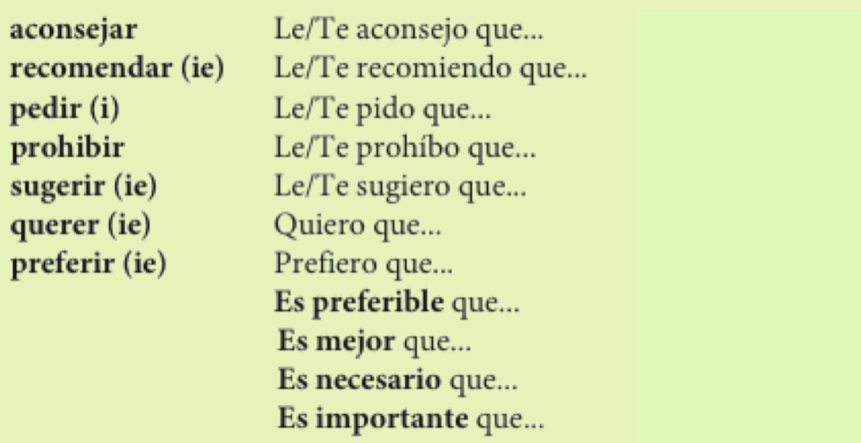

```{r setup, include=FALSE, cache=FALSE}
options(htmltools.dir.version = FALSE)
```

```{r}
#| label: xaringan-extra-all-the-things
#| echo: false
xaringanExtra::use_xaringan_extra(
  c("tile_view", "freezeframe")
)
```

exclude: true
class: inverse, center, mfalsee
count: false

# Descarga en formato PDF [aquí](https://www.midd.jvcasillas.com/slides/3/index.pdf)

<!--
pagedown::chrome_print(
  input = here::here("3", "index.html"), 
  output = here::here("3", "index.pdf")
  )
--> 

---
count: false
class: center, middle
background-color: #2f5cb4

<iframe src="https://wall.sli.do/event/b7yBkXPXYtCxi76S9PekD8?section=a706ae4a-40e4-4c9b-a82a-3309edfab34a" width="1000" height="600" style="border:none;"></iframe>


---

# Para pedir y dar instrucciones

.Large[
- Por favor, ¿cómo se va a la oficina de turismo?
- Siga todo derecho. Está al final de la calle, a la izquierda.
]

--

.Large[
- Perdone, ¿hay un banco por aqui?
- Sí, el Banco Nacional está bastante cerca. Camine 100 metros por esta calle.
Está a la derecha, al lado de la farmacia.
]

--

.Large[
- ¿Cómo llego a la farmacia?
- Vaya a la esquina. Tome la Avenida de la Independencia. Tome la segunda calle a la izquierda. Siga derecho por cuatro cuadras. Doble a la derecha en la calle República. Camine cien metros. Cruce la calle.
]

---
class: inverse, center, middle

# Mandatos formales

---

# Mandatos formales

### Se pueden dar instrucciones con mandatos formales (Ud. y Uds.)

--

.center[.grey[.large[.RUred[Tome] la avenida de la independencia.]]]

--

.Large[
- Paso 1: <blue>Se conjuga el verbo en la forma "yo"</blue>
- Paso 2: <blue>Se elimina la "o"</blue>
- Paso 3: <blue>Se pone la terminación apropiada</blue>
]

--

### Las terminaciones

.Large[
- -**ar** > <BLUE>e</BLUE>(n)  
- -**er**/-**ir** > <BLUE>a</BLUE>(n)
]

---
class: center, middle

.Large[
|     |    |    -ar    |    |    -er     |    |    -ir    |
| :-- | :- | :-------- | :- | :--------- | :- | :-------- |
|     |    | **tomar** |    | **volver** |    | **salir** |
]

---
class: center, middle

.Large[
|     |    |    -ar    |    |    -er     |    |    -ir    |
| :-- | :- | :-------- | :- | :--------- | :- | :-------- |
|     |    | **tomar** |    | **volver** |    | **salir** |
| 1.  |    | tomo      |    | vuelvo     |    | salgo     |
]

---
class: center, middle

.Large[
|     |    |    -ar      |    |    -er        |    |    -ir       |
| :-- | :- | :---------- | :- | :------------ | :- | :----------- |
|     |    | **tomar**   |    | **volver**    |    | **salir**    |
| 1.  |    | tomo        |    | vuelvo        |    | salgo        |
| 2.  |    | tom.grey[ø] |    | vuelv.grey[ø] |    | salg.grey[ø] |
]

---
class: center, middle

.Large[
|     |    |    -ar      |    |    -er        |    |    -ir       |
| :-- | :- | :---------- | :- | :------------ | :- | :----------- |
|     |    | **tomar**   |    | **volver**    |    | **salir**    |
| 1.  |    | tomo        |    | vuelvo        |    | salgo        |
| 2.  |    | tom.grey[ø] |    | vuelv.grey[ø] |    | salg.grey[ø] |
| 3.  |    | tome(n)     |    | vuelva(n)     |    | salga(n)     |
| | &nbsp; | | &nbsp; &nbsp; &nbsp; | | &nbsp; &nbsp; &nbsp; | |
]

---

# Los mandatos formales

### Se pone **no** delante de un mandato negativo.

.Large[
- No vuelvan tarde.
]

--

### Hay mandatos irregulares:

.Large[
- **ir**: Vaya(n) a la esquina. 
- **saber**: Sepa(n) que aquí no se permite fumar.
- **dar**: Déle (Denle) el pasaporte al recepcionista.
- **ser**: Sea(n) puntual(es)
- **estar**: Por favor, esté(n) aquí antes de la seis.
]

---

# Los mandatos con cambios ortográficos

.Large[
- -car > que(n)
- -gar > gue(n)
- -zar > ce(n)
]

--

.Large[
|     |    |   buscar   |    |   llegar   |    |   empezar   |
| :-- | :- | :--------- | :- | :--------- | :- | :---------- |
| 1.  |    | busco      |    | llego      |    | empiezo     |
| 2.  |    | buscø      |    | llegø      |    | empiezø     |
| !   |    | ~~busce~~  |    | ~~llege~~  |    | ~~empieze~~ |
| 3.  |    | bus**que** |    | lle**gue** |    | empie**ce** |
| | &nbsp; | | &nbsp; &nbsp; &nbsp; | | &nbsp; &nbsp; &nbsp; | |
]

---

# Los complementos y los mandatos

### Se pone el complemento:  

.Large[
- Al final de un mandato afirmativo...  

.center[.grey[¡Acuéstense ahora mismo!]]

<br>

- Delante de un mandato negativo...  

.center[.grey[¡No se acuesten en el sofá!]]
]

---

# A buscar trabajo

### En grupos de tres

.Large[
- Dos personas del grupo son los jefes
- La tercera persona se presenta para un puesto de trabajo
- Hagan una entrevista al candidato para determinar si consigue el empleo
]

--

### Antes de empezar...

.Large[
- Decidan cuál es el puesto
- Hagan una lista de vocabulario/verbos útiles
- Hablen entre ustedes de manera formal (usted, ustedes)
]

---

# No sé llegar

.Large[
Usted está perdid@ y no sabe llegar a los siguientes lugares. 
Pídale indicaciones a su compañer@
]

Modelo:  
El comedor de Proctor  
.red[Persona 1]: Perdone usted, estoy buscando Proctor. ¿Me puede ayudar?  
.blue[Persona 2]: Por supuesto. Salga de este edificio, gire a la derecha y siga la acera hasta el próximo edificio. 

--

.pull-left[

### Lugares

- El gimnasio
- Bi hall
- La biblioteca Davis
- El comedor de Ross commons
- La librería
- Dos hermanos
- El lago Dunmore
- La residencia Forest

]

.pull-right[

### Vocabulario útil

- seguir
- caminar
- girar
- doblar
- ir
- buscar
- entrar/salir
- preguntar

]

---

# Querida Abby

.Large[
Tengo un problema con mi vida personal. Tengo mucho trabajo este semestre. Tengo cuatro clases los lunes, miércoles y viernes y dos clases en martes y jueves. Tengo mucha tarea y nunca hay tiempo para completarla. Quiero recibir buenas notas en mis clases pero también quiero mantener mi vida social. Estoy muy triste y cansada. ¡Ayudame!  

--Trabajadora
]

.Large[
- ¿**Qué consejos tienes para "Trabajadora"**?
- **Usen mandatos formales**
]

---


class: inverse, center, middle

# Mandatos informales

---

# Mandatos informales

.pull-left[

### Afirmativos

.Large[
- Conjuga el verbo en la 3ra persona singular

| hablar | comer | escribir |
| :----- | :---- | :------- |
| habla  | come  | escribe  |

- ¡Ya está!
]
]

--

.pull-right[

### Negativos

.Large[
1. Conjuga el verbo en la forma "yo"
2. Quita la "o"
3. Añadir "no" y la terminación adecuada ("as"/"es")
]

.large[
| hablar     | comer     | escribir     |
| :--------- | :-------- | :----------- |
| hablo      | como      | escribo      |
| habl       | com       | escrib       |
| no hables  | no comas  | no escribas  |
]
]

---
background-image: url(./assets/img/vin.jpeg)
background-size: 500px
background-position: 50% 40%

# Mandatos informales... irregulares

</br></br></br></br></br>
</br></br></br></br></br>
</br></br></br></br></br>

.Large[
.center[
|     |       |      |     |         |
| :-: | :-:   | :-:  | :-: | :-:     |
| Vin | Disiel | has | ten | weapons |
]
]

---
background-image: url(./assets/img/vin.jpeg)
background-size: 500px
background-position: 50% 40%

# Mandatos informales... irregulares

</br></br></br></br></br>
</br></br></br></br></br>
</br></br></br></br></br>

.Large[
.center[
|     |       |      |     |         |
| :-: | :-:   | :-:  | :-: | :-:     |
| Vin | Disiel | has | ten | weapons |
| Ven | di sal | haz | ten | ve pon  |
]
]

---
background-image: url(./assets/img/vin.jpeg)
background-size: 500px
background-position: 50% 40%

# Mandatos informales... irregulares

</br></br></br></br></br>
</br></br></br></br></br>
</br></br></br></br></br>

.Large[
.center[
|     |       |      |     |         |
| :-: | :-:   | :-:  | :-: | :-:     |
| Vin | Disiel | has | ten | weapons |
| Ven | di sal | haz | ten | ve pon  |
| venir | decir, salir| hacer| tener| ir, poner |
]
]

---
background-image: url(./assets/img/vin.jpeg)
background-size: 350px
background-position: 99% 50%

# Mandatos informales... irregulares

.Large[
|     |       |      |     |         |
| :-: | :-:   | :-:  | :-: | :-:     |
| Vin | Disiel | has | ten | weapons |
| Ven | di sal | haz | ten | ve pon  |
| venir | decir, salir| hacer| tener| ir, poner |
]

</br>

.pull-left[
.Large[
Tu compañero/a tiene malas notas, sale de marcha demasiado y no ayuda a recoger la casa. 
Poned orden dándole consejos (usad mandatos informales).
]
]


---
class: title-slide-section-blue

---
exclude: false

# Las partes del cuerpo:

<div align="center">
  
</div>

---
exclude: true
background-image: url(./assets/img/doler2false)
background-position: 95% 50%

# El verbo doler sigue el modelo de gustar

- Me duel**e** <blue>la espalda</blue>.
- Me duel**en** <blue>los pies</blue>.
- ¿Cuál es la situación más dolerosa que has experimentado en tu vida?


|   Singular  |    plural    |
| :---------- | :----------- |
| me duele(n) | nos duele(n) |
| te duele(n) | os duele(n)  |
| le duele(n) | les duele(n) |

---
exclude: false
background-image: url(./assets/img/doler3.jpg)
background-size: 500px
background-position: 95% 50%

# Romperse es un verbo reflexivo

- Paco <blue>se rompe</blue> el brazo. 

- <blue>Me rompo</blue> la pierna.

- ¿Alguna vez **te rompiste** un hueso? ¿Qué pasó?

---

# Simón dice...


---

# Querida Abby

.Large[
Tengo un problema con mi vida personal. Tengo mucho trabajo este semestre. Tengo cuatro clases los lunes, miércoles y viernes y dos clases en martes y jueves. Tengo mucha tarea y nunca hay tiempo para completarla. Quiero recibir buenas notas en mis clases pero también quiero mantener mi vida social. Estoy muy triste y cansada. ¡Ayudame!  

--Trabajadora

</br>

- ¿**Qué consejos tienes para "Trabajadora"**?
- **Usad mandatos .RUred[informales]**

]

---

# Recomendaciones y consejos

### ¿Qué recomendaciones tienes para futuros estudiantes de 1.5?

.Large[

Posibles temas...

- Cómo sobrevivir en Middlebury
- Cómo aprender mucho español
- Dónde comer en el pueblo
- Qué (no) hacer durante el tiempo libre
- Actividades co-curriculares
- Madrinas/Padrinos

]

---
exclude: false

<iframe src="https://play.kahoot.it/v2/?quizId=1e2ea1a4-3579-4a39-95e8-157f882463bd" width="1000" height="600" style="border:none;"></iframe>

---


class: inverse, center, middle

# ¿y esas metas?

---
background-image: url(https://media2.giphy.com/media/XfBtsIAbXUJIk/giphy.gif)
background-size: 500px
background-position: 50% 35%

# Hablemos de metas

--

<br><br><br><br><br><br>
<br><br><br><br><br><br>

### Comparte una de tus metas con un/a compañero/a

- ¿**Qué** meta tienes? Explica con detalle
- Describe **cómo** la vas a lograr
- Comenta cómo la puedes **medir**

--

.Large[
.center[¿.RUred[Quieres modificar tus metas]?]
]

---


exclude: true
class: inverse, center, mfalsee

<video width="350" controls>
  <source src="./assets/video/no_se_hacen_fotos.mov" type="video/mp4">
Your browser does not support the video tag.
</video>

---

exclude: false

# Leed el siguiente párrafo...

.Large[
En la escuela de español sólo se habla español. No se puede hablar en inglés. En general, se participa en muchas actividades, como el club de cocina, la clínica de pronunciación y el fútbol. 
Además, se llevan a cabo otras actividades como el teatro y el taller de salsa. Las clases son 
muy difíciles. Se tiene que trabajar mucho y las tareas se entregan todos los días. En fin, en Middlebury se aprenden muchas lenguas y se divierte mucho.
]

---
exclude: true
class: inverse, center, mfalsee

# El "se" pasivo

---
exclude: false

# El "se" pasivo

.Large[
- El "se" pasivo pone énfasis en la acción de la frase.
]

--
exclude: false

.Large[
- **se** + <blue>verbo conjugado</blue> + sustantivo
]

--
exclude: false

<p></p>

.Large[
- Un verbo **singular** con un sustantivo **singular**
	- Se **produce** mucho **software** en Ecuador.
]

--
exclude: false

<p></p>

.Large[
- Un verbo <blue>plural</blue> con un sustantivo <blue>plural</blue>
	- También se <blue>cultivan</blue> muchas <blue>flores</blue>.
]

---
exclude: false

# El "se" impersonal

.Large[
- El "se" impersonal no pone énfasis en ninguna persona como sujeto.
]

--
exclude: false

.Large[
- Podemos pensar que la(s) persona(s) que realiza(n) la acción son "ellos", "la gente", "las personas", "tú" o "uno".
]

--
exclude: false

.Large[
- **se** + <blue>verbo singular</blue> + un infinitivo/un adverbio
]

--
exclude: false

.Large[
- Ej. 
	- En Ecuador, se almuerza a la una.
	- ¿Se puede ir a pie?
	- ¿Dónde se puede comprar aspirina?
]

---
exclude: false

# "Se" impersonal vs. "se" pasivo

### Pasivo

.Large[
- **se** + <blue>verbo conjugado</blue> + sustantivo  
]

</br>

### Impersonal

.Large[
- **se** + <blue>verbo singular</blue> + un infinitivo/un adverbio
]

---
exclude: false

# No sé llegar

.Large[
Usted está perdid@ y no sabe llegar a los siguientes lugares. 
Pídale indicaciones a su compañer@
]

Modelo: El comedor de Proctor  
.red[Persona 1]: Perdone usted, estoy buscando Proctor. ¿Me puede ayudar?  
.blue[Persona 2]: Por supuesto. Se sale de este edificio, se gira a la derecha y se sigue la acera hasta el próximo edificio. 

--
exclude: false

.pull-left[

### Lugares

- El gimnasio
- Bi hall
- La biblioteca Davis
- El comedor de Ross commons
- La librería
- Dos hermanos
- El lago Dunmore
- La residencia Forest

]

.pull-right[

### Vocabulario útil

- seguir
- caminar
- girar
- doblar
- ir
- buscar
- entrar/salir
- preguntar

]

---
exclude: false

# Releed el siguiente párrafo...

.Large[
En la escuela de español sólo **se** habla español. No **se** puede hablar en inglés. En general, **se** participa en muchas actividades, como el club de cocina, la clínica de pronunciación y el fútbol. Además, **se** llevan a cabo otras actividades como el teatro y el taller de salsa. Las clases son muy difíciles. **Se** tiene que trabajar mucho y las tareas **se** entregan todos los días. En fin, en Middlebury **se** aprenden muchas lenguas y **se** divierte mucho.
]
 
--
exclude: false

.pull-left[

### Pasivo

- **se** + <blue>verbo conjugado</blue> + sustantivo  
]

.pull-right[

### Impersonal

- **se** + <blue>verbo singular</blue> + un infinitivo/un adverbio
]

---
exclude: false
background-image: url(./assets/img/golden.jpg)
background-size: 250px
background-position: 95% 50%

# Tu comida preferida

- ¿Cuál es tu comida preferida? Escribe una receta explicando cómo se cocina.
- Utiliza mandatos **formales**

<!--
- Utiliza el se pasivo y el se impersonal  
-->

--
exclude: false

**Verbos útiles**  

- poner
- agarrar/coger
- batir/revolver
- hervir
- echar
- untar
- juntar
- medir
- cocinar
- hornear
- sazonar
- probar

--
exclude: false

<p></p>
- Reescribe tu lista usando mandatos informales

---
exclude: false

# Resumen

### ¿Qué recursos tenemos para dar instrucciones/indicaciones?

Aportad un ejemplo de cada estrategia...

- Mandato formal

<!-- 
- Se pasivo

- Se impersonal
-->

- Mandato informal

---
background-image: url(./assets/img/mandatos_se_pasiva-impersonal_0.png)
background-size: contain

---
count: false
background-image: url(./assets/img/mandatos_se_pasiva-impersonal_1.png)
background-size: contain

---
count: false
background-image: url(./assets/img/mandatos_se_pasiva-impersonal_2.png)
background-size: contain

---
exclude: true
count: falsee
background-image: url(./assets/img/mandatos_se_pasiva-impersonal_3.png)
background-size: contain

---
exclude: true
count: falsee
background-image: url(./assets/img/mandatos_se_pasiva-impersonal_4.png)
background-size: contain

---
class: middle

.Large[
|          | Informal         | Formal      |
| :------- | :--------------- | :---------- |
| Singular | .RUred[tú]       | **usted**   |
| Plural   | .RUred[vosotros] | **ustedes** |
]

---


exclude: true
class: title-slide-sectionfalsee

---
exclude: true
class: inverse, middle, cfalser

# ¿Cómo damos consejos?

<div align="center">
    
</div>

---
exclude: false

# ¿Cómo damos consejos?

<div style="float: right">
    
</div>

### Con un mandato formal:

- **Use** esta crema cada seis horas.

--
exclude: false

### Con un consejo indirecto:

- Es importante que Ud. **use** un protector solar.

---
exclude: false

# El subjuntivo

- Con un consejo indirecto, se usa la forma de un mandato para formar **el subjuntivo**.

<!-- <div align="center">
    
</div> -->

|          Mandato          |    |           Presente del subjuntivo           |
| :------------------------ | :- | :------------------------------------------ |
| **Guarde** cama           |    | Es necesario que Ud. **guarde** cama        |
| **Beban** muchos líquidos |    | Es mejor que Uds. **beban** muchos líquidos |
| | &nbsp; &nbsp; &nbsp; &nbsp; | |

</br>

### Con la forma tú:

- Es necesario que (tú) **guardes** cama.


---
exclude: false

# El subjuntivo

- El uso del subjuntivo requiere una frase con dos cláusulas.

<div align="center">
    
</div>

---
exclude: false

# El subjuntivo

### Algunas cláusulas que requieren el subjuntivo:

- Le/te recomiendo que...
- Quiero que...
- Es necesario que...
- Es aconsejable que...
- Es preferible que...
- Es mejor que...
- Es recomendable que...
- Es importante que...

<!-- <div align="center">
    
</div> -->

---
exclude: true
background-image: url(./assets/img/ali3false)
background-size: contain
background-position: 100% 50%

# El subjuntivo

### Algunos hechos

.large[
.pull-left[

- Es uno de los retos más difíciles del español como L2
- Se puede tardar **años** en aprender todos los detalles
- Muchos no nativos nunca lo pillan del todo 
- Se desarrolla en los niños desde muy joven
- La mayoría de los nativos ni saben lo que es 

<audio controls>
  <source src="./assets/img/ali1.ogg" type="audio/ogg">
  <source src="./assets/img/ali1.wav" type="audio/mpeg">
Your browser does not support the audio element.
</audio>

<audio controls>
  <source src="./assets/img/ali2.ogg" type="audio/ogg">
  <source src="./assets/img/ali2.wav" type="audio/mpeg">
Your browser does not support the audio element.
</audio>

]
]

---
exclude: false

# Querida Abby

.Large[
Tengo un problema con mi vida personal. Tengo mucho trabajo este semestre. Tengo cuatro clases los lunes, miércoles y viernes y dos clases en martes y jueves. Tengo mucha tarea y nunca hay tiempo para completarla. Quiero recibir buenas notas en mis clases pero también quiero mantener mi vida social. Estoy muy triste y cansada. ¡Ayudame!  

--Trabajadora
]

--
exclude: false

.large[
- ¿Qué consejos tienes para "Trabajadora"?
- Usad mandatos indirectos (el subjuntivo)
]

--
exclude: false

.large[
- Con un compañero, escribidle a Abby un párrafo corto explicando un problema que has tenido en Middlebury. Pedidle consejos para que os ayude. 
- Intercambiad consejos con otro grupo y haced el papel de Abby
]

---


# Resumen

### Cosas que hemos visto...

.pull-left[
.Large[
- Mucho vocabulario
- El abecedario
- Los números
- Los artículos (definidos, indefinidos)
- El presente
- La concordancia
- Los adjetivos
- Los adjetivos posesivos
- La posesión con "de"
]
]

.pull-right[
.Large[
- Ser y estar
- tener, ir
- Algunos verbos irregulares
- Se reflexivo
- Se recíproco
- Mandatos directos (informales, formales)
]
]