```{r setup, include=FALSE, cache=FALSE}
options(htmltools.dir.version = FALSE)
```

```{r}
#| label: xaringan-extra-all-the-things
#| echo: false
xaringanExtra::use_xaringan_extra(
  c("tile_view", "freezeframe")
)
```

exclude: true
class: inverse, center, middle
count: false

# Descarga en formato PDF [aquí](https://www.midd.jvcasillas.com/slides/4/index.pdf)

<!--
pagedown::chrome_print(
  input = here::here("4", "index.html"), 
  output = here::here("4", "index.pdf")
  )
--> 

---
count: false
class: center, middle
background-color: #2f5cb4

<iframe src="https://wall.sli.do/event/dcr98S2G4xvYro9pR7JtU5?section=037ee277-203f-4755-acbb-ca5fa298ecae" width="1000" height="600" style="border:none;"></iframe>


---
class: inverse, middle, center

# El presente progresivo

---
class: title-slide-section-blue, bottom, center
background-image: url(./assets/img/hacer1.png)
background-size: contain
background-position: 50% 50%

# .Large[.blue[¿Qué está haciendo?]]

--

## .black[Está estudiando]

---
class: title-slide-section-blue, left
background-image: url(./assets/img/hacer2.png)
background-size: contain
background-position: 100% 50%

# .Large[.white[¿Qué está <br>haciendo?]]

--

## Está gritando

--

## Está hablando por teléfono

---
class: title-slide-section-blue, right
background-image: url(./assets/img/hacer3.png)
background-size: contain
background-position: -3% 50%

# .Large[.black[¿Qué está] .white[haciendo?]]

--

## Está sonriendo

--

## Está graduándose

---
class: title-slide-section-blue
background-image: url(./assets/img/hacer4.png)
background-size: contain
background-position: 100% 50%

# .Large[.white[¿Qué está haciendo?]]

---
class: title-slide-section-blue, bottom
background-image: url(./assets/img/hacer5.png)
background-size: 1250px
background-position: 50% 50%

# .Large[.white[¿Qué están haciendo?]]

---
class: title-slide-section-blue, center, bottom
background-image: url(./assets/img/hacer6.png)
background-size: contain
background-position: 50% 50%

# .Large[.white[¿Qué está haciendo?]]

---
class: title-slide-section-blue, center, bottom
background-image: url(./assets/img/hacer7.png)
background-size: contain
background-position: 50% 50%

# .Large[.white[¿Qué está haciendo?]]

---
background-image: url(https://raw.githubusercontent.com/jvcasillas/media/master/teaching/img/frustration.png)
background-size: 300px
background-position: 95% 50%

# ¿Qué?

### ¿Qué estamos haciendo?

.pull-left[
.Large[
- Con un colega discute lo que acabamos de hacer

- Busca **patrones** e intenta generar una regla

- ¿Qué problemas encuentras?
]
]

---

# El presente progresivo

.Large[
- Sirve para hablar de acciones en progreso
]

<p></p>

.Large[
- estar + gerundio
  - -ar = ando
  - -er/-ir = iendo
]

--

.pull-left[
.Large[
1. com**er**
2. com
3. com + iendo
4. comiendo
5. Estoy comiendo. 
]
]

--

.pull-right[
.Large[
1. habl**ar**
2. habl
3. habl + ando
4. hablando
5. Estoy hablando. 
]
]

---

# El presente progresivo

### Formas irregulares

.Large[
| Infinitivo | Cambio | Ejemplo |
| :- | :-: | :- |
| pedir, servir, vestir </br> decir, repetir, seguir | e > i | p.RUred[i]diendo |
| &nbsp; | &nbsp; | &nbsp; |
| leer, creer, oír | y | le.RUred[y]endo |
| &nbsp; | &nbsp; | &nbsp; |
| dormir | o > u | d.RUred[u]rmiendo |

]

---
class: title-slide-section-blue, bottom
background-image: url(./assets/img/hacer8.png)
background-size: contain
background-position: 100% 50%

# .Large[.white[¿Qué está haciendo?]]

---
class: title-slide-section-blue, center, bottom
background-image: url(./assets/img/hacer9.png)
background-size: contain
background-position: 50% 50%

# .Large[.white[¿Qué está haciendo?]]

---
class: title-slide-section-blue, bottom
background-image: url(./assets/img/hacer10.png)
background-size: contain
background-position: 100% 50%

# .Large[.white[¿Qué están haciendo?]]

---
class: title-slide-section-blue, center, bottom
background-image: url(./assets/img/hacer11.png)
background-size: contain
background-position: 50% 50%

# .Large[.white[¿Qué está haciendo?]]

---
class: title-slide-section-blue, center, bottom
background-image: url(./assets/img/hacer12.png)
background-size: contain
background-position: 50% 50%

# .Large[.white[¿Qué están haciendo?]]

---
class: title-slide-section-blue, right, bottom
background-image: url(./assets/img/hacer13.png)
background-size: contain
background-position: 0% 50%

# .Large[.white[¿Qué están haciendo?]]

---
class: title-slide-section-blue, center
background-image: url(./assets/img/hacer14.png)
background-size: contain
background-position: 50% 50%

# .Large[.white[¿Qué están haciendo?]]

---
class: title-slide-section-blue, right, center
background-image: url(./assets/img/hacer15.png)
background-size: contain
background-position: 0% 50%

# .Large[.white[¿Qué están haciendo?]]

---
class: title-slide-section-blue, center, bottom
background-image: url(./assets/img/hacer16.png)
background-size: contain
background-position: 50% 50%

# .Large[.white[¿Qué están haciendo?]]

---

# Más práctica

### ¿Qué están haciendo?

--

background-image: url(https://raw.githubusercontent.com/jvcasillas/media/master/general/gifs/throw_into_pool.gif)
background-position: 95% 50%
background-size: 600px

--

background-image: url(https://raw.githubusercontent.com/jvcasillas/media/master/teaching/gifs/haha.gif)
background-position: 95% 50%
background-size: 600px

--

background-image: url(https://raw.githubusercontent.com/jvcasillas/media/master/teaching/gifs/partner.gif)
background-position: 95% 50%
background-size: 600px

--

background-image: url(https://raw.githubusercontent.com/jvcasillas/media/master/teaching/gifs/rock_clap.gif)
background-position: 95% 50%
background-size: 600px

---


background-color: black
background-image: url(https://teacherswithguts.org/sites/default/files/styles/resources/public/2019-11/piedrapapeltijera.png?h=ae116200)
background-size: 400px
---


class: title-slide-section-grey, middle

# Los complementos directos

---

# ¿Qué ves?

<div align="center">
  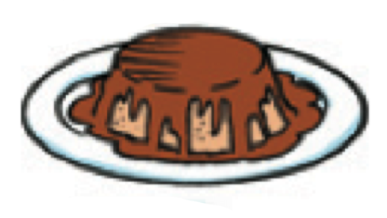
  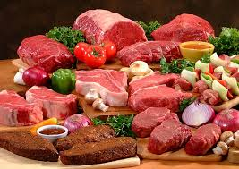
</div>

---

# ¿Qué comes?

<div align="center">
  
  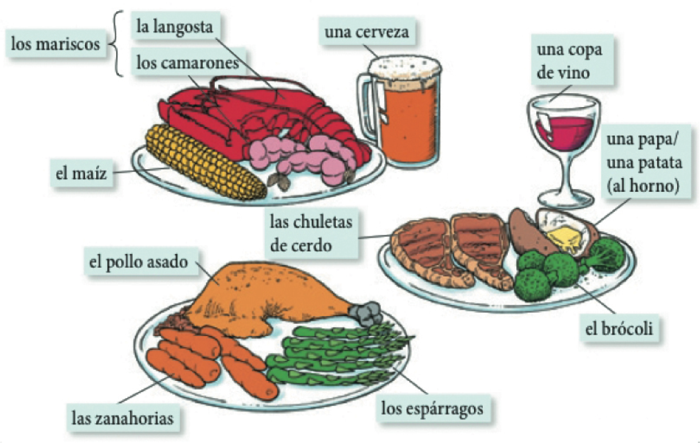
</div>

---
background-image: url(https://raw.githubusercontent.com/jvcasillas/media/master/teaching/img/frustration.png)
background-size: 300px
background-position: 95% 50%

# ¿Qué?

### ¿Qué estamos haciendo?

.pull-left[
.Large[
- Con un colega discute lo que acabamos de hacer

- Busca **patrones** e intenta generar una regla

- ¿Qué problemas encuentras?
]
]

---

# Los complementos directos...

### Reciben la acción del verbo

<div style="float: right">
   
 
</div>

--

.Large[
- Voy a probar **el flan**.
- ¿Qué voy a probar? **El flan**.
]

</br>

--

.Large[
- Veo a **nuestro camarero**.
- ¿A quién veo? A **nuestro camarero**.
]

---

# Los <blue>PRONOMBRES</blue> de complementos directos...

### Sirven para evitar la repitición

<div style="float: right">
   
 
</div>

--

.Large[
- Voy a probar **el flan**.
- **Lo** como con frecuencia.
]

</br>

--

.Large[
- Veo a **nuestro camarero**.
- **Lo** veo enfrente del restaurante.
]

---

# Los <blue>pronombres</blue> de complementos directos

Concuerdan en cuanto al número y género. 

.Large[
```{r results='asis', echo=FALSE, message=F, warning=F}
library(dplyr)
tribble(

 ~Persona,       ~'&#160;', ~Singular,     ~'&nbsp;',  ~Plural,
  '1a',           '',        '**me**',      '',        '**nos**', 
  '2a',           '',        '**te**',      '',        '**os**', 
  '3a',           '',        '**lo, la**',  '',        '**los, las**', 
  'sustantivos',  '',        '**lo, la**',  '',        '**los, las**') %>%

as.data.frame(.) %>% 
pander::pandoc.table(., style = "rmarkdown", 
                        justify = c('left', 'left', 'left', 'left', 'left'))
```
]

</br>

--

- ¿Cómo quieres **el café**?
- **Lo** tomo con azúcar.

--

<p></p>

- ¿Tienes **las galletas**?
- Sí, **las** tengo.

--

<p></p>

- ¿Tú **me** ves?
- Sí, yo **te** veo. 

---

# Los complementos directos

## La posición de los complementos directos pronominales depende de la forma verbal.

--

### Con un verbo conjugado

.Large[
- ¿Necesitas **el menú**?
- No, no **lo** necesito.
]

--

### Con un verbo conjugado y un infinitivo 

.Large[
- ¿Vas a servir **la torta** ahora?
- No, **la** voy a servir un poco más tarde.
- No, voy a servir**la** un poco más tarde.
]

---

# A practicar

### Forma una pregunta para tu compañer@ usando los ejemplos abajo  

Ej. **ayudar económicamente**  

<grey>Pregunta</grey>: ¿Quién <blue>te</blue> **ayuda** económicamente?  

--

<grey>Respuesta</grey>: Mis padres <blue>me</blue> **ayudan** económicamente. 

--

.Large[
1. querer mucho
2. escuchar en todo momento
3. llamar por teléfono con frecuencia
4. ayudar con los problemas
5. aconsejar cuando estás indeciso/a
]

---

# ¿Qué ves?

<div align="center">
  
  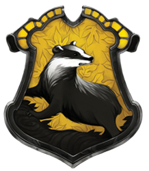
  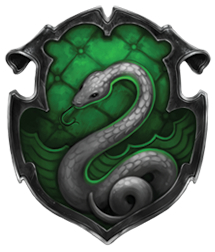
</div>

---

# ¿Qué ves?

<div align="center">
  
  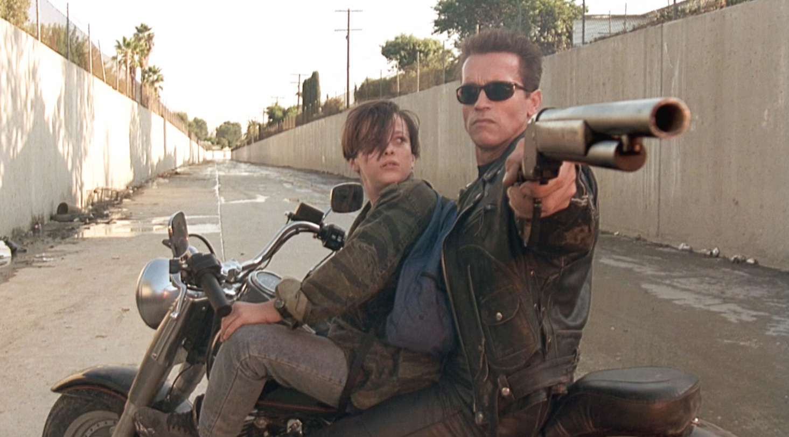
  
</div>

---

# ¿Qué ves?

<div align="center">
  
</div>

---

# ¿Qué ves?

<div align="center">
  
</div>

---

# ¿Qué ves?

<div align="center">
  
</div>

---

# ¿Qué ves?

<div align="center">
  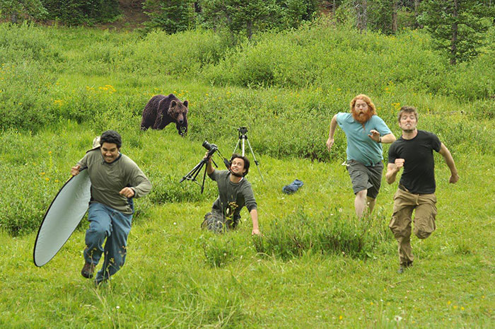
</div>

---

# ¿Qué ves?

<div align="center">
  
</div>


---
class: title-slide-section-blue

---


class: inverse, middle, center

# Complemento indirecto

---

# Los complementos indirectos

### Expresan ¿a quién? o ¿para quién?

.Large[
Siempre **les** sirvo *vino* **a mis invitados**.
]

--

### ¿Qué sirvo? 

.Large[
- *El vino*  
(el complemento directo)
]

--

### ¿A quién sirvo? 

.large[
- **A mis invitados**  
(el complemento indirecto)
]

---
background-image: url("https://www.wpclipart.com/signs_symbol/arrows/BW_arrows/arrow_BW_thin_left.png")
background-position: 47% 38%
background-size: 60px

# Los complementos indirectos

.large[
|  Singular         |    |        |    |  Plural               |    |         |
| :---------------- | :- | :----- | :- | :-------------------- | :- | :------ |
| yo                |    | **me** |    | nosotros              |    | **nos** |
| tú                |    | **te** |    | vosotros              |    | **os**  |
| usted, él, ella   |    | <blue>le</blue> |    | ustedes, ellos, ellas |    | <blue>les</blue> |
| | &nbsp; | | &nbsp; &nbsp; &nbsp; | | &nbsp; | |
]

</br>

.large[
- ¿**Me** puede traer una cuchara?

- Siempre **les** preparo las galletas.
]

---

# Los complementos indirectos

.Large[
La posición de los complementos indirectos pronominales depende de la forma verbal
]

--

### Con un verbo conjugado

.Large[
- ¿Cuánto **le** debo?
]

--

### Con un verbo conjugado y un infinitivo

.Large[
- ¿**Me** puede traer un tenedor?
- ¿Puede traer**me** un tenedor?
]

---

# Los complementos indirectos

### Muchas veces el complemento indirecto <blue>y</blue> el pronombre de complemento indirecto aparecen en la misma oración para evitar la confusión

.Large[
- Siempre **le** sirvo platos vegetarianos **a María**.

- **Les** voy a servir una sopa **a mis invitados**.
]

---
class: inverse-title-slide-grey, middle

# Dos complementos...

---

# Dos complementos: directo e indirecto

.pull-left[

### <blue>CD</blue>

.Large[
|        |    | singular |    |  plural  |
| :----- | :- | :------- | :- | :------- |
| 1a     |    | me       |    | nos      |
| 2a     |    | te       |    | os       |
| 3a     |    | lo, la   |    | los, las |
| | &nbsp; &nbsp; | | &nbsp; &nbsp; |
]
]

.pull-right[

### **CI**

.Large[
|        |   | singular |    | plural |
| :----- |:- | :------- | :- | :----- |
| 1a     |   | me       |    | nos    |
| 2a     |   | te       |    | os     |
| 3a     |   | le       |    | les    |
| | &nbsp; &nbsp; | | &nbsp; &nbsp; |
]
]

---

# Dos complementos: directo e indirecto

</br></br></br>

.center[

### Mami, ¿**me** haces <blue>unas galletas</blue>?

]

--

.center[

### Sí, **te** <blue>las</blue> hago esta tarde.

]

---

# Dos complementos: directo e indirecto

### Mami, ¿**me** haces <blue>unas galletas</blue>?

.Large[
- ¿Qué haces?  
unas galletas (el complemento directo)
]

.Large[
- ¿A quién o para quién?  
a mí (me) (el complemento indirecto)
]

--

### Sí, **te** <blue>las</blue> hago esta tarde.

.large[
- Te = para ti
- las = las galletas
]

---

# A veces "le" y "les" cambian a "se"

</br>

.Large[
|        |     |     |    |     |    |     |     |     |
| :----- | :-: | :-- | :- | :-: | :- | :-  | :-: | :-- |
|        |     | lo  |    |     |    |     |     | lo  |
| &nbsp; |     |     |    |     |    |     |     |     |
|        |     | la  |    |     |    |     |     | la  |
| le/les |  +  |     |    |  →  |    | se  |  +  |     |
|        |     | los |    |     |    |     |     | los |
| &nbsp; |     |     |    |     |    |     |     |     |
|        |     | las |    |     |    |     |     | las |
]

--

</br>

.Large[
- ¿Me puede traer un menú?
- Ahora **se** lo traigo. 
]

---

# ¿Qué pasa?

<div align="center">
  
</div>

--

.pull-left[

### El perro come *las pelotas de tenis*

]

--

.pull-right[

### *Las* come. 

]

---
background-image: url(./assets/img/doio.gif)
background-size: 300px
background-position: 60% 50%

# ¿Qué pasa?

--

.pull-left[

## Benjamín **le** da .RUred[una manzana] **a la maestra**.

]

--

.footnote[

## **Se** .RUred[la] da.

]

---
background-image: url(./assets/img/jing.jpg)
background-size: 500px
background-position: 50% 50%

# ¿Qué pasa?

--

.pull-left[

</br></br></br></br></br>
</br></br></br></br></br>
</br></br></br></br></br>

## Jing **le** da .RUred[uvas] **a Kim**.

]

--

.pull-right[

</br></br></br></br></br>
</br></br></br></br></br>
</br></br></br></br></br>

## **Se** .RUred[las] da.

]

---
background-image: url(./assets/img/doio1.gif)
background-size: 300px
background-position: 50% 50%

# ¿Qué pasa?

--

.pull-left[

</br></br></br></br></br>
</br></br></br></br></br>
</br></br></br></br></br>

## El niño **le** va a regalar .RUred[una sorpresa] **a la niña**.

]

--

.pull-right[

</br></br></br></br></br>
</br></br></br></br></br>
</br></br></br></br></br>

## **Se** .RUred[la] va a regalar.</br>Va a regalár**se**.RUred[la].

]

---
background-image: url(./assets/img/doio5.jpg)
background-size: 700px
background-position: 50% 50%

# ¿Qué pasa?

---
background-image: url(./assets/img/doio6.jpg)
background-size: 700px
background-position: 50% 50%

# ¿Qué pasa?

---
exclude: false

<iframe src="https://play.kahoot.it/v2/?quizId=683897f5-ed33-407e-ad9a-90f2fd7d45e3" width="1000" height="600" style="border:none;"></iframe>


---
class: inverse, middle, center

# El pretérito

---

# ¿Qué hiciste ayer?: el pasado

<div align="center">
  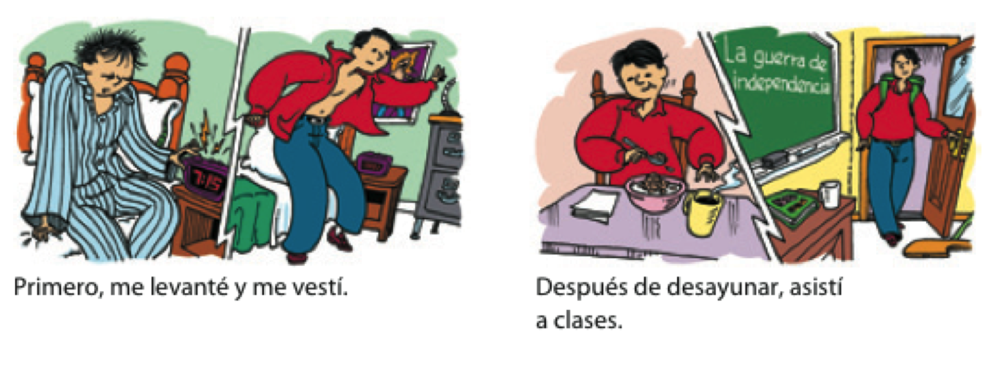
</div>

---

# ¿Qué hiciste ayer?: el pasado

<div align="center">
  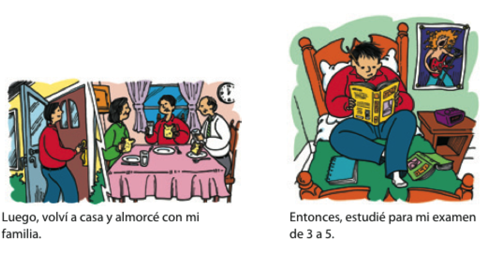
</div>

---

# ¿Qué hiciste ayer?: el pasado

<div align="center">
  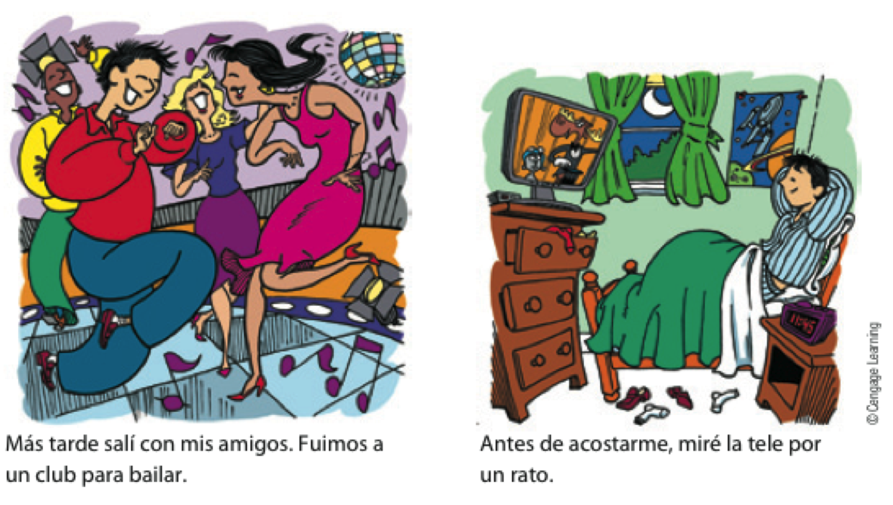
</div>

---

# El pretérito expresa el pasado con una referencia a un tiempo particular

.Large[
- Salí con unos compañeros de clase **anoche**.
]

--

.Large[
- **Ayer** fuimos a Dos Hermanos.
]

--

.Large[
- **La semana pasada** corrimos dos millas.
]

--

.Large[
- Me bañé en el mar **el año pasado**. 
]

---

# El pretérito

.Large[
|                  |    |     tomar     |    |     volver     |    |     salir     |
| :--------------- | :- | :------------ | :- | :------------- | :- | :------------ |
| yo               |    | tom**é**      |    | volv**í**      |    | sal**í**      |
| tú               |    | tom**aste**   |    | volv**iste**   |    | sal**iste**   |
| Ud./él/ella      |    | tom**ó**      |    | volv**ió**     |    | sal**ió**     |
| nosotros(as)     |    | tom**amos**   |    | volv**imos**   |    | sal**imos**   |
| vosotros(as)     |    | tom**asteis** |    | volv**isteis** |    | sal**isteis** |
| Uds./ellos/ellas |    | tom**aron**   |    | volv**ieron**  |    | sal**ieron**  |
]

--

.Large[
**¡OJO!**
]

.large[
-  Los verbos reflexivos requieren el pronombre reflexivo.
- **Me desperté** a las ocho ayer.
]

--

.large[
-  El verbo gustar tiene dos formas más comunes en el pretérito.
- **Me gustó** el concierto. No **me gustaron** esas dos películas.
]

---

# ¿Qué hiciste la semana pasada?

.Large[
- Piensa en algunas cosas que hiciste la semana pasada
- Forma 3 oraciones usando el préterito y cuéntaselas a tu grupo
- Responde a las oraciones de tus compañeros/as con más preguntas en el pasado
]

</br>

--

.Large[
|                  |    |     tomar     |    |     volver     |    |     salir     |
| :--------------- | :- | :------------ | :- | :------------- | :- | :------------ |
| yo               |    | tom**é**      |    | volv**í**      |    | sal**í**      |
| tú               |    | tom**aste**   |    | volv**iste**   |    | sal**iste**   |
| Ud./él/ella      |    | tom**ó**      |    | volv**ió**     |    | sal**ió**     |
| nosotros(as)     |    | tom**amos**   |    | volv**imos**   |    | sal**imos**   |
| vosotros(as)     |    | tom**asteis** |    | volv**isteis** |    | sal**isteis** |
| Uds./ellos/ellas |    | tom**aron**   |    | volv**ieron**  |    | sal**ieron**  |
]

---


class: title-slide-section-blue

---

# ¿Qué hiciste durante el fin de semana?

### Encuentra a alguien que...

.Large[
1. nadó en el lago.
2. cenó en el pueblo. 
3. rompió la palabra de honor.
4. miró casa de papel.
5. bebió demasiado.
6. estudió todo el fin de semana. 
7. salió de Middlebury.
8. tomó comida de Proctor.
]

---

# Más sobre el pretérito 

### Expresa un momento particular en el pasado.

.Large[
**Palabras importantes: ayer, anoche, la semana pasada**  
]

</br>

.Large[
- Anoche miramos la televisión.
- Mi abuela me visitó hace dos semanas.
]

---

# El pretérito 

### Expresa un evento que ocurrió varias veces

.Large[
**Palabras importantes: una vez, dos veces, varias veces**
]

</br>

.Large[
- Fuimos a la piscina dos veces la semana pasada.
]

---

# El pretérito 

### Expresa cuánto tiempo duró un evento.

.Large[
**Palabras importantes: por veinte minutos, por dos días**
]

</br>

.Large[
- Arturo habló por teléfono por quince minutos.
]

---

# El pretérito

### Resume una experiencia (al principio o al final de una historia)

</br>

.Large[
- Ayer fue un día fantástico en la uni. Primero...
]

---

# Mi experiencia en Midd

.large[
Querida mamá,  

Ya \_\_\_\_\_\_\_\_\_\_ (llevar, presente) 5 semanas en el programa de 
Middlebury. 
\_\_\_\_\_\_\_\_\_\_ (ser/estar, presente) muy bien, creo, pero yo siempre 
\_\_\_\_\_\_\_\_\_\_ (ser/estar, presente) cansadx y tengo mucha tarea. 
La semana pasada \_\_\_\_\_\_\_\_\_\_ (escribir) 6 ensayos para mi clase de 
escritura. 
¡No \_\_\_\_\_\_\_\_\_\_ (dormir) nada! 
\_\_\_\_\_\_\_\_\_\_ (estudiar) muchísimo y todos mis amigos 
\_\_\_\_\_\_\_\_\_\_ (salir) al lago para festejar sin mí. 
Ellos lo \_\_\_\_\_\_\_\_\_\_ (pasar) muy bien y yo \_\_\_\_\_\_\_\_\_\_ 
(ensayar) mi presentación oral para la clase de Joseph. 
Cuando \_\_\_\_\_\_\_\_\_\_ (ellos volver) me dijeron "¡te lo 
\_\_\_\_\_\_\_\_\_\_ (tú perder)! Fue el día más divertido desde que 
\_\_\_\_\_\_\_\_\_\_ (empezar) el coronavirus". 
Yo \_\_\_\_\_\_\_\_\_\_ (sentir) FOMO, pero al menos \_\_\_\_\_\_\_\_\_\_ 
(trabajar) más con los complementos directos e indirectos y 
\_\_\_\_\_\_\_\_\_\_ (mirar) 4 películas en español. 
Bueno, te dejo, que tengo que trabajar en mi proyecto de cultura.  

Un beso,  
Triste estudiante de nivel 1.5 😭
]

---

# Mi experiencia en Midd

.large[
Querida mamá,  

Ya **llevo** 5 semanas en el programa de Middlebury.
**Estoy** muy bien, creo, pero yo siempre **estoy** cansadx y tengo mucha tarea. 
La semana pasada **escribí** 6 ensayos para mi clase de escritura.
¡No **dormí** nada! 
**Estudié** muchísimo y todos mis amigos **salieron** al lago para festejar 
sin mí. 
Ellos lo **pasaron** muy bien y yo **ensayé** mi presentación oral para la 
clase de Joseph. 
Cuando **volvieron** me dijeron "¡te lo **perdiste**! Fue el día más divertido 
desde que **empezó** el coronavirus". 
Yo **sentí** FOMO, pero al menos **trabajé** más con los complementos directos 
e indirectos y **miré** 4 películas en español. 
Bueno, te dejo, que tengo que trabajar más en mi proyecto de cultura.  

Un beso,  
Triste estudiante de nivel 1.5 😭
]


---

class: title-slide-section-grey, middle

# El pretérito (verbos irregulares)

---

# Algunos verbos irregulares en el pretérito:

.Large[

|                  |    |    ir    |    |   ser    |    |   dar   |    |   ver   |
| :--------------- | :- | :------- | :- | :------- | :- | :------ | :- | :------ |
| yo               |    | fui      |    | fui      |    | di      |    | vi      |
| tú               |    | fuiste   |    | fuiste   |    | diste   |    | viste   |
| Ud./él/ella      |    | fue      |    | fue      |    | dio     |    | vio     |
| nosotros(as)     |    | fuimos   |    | fuimos   |    | dimos   |    | vimos   |
| vosotros(as)     |    | fuisteis |    | fuisteis |    | disteis |    | visteis |
| Uds./ellos/ellas |    | fueron   |    | fueron   |    | dieron  |    | vieron  |
| | &#160; &#160; | | &#160; &#160; | | &#160; &#160; | | &#160; &#160; | |

]

---

# Algunos verbos irregulares en el pretérito: 

### Los verbos con .RUred[u] en la raíz

.Large[

|      estar      |    |     poder     |    |     poner     |    |     saber     |    |     tener     |
| :-------------- | :- | :------------ | :- | :------------ | :- | :------------ | :- | :------------ |
| estuv**e**      |    | pud**e**      |    | pus**e**      |    | sup**e**      |    | tuv**e**      |
| estuv**iste**   |    | pud**iste**   |    | pus**iste**   |    | sup**iste**   |    | tuv**iste**   |
| estuv**o**      |    | pud**o**      |    | pus**o**      |    | sup**o**      |    | tuv**o**      |
| estuv**imos**   |    | pud**imos**   |    | pus**imos**   |    | sup**imos**   |    | tuv**imos**   |
| estuv**isteis** |    | pud**isteis** |    | pus**isteis** |    | sup**isteis** |    | tuv**isteis** |
| estuv**ieron**  |    | pud**ieron**  |    | pus**ieron**  |    | sup**ieron**  |    | tuv**ieron**  |
| | &#160; &#160; | | &#160; &#160; | | &#160; &#160; | | &#160; &#160; | |

]

---

# Algunos verbos irregulares en el pretérito: 

### Los verbos con .RUred[i] en la raíz

.Large[

|     hacer     |    |     querer     |    |     venir     |
| :------------ | :- | :------------- | :- | :------------ |
| hic**e**      |    | quis**e**      |    | vin**e**      |
| hic**iste**   |    | quis**iste**   |    | vin**iste**   |
| hiz**o**      |    | quis**o**      |    | vin**o**      |
| hic**imos**   |    | quis**imos**   |    | vin**imos**   |
| hic**isteis** |    | quis**isteis** |    | vin**isteis** |
| hic**ieron**  |    | quis**ieron**  |    | vin**ieron**  |
| | &#160; &#160; | | &#160; &#160; | |

]

---

# Algunos verbos irregulares en el pretérito: 

### Los verbos con .RUred[j] en la raíz

.Large[

|     conducir     |    |     decir     |    |     traer      |
| :--------------- | :- | :------------ | :- | :------------- |
| conduj**e**      |    | dij**e**      |    | traj**e**      |
| condu**jiste**   |    | di**jiste**   |    | tra**jiste**   |
| condu**jo**      |    | di**jo**      |    | tra**jo**      |
| condu**jimos**   |    | di**jimos**   |    | tra**jimos**   |
| condu**jisteis** |    | di**jisteis** |    | tra**jisteis** |
| condu**jeron**   |    | di**jeron**   |    | tra**jeron**   |
| | &#160; &#160; | | &#160; &#160; | |

]

---

# ¿Qué pasó?

<div align="center">
  <video width="450" allowfullscreen controls>
    <source src="./assets/videos/maya.mp4" type="video/mp4">
    <source src="./assets/videos/maya.ogg" type="video/ogg">
  </video>
</div>

---

# El pretérito (irregulares)

.pull-left[
.Large[
- tener
- estar
- ir
- ser
- poner
- poder
- traer
- hacer
]
]

.pull-right[
.Large[
- haber
- saber
- querer
- decir
- venir
- ver
- dar
]
]

---

# El pretérito (irregulares)

<iframe width="560" height="315" src="https://www.youtube.com/embed/iFUAWMMdE7c" frameborder="0" allowfullscreen></iframe>

---

# El pretérito (irregulares)

<div style="float: right">
  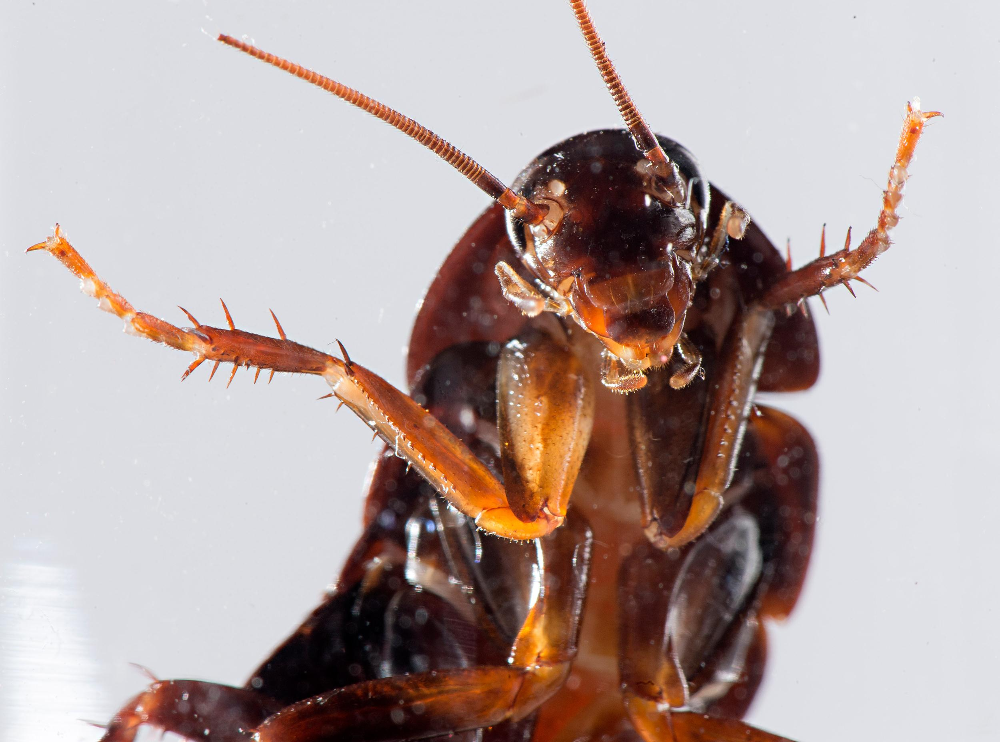
</div>

.Large[
**tener** es tuve,  
**estar** es estuve  
**ir** es fui, y tambien **ser**  
**poner** es puse, **poder** es pude  
traje es para **traer**  

**hacer** hice, **haber** hube  
**saber** supe, **querer** quise  
**decir** dije, **venir** vine  
**ver** vi, **dar** di  
sin acentos
]

<audio controls>
  <source src="./assets/videos/pretIrreg.ogg" type="audio/ogg">
  <source src="./assets/videos/pretIrreg.m4a" type="audio/mpeg">
Your browser does not support the audio element.
</audio>

.footnote[
.Large[
[(Remix)](https://soundcloud.com/michaelgo/preteritos-remix-07-20-2021/s-XYInUcwrNWz)
]
]

---


class: title-slide-section-blue

---

# Cambios ortográficos en la forma yo

### -car (buscar, tocar, sacar) 

.Large[
- c > qu
- **toqué**, tocaste, tocó, tocamos, tocasteis, tocaron
]

--

### -gar (llegar, jugar, pagar) 

.Large[
- g > gu
- **llegué**, llegaste, llegó, llegamos, llegasteis, llegaron
]

--

### -zar (empezar, almorzar) 

.Large[
- z > c
- **empecé**, empezaste, empezó, empezamos, empezasteis, empezaron
]

---

# Los verbos de –er y –ir con una vocal: Leer, creer y caerse

### Leer

.Large[
- leí, leíste, le**y**ó, leímos, leísteis, le**y**eron
]

--

### Creer

.Large[
- creí, creíste, cre**y**ó, creímos, creísteis, cre**y**eron
]

--

### Caerse

.Large[
- me caí, te caíste, se ca**y**ó, nos caímos, os caísteis, se ca**y**eron
]

---

# Verbos con cambios en la raíz en el pretérito: 

.Large[

|                  |     |       e > i        |     |     o > u     |
| :--------------- | :-- | :----------------- | :-- | :------------ |
|                  |     | <blue>div**e**rtirse</blue> | | <blue>d**o**rmir</blue>    |
| yo               |     | me divertí         |     | dormí         |
| tú               |     | te divertiste      |     | dormiste      |
| Ud./él/ella      |     | se div**i**rtió    |     | d**u**rmió    |
| nosotros(as)     |     | nos divertimos     |     | dormimos      |
| vosotros(as)     |     | os divertisteis    |     | dormisteis    |
| Uds./ellos/ellas |     | se div**i**rtieron |     | d**u**rmieron |
| | &#160; &#160; &#160; | | &#160; &#160; &#160; | |

]

</br>

.Large[
- ¡**OJO**!: Estos cambios sólo ocurren en la tercera persona (o segunda persona formal)  
(Ud., él, ella y Uds., ellos, ellas, elles)
]

---

# Hay verbos con significados particulares en el pretérito.

<div align="center">
  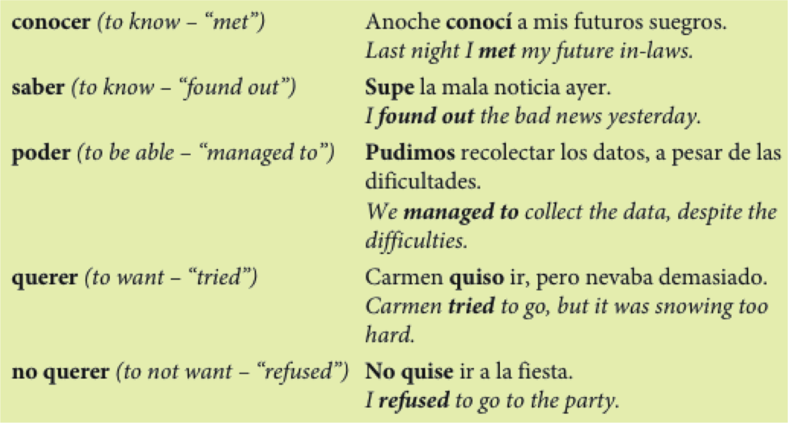
</div>

---
background-image: url("http://nationalinterest.org/files/styles/main_image_on_posts/public/main_images/uss_new_jersey_6219214852.jpg?itok=gO7-Wwi6")
background-position: 50% 65%
background-size: 500px

# Batalla naval

.Large[
- Poned vuestros barcos en el papel

- Conjugad los verbos en el pretérito para hundir 
los de tu compañer@
]

