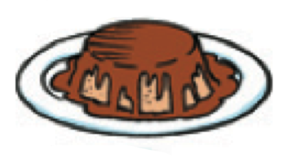
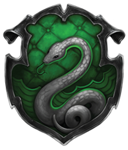

```{r setup, include=FALSE, cache=FALSE}
options(htmltools.dir.version = FALSE)
```

```{r}
#| label: xaringan-extra-all-the-things
#| echo: false
xaringanExtra::use_xaringan_extra(
  c("tile_view", "freezeframe")
)
```

class: inverse, center, middle
count: false

# Descarga en formato PDF [aquí](https://www.midd.jvcasillas.com/slides/4/index.pdf)

<!--
pagedown::chrome_print(
  input = here::here("4", "index.html"), 
  output = here::here("4", "index.pdf")
  )
--> 

---
count: false
class: center, middle
background-color: #2f5cb4

<iframe src="https://wall.sli.do/event/wjGrDxvrjxBkdeQU1rfwXa?section=ca6fbcc3-4f66-40a1-8df3-16ff90dd8248" width="1000" height="600" style="border:none;"></iframe>


---
class: inverse, middle, center

# El presente progresivo

---
class: title-slide-section-blue, bottom, center
background-image: url(./assets/img/hacer1.png)
background-size: contain
background-position: 50% 50%

# .Large[.blue[¿Qué está haciendo?]]

--

## .black[Está estudiando]

---
class: title-slide-section-blue, left
background-image: url(./assets/img/hacer2.png)
background-size: contain
background-position: 100% 50%

# .Large[.white[¿Qué está <br>haciendo?]]

--

## Está gritando

--

## Está hablando por teléfono

---
class: title-slide-section-blue, right
background-image: url(./assets/img/hacer3.png)
background-size: contain
background-position: -3% 50%

# .Large[.black[¿Qué está] .white[haciendo?]]

--

## Está sonriendo

--

## Está graduándose

---
class: title-slide-section-blue
background-image: url(./assets/img/hacer4.png)
background-size: contain
background-position: 100% 50%

# .Large[.white[¿Qué está haciendo?]]

---
class: title-slide-section-blue, bottom
background-image: url(./assets/img/hacer5.png)
background-size: 1250px
background-position: 50% 50%

# .Large[.white[¿Qué están haciendo?]]

---
class: title-slide-section-blue, center, bottom
background-image: url(./assets/img/hacer6.png)
background-size: contain
background-position: 50% 50%

# .Large[.white[¿Qué está haciendo?]]

---
class: title-slide-section-blue, center, bottom
background-image: url(./assets/img/hacer7.png)
background-size: contain
background-position: 50% 50%

# .Large[.white[¿Qué está haciendo?]]

---

# El presente progresivo

.Large[
- Sirve para hablar de acciones en progreso
]

<p></p>

.Large[
- estar + gerundio
  - -ar = ando
  - -er/-ir = iendo
]

--

.pull-left[
.Large[
1. com**er**
2. com
3. com + iendo
4. comiendo
5. Estoy comiendo. 
]
]

--

.pull-right[
.Large[
1. habl**ar**
2. habl
3. habl + ando
4. hablando
5. Estoy hablando. 
]
]

---

# El presente progresivo

### Formas irregulares

.Large[
| Infinitivo | Cambio | Ejemplo |
| :- | :-: | :- |
| pedir, servir, vestir </br> decir, repetir, seguir | e > i | p.RUred[i]diendo |
| &nbsp; | &nbsp; | &nbsp; |
| leer, creer, oír | y | le.RUred[y]endo |
| &nbsp; | &nbsp; | &nbsp; |
| dormir | o > u | d.RUred[u]rmiendo |

]

---
class: title-slide-section-blue, bottom
background-image: url(./assets/img/hacer8.png)
background-size: contain
background-position: 100% 50%

# .Large[.white[¿Qué está haciendo?]]

---
class: title-slide-section-blue, center, bottom
background-image: url(./assets/img/hacer9.png)
background-size: contain
background-position: 50% 50%

# .Large[.white[¿Qué está haciendo?]]

---
class: title-slide-section-blue, bottom
background-image: url(./assets/img/hacer10.png)
background-size: contain
background-position: 100% 50%

# .Large[.white[¿Qué están haciendo?]]

---
class: title-slide-section-blue, center, bottom
background-image: url(./assets/img/hacer11.png)
background-size: contain
background-position: 50% 50%

# .Large[.white[¿Qué está haciendo?]]

---
class: title-slide-section-blue, center, bottom
background-image: url(./assets/img/hacer12.png)
background-size: contain
background-position: 50% 50%

# .Large[.white[¿Qué están haciendo?]]

---
class: title-slide-section-blue, right, bottom
background-image: url(./assets/img/hacer13.png)
background-size: contain
background-position: 0% 50%

# .Large[.white[¿Qué están haciendo?]]

---
class: title-slide-section-blue, center
background-image: url(./assets/img/hacer14.png)
background-size: contain
background-position: 50% 50%

# .Large[.white[¿Qué están haciendo?]]

---
class: title-slide-section-blue, right, center
background-image: url(./assets/img/hacer15.png)
background-size: contain
background-position: 0% 50%

# .Large[.white[¿Qué están haciendo?]]

---
class: title-slide-section-blue, center, bottom
background-image: url(./assets/img/hacer16.png)
background-size: contain
background-position: 50% 50%

# .Large[.white[¿Qué están haciendo?]]

---

# Más práctica

### ¿Qué están haciendo?

--

background-image: url(https://raw.githubusercontent.com/jvcasillas/media/master/general/gifs/throw_into_pool.gif)
background-position: 95% 50%
background-size: 600px

--

background-image: url(https://raw.githubusercontent.com/jvcasillas/media/master/teaching/gifs/haha.gif)
background-position: 95% 50%
background-size: 600px

--

background-image: url(https://raw.githubusercontent.com/jvcasillas/media/master/teaching/gifs/partner.gif)
background-position: 95% 50%
background-size: 600px

--

background-image: url(https://raw.githubusercontent.com/jvcasillas/media/master/teaching/gifs/rock_clap.gif)
background-position: 95% 50%
background-size: 600px

---


class: title-slide-section-grey, middle

# Los complementos directos

---

# ¿Qué ves?

<div align="center">
  
  
</div>

---

# ¿Qué comes?

<div align="center">
  
  
</div>

---

# Los complementos directos...

### Reciben la acción del verbo

<div style="float: right">
   
 
</div>

--

.Large[
- Voy a probar **el flan**.
- ¿Qué voy a probar? **El flan**.
]

</br>

--

.Large[
- Veo a **nuestro camarero**.
- ¿A quién veo? A **nuestro camarero**.
]

---

# Los <blue>PRONOMBRES</blue> de complementos directos...

### Sirven para evitar la repitición

<div style="float: right">
   
 
</div>

--

.Large[
- Voy a probar **el flan**.
- **Lo** como con frecuencia.
]

</br>

--

.Large[
- Veo a **nuestro camarero**.
- **Lo** veo enfrente del restaurante.
]

---

# Los <blue>pronombres</blue> de complementos directos

Concuerdan en cuanto al número y género. 

.Large[
```{r results='asis', echo=FALSE, message=F, warning=F}
library(dplyr)
tribble(

 ~Persona,       ~'&#160;', ~Singular,     ~'&nbsp;',  ~Plural,
  '1a',           '',        '**me**',      '',        '**nos**', 
  '2a',           '',        '**te**',      '',        '**os**', 
  '3a',           '',        '**lo, la**',  '',        '**los, las**', 
  'sustantivos',  '',        '**lo, la**',  '',        '**los, las**') %>%

as.data.frame(.) %>% 
pander::pandoc.table(., style = "rmarkdown", 
                        justify = c('left', 'left', 'left', 'left', 'left'))
```
]

</br>

--

- ¿Cómo quieres **el café**?
- **Lo** tomo con azúcar.

--

<p></p>

- ¿Tienes **las galletas**?
- Sí, **las** tengo.

--

<p></p>

- ¿Tú **me** ves?
- Sí, yo **te** veo. 

---

# Los complementos directos

## La posición de los complementos directos pronominales depende de la forma verbal.

--

### Con un verbo conjugado

.Large[
- ¿Necesitas **el menú**?
- No, no **lo** necesito.
]

--

### Con un verbo conjugado y un infinitivo 

.Large[
- ¿Vas a servir **la torta** ahora?
- No, **la** voy a servir un poco más tarde.
- No, voy a servir**la** un poco más tarde.
]

---

# A practicar

### Forma una pregunta para tu compañer@ usando los ejemplos abajo  

Ej. **ayudar económicamente**  

<grey>Pregunta</grey>: ¿Quién <blue>te</blue> **ayuda** económicamente?  

--

<grey>Respuesta</grey>: Mis padres <blue>me</blue> **ayudan** económicamente. 

--

.Large[
1. querer mucho
2. escuchar en todo momento
3. llamar por teléfono con frecuencia
4. ayudar con los problemas
5. aconsejar cuando estás indeciso/a
]

---

# ¿Qué ves?

<div align="center">
  
  
  
</div>

---

# ¿Qué ves?

<div align="center">
  
  
  
</div>

---

# ¿Qué ves?

<div align="center">
  
</div>

---

# ¿Qué ves?

<div align="center">
  
</div>

---

# ¿Qué ves?

<div align="center">
  
</div>

---

# ¿Qué ves?

<div align="center">
  
</div>

---

# ¿Qué ves?

<div align="center">
  
</div>


