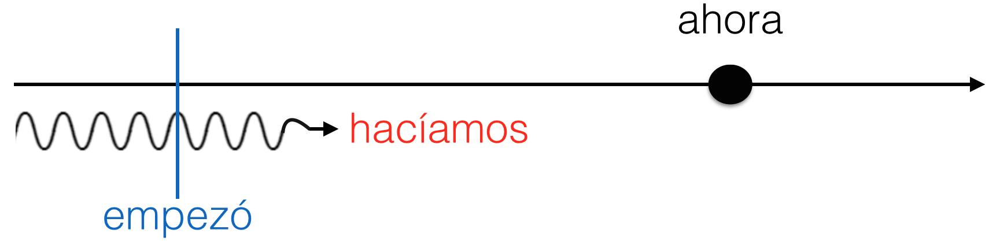
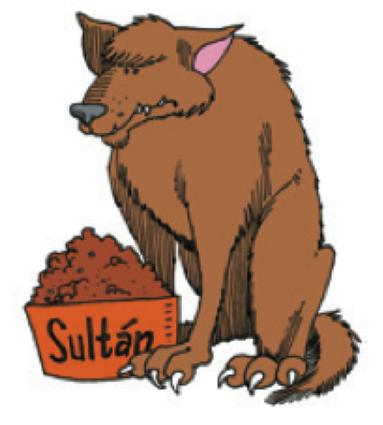
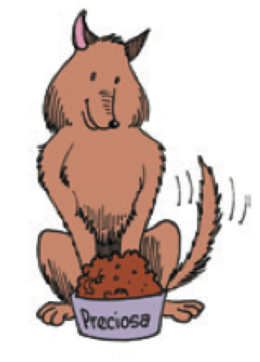

```{r setup, include=FALSE, cache=FALSE}
options(htmltools.dir.version = FALSE)
```

```{r}
#| label: xaringan-extra-all-the-things
#| echo: false
xaringanExtra::use_xaringan_extra(
  c("tile_view", "freezeframe")
)
```

class: inverse, center, middle
count: false

# Descarga en formato PDF [aquí](https://www.midd.jvcasillas.com/slides/5/index.pdf)

<!--
pagedown::chrome_print(
  input = here::here("5", "index.html"), 
  output = here::here("5", "index.pdf")
  )
--> 

---
count: false
class: center, middle
background-color: #2f5cb4

<iframe src="https://wall.sli.do/event/d6aXbQFnkHui9rX9hVdm3A?section=7c74fb24-a075-4d64-beef-0421960090b9" width="1000" height="600" style="border:none;"></iframe>

---
exclude: false

<iframe src="https://play.kahoot.it/v2/?quizId=93313c7b-2046-44ae-bc94-9f2163033272" width="1000" height="600" style="border:none;"></iframe>


---

# Un repaso: el verbo gustar

.Large[
- El verbo gustar usa dos formas: **gusta y gustan**
- Un complemento indirecto expresa **a quién** le gusta.  
(**me, te, le, nos, os, les**)
]

</br>

.Large[
- Me gusta la blusa.
- A Sara le gustan las camisas. 
]

---

# Otros verbos como gustar: interesar y encantar

.Large[

- A Sara le gusta la clase de inglés. 
- Me encanta la clase de biología. 
- Nos interesan las ciencias. 

]

</br>

--

.Large[
|     |    |  **Singular** |    | <blue>Plural</blue> |
| :-- | :- | :------------ | :- | :------------- | 
| 1a  |    | <black>me</black> encanta(n) |    | <black>nos</black> encanta(n) |
| 2a  |    | <black>te</black> encanta(n) |    | <black>os</black> encanta(n)  |
| 3a  |    | <black>le</black> encanta(n) |    | <black>les</black> encanta(n) |
| | &nbsp; &nbsp; &nbsp; | | &nbsp; &nbsp; &nbsp; | |

|     |    |  **Singular**  |    | <blue>Plural</blue> |
| :-- | :- | :------------- | :- | :------------------ |
| 1a  |    | <black>me</black> interesa(n) |    | <black>nos</black> interesa(n)     |
| 2a  |    | <black>te</black> interesa(n) |    | <black>os</black> interesa(n)      |
| 3a  |    | <black>le</black> interesa(n) |    | <black>les</black> interesa(n)     |
| | &nbsp; &nbsp; &nbsp; | | &nbsp; &nbsp; &nbsp; | |
]

---

# Otros verbos como gustar: importar, faltar y quedar

### Importar > importa / importan

.Large[
- A Marisa no le importa el precio.
]

<p></p>

--

### Faltar > falta / faltan

.Large[
- Les falta un dólar.
]

<p></p>

--

### Quedar > queda / quedan

.Large[
- No me quedan más suéteres azules
]

---

# Otros verbos como gustar: parecer 

### ¡**OJO**! Va acompañado de un adjetivo.

.Large[
- **Nos** *parecen* ***caros*** *esos pantalones*. 
- Pantalones > masculino, plural
]

<p></p>

--

.Large[
- Me pareció divertid**a** la película.
- la película > femenina, singular
]

<p></p>

--

### ¿Qué te parece(n)...

.Large[
- el club de cocina?
- las fiestas en el grill?
- la comida de proctor?
- los partidos de fútbol?
]

---

# Otros verbos como gustar: quedar 

### Se puede utilizar para hablar de la ropa

.Large[
- Se usa con bien / mal.
- Me quedan **bien** esos pantalones.
]

<p></p>

--

.Large[
- Se usa con los adjetivos para describir más.
- Le quedan **un poco apretados** esos zapatos.
]

---

# Verbos como gustar

.pull-left[

### ¿Qué tienen en común?

]

.pull-right[
.Large[
- gustar
- encantar
- interesar
- importar
- faltar
- parecer
- quedar
]
]

--

.footnote[el complemento indirecto]

---

# Ahora prueba tú

### Construye preguntas y respuestas con estos componentes

.Large[
Ej. parecer/el libro de Cervantes/a tu amiga  
]
--

.Large[
¿Qué **le** .RUred[parece] .grey[el libro de Cervantes] **a tu amiga**?  
]
--

.Large[
(**A mi amiga**) **le** .RUred[parece] muy .grey[aburrido]. 
]

--

.Large[
1. parecer/las clases de filosofía/a ti
2. parecer/los amigos de mi novi@/a ti
3. parecer/la cerveza switchback/a nosotros
4. parecer/estos ejercicios/a ustedes
5. parecer/la lluvia/a vosotros
]

--

.Large[
¡Ahora pon las frases en el pasado!
]

---

# Ahora prueba tú

### Construye preguntas y respuestas con estos componentes

.large[
Ej. parecer/el libro de Cervantes/a tu amiga  
¿Qué **le** .RUred[parece] .grey[el libro de Cervantes] **a tu amiga**?  
(**A mi amiga**) **le** .RUred[parece] muy .grey[aburrido]. 
]

1. parecer/las clases de filosofía/a ti  
.grey[¿Qué te parecen las clases de filosofía?<br> Me parecen fantásticas.]
2. parecer/los amigos de mi novi@/a ti  
.grey[¿Qué te parecen los amigos de mi novia?<br> Me parecen divertidos.]
3. parecer/la cerveza switchback/a nosotros  
.grey[¿Qué nos parece las cerveza switchback?<br> Nos parece deliciosa.]
4. parecer/estos ejercicios/a ustedes  
.grey[¿Qué les parecen estos ejercicios?<br> Nos parecen difíciles.]
5. parecer/la lluvia/a vosotros  
.grey[¿Qué os parece la lluvia?<br> ¡Nos parece fatal!]

---

# Ahora prueba tú

### Construye preguntas y respuestas con estos componentes

.Large[
Ej. parecer/el senderismo/a los estudiantes (encantar)  
]

--

.Large[
¿Qué **les** .RUred[parece] .grey[el senderismo] **a los estudiantes**?  
]
--

.Large[
(**A los estudiantes**) **les** .RUred[encanta] (.grey[el senderismo]). 
]

--

.Large[
1. parecer/la tarea/a los niños (encantar)
2. parecer/Jeff Bezos/a ti (interesar/no interesar)
3. parecer/el cambio climático/a la juventud (important/no importar)
4. parecer/las fiestas de la escuela de español/a ustedes (dar igual)
5. parecer/la poesía de Neruda/a nosotros (fascinar)
]

--

.Large[
¡Ahora pon las frases en el pasado!
]

---

# Ahora prueba tú

### Construye preguntas y respuestas con estos componentes

.large[
Ej. parecer/el senderismo/a los estudiantes (encantar)  
¿Qué **les** .RUred[parece] .grey[el senderismo] **a los estudiantes**?  
(**A los estudiantes**) **les** .RUred[encanta] (.grey[el senderismo]). 
]

1. parecer/la tarea/a los niños (encantar)  
.grey[¿Qué les parece la tarea a los niños?<br>A los niños les encanta la tarea.]
2. parecer/Jeff Bezos/a ti (interesar/no interesar)  
.grey[¿Qué te parece Jeff Bezos?<br>A mí no me interesa Jeff Bezos para nada.]
3. parecer/el cambio climático/a la juventud (important/no importar)  
.grey[¿Qué le parece el cambio climático a la juventud?<br>A la juventud le importa mucho.]
4. parecer/las fiestas de la escuela de español/a ustedes (dar igual)  
.grey[¿Qué les parecen las fiestras de la escuela de español a ustedes?<br>A nosotros nos dan igual las fiestas.]
5. parecer/la poesía de Neruda/a nosotros (fascinar)  
.grey[¿Qué nos parece la poesía de Neruda a nosotros?<br>¡A nosotros nos fascina!]

---


exclude: false
.large[

Martín le escribe una carta a su mejor amigo Javier para contarle lo que hizo durante el fin de semana en la Escuela Española de Middlebury College. Conjuga los verbos en el pretérito.  

Hola Javier,  

Ya llevo 3 semanas en la Escuela Española y creo que he aprendido mucho. El fin de semana pasado ______________ (1. estar) genial. El viernes por la noche mis amigos y yo fuimos a un concierto de poesía y jazz. A mí no ______________ (2. gustar (me)) mucho la poesía, pero los músicos ______________ (3. tocar) muy bien. Después, ______________ (4. caminar (yo)) al Grill para tomar un batido de chocolate. ______________ (5. encontrarse (yo)) con unos amigos de mi clase de Comunicación y ______________ (6. salir (nosotros)) para Dos Hermanos. El sábado por la noche ______________ (7. cantar (yo)) una canción en español en la fiesta de karaoke. Luego, ______________ (8. beber) dos o tres cervezas y ______________ (9. regresar) a mi habitación. Fue un fin de semana divertido. Espero que el siguiente sea igual.

Un saludo,  
Martín

]

---
exclude: false

.large[

Martín le escribe una carta a su mejor amigo Javier para contarle lo que hizo durante el fin de semana en la Escuela Española de Middlebury College. Conjuga los verbos en el pretérito.  

Hola Javier,  

Ya llevo 3 semanas en la Escuela Española y creo que he aprendido mucho. El fin de semana pasado **estuvo** genial. El viernes por la noche mis amigos y yo fuimos a un concierto de poesía y jazz. A mí no **gustó** mucho la poesía, pero los músicos **tocaron** muy bien. Después, **caminé** al Grill para tomar un batido de chocolate. **Me encontré** con unos amigos de mi clase de Comunicación y **salimos** para Dos Hermanos. El sábado por la noche **canté** una canción en español en la fiesta de karaoke. Luego, **bebí** dos o tres cervezas y **regresé** a mi habitación. Fue un fin de semana divertido. Espero que el siguiente sea igual.  

Un saludo,  
Martín
]


---
exclude: false

# Resumen - los tiempos verbales

### Las conversaciones normalmente incluyen el presente, el pasado y el futuro.

**Carmen**: Oye, Silvia, ¿Qué <black>vas a hacer</black> este fin de semana?  

.RUred[Silvia]: ¡<black>Voy a estudiar</black>! La próxima semana <black>va a ser</black> muy ajetreada.  

**Carmen**: Chica, prácticamente <black>vives</black> en la biblioteca.  

.RUred[Silvia]: Sí, <black>es</black> cierto. Pero, ¿sabes?, <black>me gusta estudiar</black>. Mis clases <black>son</black> muy interesantes y <black>me encantan</black> mis profesores.  

**Carmen**: ¿Y el profesor Suárez?  

.RUred[Silvia]: Bueno, él sí <blac>es</blac> quisquilloso. La semana pasada nos <black>dio</black> un examen sobre la época medieval y <black>fue</black> dificilísimo. 

---
exclude: false

# Resumen - los tiempos verbales

### El futuro puede expresarse con verbos en el tiempo presente.

- Ir + a + infinitivo
  - **Voy a estudiar** este fin de semana.

--
exclude: false

- Expresiones del futuro
  - La próxima semana
  - el año que viene

--
exclude: false

- Otros verbos que expresan el futuro
  - **Pienso vivir** en la residencia el próximo semestre.
  - **Espero trabajar** en un banco en el futuro. 

---
exclude: false

# Resumen - los tiempos verbales

### El tiempo presente expresa las costumbres de la vida diaria.

--
exclude: false

- Palabras importantes: 
  - todos los días, frecuentemente, a menudo, a veces  

Todos los días estudio por dos o tres horas.

---
exclude: false

# Resumen - los tiempos verbales

### Se usa **el pretérito** para expresar el pasado.  


- UNA acción o evento que ocurrió UNA vez.

--
exclude: false

- una SERIE de acciones en el pasado.

--
exclude: false

- una acción que DURÓ un tiempo específico.

--
exclude: false

- UN EVENTO ESPECÍFICO en el pasado.

</br>

**Palabras asociadas al pretérito:**

--
exclude: false

- ayer, la semana pasada, el año pasado, primero, luego
- antes de/después de + infinitivo, por último

---
exclude: false

# Ahora, identifiquen los tiempos verbales en esta conversación:

**Carmen**: Oye, Silvia, ¿Qué <black>vas a hacer</black> este fin de semana?  

.RUred[Silvia]: ¡<black>Voy a estudiar</black>! La próxima semana <black>va a ser</black> muy ajetreada.  

**Carmen**: Chica, prácticamente <black>vives</black> en la biblioteca.  

.RUred[Silvia]: Sí, <black>es</black> cierto. Pero, ¿sabes?, <black>me gusta estudiar</black>. Mis clases <black>son</black> muy interesantes y <black>me encantan</black> mis profesores.  

**Carmen**: ¿Y el profesor Suárez?  

.RUred[Silvia]: Bueno, él sí <blac>es</blac> quisquilloso. La semana pasada nos <black>dio</black> un examen sobre la época medieval y <black>fue</black> dificilísimo. 


---

# Prueba (en parejas)

Hola Javier,  

Ya llevo muchas semanas en la Escuela Española y creo que me estoy volviendo 
loco. La semana pasada yo (ver) que no siempre es divertido estar en 
Middlebury. Los profesores me (dar) mucha tarea y yo (estar) 
enfermo durante 2 días. Mis amigos y yo (querer) ir al lago Dunmore, 
pero no (haber) manera con tanta tarea. Al final nosotros (ir) 
al grill cada noche para estudiar más. Por si te parece poco, mi mejor amigo 
(tener) que dejar el programa porque tenía demasiado estrés y se le 
(caer) todo el pelo. 

Él (ponerse) malo después de las pruebas del profesor Joseph. La semana 
pasada yo te (decir) que me encantaba Middlebury, pero yo (llegar) 
a la conclusión de que echo de menos a mi madre y no sé para qué yo 
(venir). Le escribí una carta en español pero creo que ella ni la 
(leer). ¿Cómo (poder) aguantar todo esto durante 7 semanas? Yo 
(buscar) información en la oficina de los bilingües, pero ni modo. 
Espero sobrevivir hasta el final. Si no me ves dentro de dos semanas, es 
porque me (matar) la comida de Proctor.  

Con mucho miedo,  
Martín

---

# Prueba (en parejas)

Hola Javier,  

Ya llevo muchas semanas en la Escuela Española y creo que me estoy volviendo 
loco. La semana pasada yo .RUred[vi] que no siempre es divertido estar en 
Middlebury. Los profesores me .RUred[dieron] mucha tarea y yo .RUred[estuve] 
enfermo durante 2 días. Mis amigos y yo .RUred[quisimos] ir al lago Dunmore, 
pero no .RUred[hubo] manera con tanta tarea. Al final nosotros .RUred[fuimos] 
al grill cada noche para estudiar más. Por si te parece poco, mi mejor amigo 
.RUred[tuvo] que dejar el programa porque tenía demasiado estrés y se le 
.RUred[cayó] todo el pelo. 

--

Él .RUred[se puso] malo después de las pruebas del profesor Joseph. La semana 
pasada yo te .RUred[dije] que me encantaba Middlebury, pero yo .RUred[llegué] 
a la conclusión de que echo de menos a mi madre y no sé para qué yo 
.RUred[vine]. Le escribí una carta en español pero creo que ella ni la 
.RUred[leyó]. ¿Cómo .RUred[pudiste] aguantar todo esto durante 7 semanas? Yo 
.RUred[busqué] información en la oficina de los bilingües, pero ni modo. 
Espero sobrevivir hasta el final. Si no me ves dentro de dos semanas, es 
porque me mató la comida de Proctor.  

Con mucho miedo,  
Martín

---


class: inverse, middle

<div style="float:right">
  
</div>

### Era una noche fría de invierno. Yo estaba en casa, sola y 
### aburrida. Bueno, no estaba completamente sola, porque 
### allí a mi lado, tenía mi gato. Mi gato se llamaba Tigre y 
### era un gato de esos egoístas y fríos. Normalmente, Tigre 
### pasaba la noche en el dormitorio donde dormía debajo de mi cama. Pero esa noche parecía un 
### poco nervioso y se escondía detrás de los cojines del sofá. De repente, Tigre saltó del sofá 
### y corrió a la puerta. Yo lo seguí y abrí la puerta con cuidado...

---
class: inverse, middle

<div style="float:right">
  
</div>

### .RUred[Era] una noche fría de invierno. Yo .RUred[estaba] en casa, sola y 
### aburrida. Bueno, no .RUred[estaba] completamente sola, porque 
### allí a mi lado, .RUred[tenía] mi gato. Mi gato se .RUred[llamaba] Tigre y 
### .RUred[era] un gato de esos egoístas y fríos. Normalmente, Tigre 
### .RUred[pasaba] la noche en el dormitorio donde .RUred[dormía] debajo de mi cama. Pero esa noche .RUred[parecía] un 
### poco nervioso y se .RUred[escondía] detrás de los cojines del sofá. De repente, Tigre saltó del sofá 
### y corrió a la puerta. Yo lo seguí y abrí la puerta con cuidado...

---
class: inverse, middle, center

# El imperfecto

---

# El imperfecto 

## En un cuento, el imperfecto describe el trasfondo de la historia y crea una imagen. 

--

### .RUred[Era] una noche fría de invierno. Yo .RUred[estaba] en casa, sola y aburrida. Bueno, no .RUred[estaba] completamente sola, porque allí a mi lado, .RUred[tenía] mi gato. Mi gato se .RUred[llamaba] Tigre y .RUred[era] un gato de esos egoístas y fríos. Normalmente, Tigre .RUred[pasaba] la noche en el dormitorio donde .RUred[dormía] debajo de mi cama. Pero esa noche .RURed[parecía] un poco nervioso y .RUred[se escondía] detrás de los cojines del sofá.

--

.pull-left[

- la hora, la fecha, el lugar
- describir el lugar, a los personajes

]

.pull-right[

- describir las costumbres
- ¿Qué pasa en este momento?

]

---

# El pretérito

## En un cuento, el pretérito narra los eventos importantes del cuento.

--

### Era una noche fría de invierno. Yo estaba en casa, sola y aburrida. Bueno, no estaba completamente sola, porque allí a mi lado, tenía mi gato. Mi gato se llamaba Tigre y era un gato de esos egoístas y fríos. Normalmente, Tigre pasaba la noche en el dormitorio donde dormía debajo de mi cama. Pero esa noche parecía un poco nervioso y se escondía detrás de los cojines del sofá.  
###<black>*De repente*, Tigre **saltó** del sofá y **corrió** a la puerta. Yo lo **seguí** y **abrí** la puerta con cuidado.

---

# En combinación...

- Describimos más con **el imperfecto**. 
- Continuamos y resumimos con <blue>el pretérito</blue>.

<p></p>

--

### .RUred[El imperfecto]:

- Afuera, .RUred[nevaba] un poco.
- La luna .RUred[brillaba] como el sol, pero afuera no se .RUred[veía] a nadie.

<p></p>

--

### **El pretérito**:

- **Cerré** la puerta y **volví** a sentarme en el sofá. 
- **Fue** una experiencia un poco inquietante.

---
class: inverse, middle

<div style="float:right">
  
</div>

### .RUred[Era] una noche fría de invierno. Yo .RUred[estaba] en casa, sola y 
### aburrida. Bueno, no .RUred[estaba] completamente sola, porque 
### allí a mi lado, .RUred[tenía] mi gato. Mi gato se .RUred[llamaba] Tigre y 
### .RUred[era] un gato de esos egoístas y fríos. Normalmente, Tigre 
### .RUred[pasaba] la noche en el dormitorio donde .RUred[dormía] debajo de mi cama. Pero esa noche .RUred[parecía] un 
### poco nervioso y se .RUred[escondía] detrás de los cojines del sofá. De repente, Tigre saltó del sofá 
### y corrió a la puerta. Yo lo seguí y abrí la puerta con cuidado...

---


# El pretérito y el imperfecto: 

.pull-left[

### **¿Cómo era?**

]

.pull-right[

### .RUred[¿Qué pasó?]

]

### **Había** una vez una princesa muy hermosa. Una tarde de primavera, la princesa **cantaba** y **paseaba** por el parque del palacio cuando .black[de repente] .RUred[oyó] una voz muy bajita. .RUred[Miró] a su alrededor y .RUred[vio] un sapo que le **sonreía** desde el suelo...

---

# El pretérito y el imperfecto: 

- **Dos acciones**: el imperfecto describe las acciones continuas y simultáneas.

<p></p>

- **Palabras importantes**: 
  - mientras
  - mientras tanto

<p></p>

- Ángel .RUred[miraba] el desfile en la televisión mientras yo .RUred[cocinaba].

--

<div align="center">
  
</div>

---

# El pretérito y el imperfecto: 

- El pretérito **narra** una serie de acciones completadas.

- Después de mirar el desfile, Ángel **llamó** a su amiga y la **invitó** 
a salir. Primero **fueron** al cine y luego **miraron** los fuegos artificiales. 

--

<div align="center">
  
</div>

---

# El pretérito y el imperfecto: 

- .RUred[El imperfecto] expresa una acción continua. 
- **El pretérito** expresa su interrupción.

<p></p>

- Palabras importantes: 
  - mientras.... (el imperfecto)
  - cuando (el pretérito)

<p></p>

- **Empezó** a llover mientras .RUred[hacíamos] nuestro picnic.

--

<div align="center">
  
</div>

---
background-image: url(./assets/img/imperfecto3.png),  url(./assets/img/imperfecto4.png), url(./assets/img/imperfecto5.png)
background-position: 95% 20%, 95% 50%, 95% 80%
background-size: 500px, 500px, 500px

# Cuenta, cuenta, cuenta

### Cuéntale a tu vecino algo que hiciste durante el fin</br>de semana pasado

### Incluye lo siguiente:

- 2 oraciones que contengan acciones que ocurren</br>al mismo tiempo
- 2 o más acciones que ocurran en secuencia
- 2 ejemplos de una acción que interrumpe otra

---
background-image: url("./assets/img/resumen.png")
background-size: contain


---
class: title-slide-section-blue

---

.pull-left[
.content-box-blue[
### **El pretérito**

- UNA acción o evento que ocurrió UNA vez.
- una SERIE de acciones completadas en el pasado.
- una acción que DURÓ un tiempo específico.
- UN EVENTO ESPECÍFICO en el pasado.
- Palabras asociadas al pretérito:  
.RUred[ayer], .RUred[la semana pasada], .RUred[el año pasado], .RUred[primero], .RUred[luego], .RUred[antes de/después de + infinitivo], .RUred[por último]

]
]

--

.pull-right[
.content-box-red[
### .RUred[El imperfecto]

- describe el trasfondo de la historia, crea una imagen
- describe la hora, la fecha, el lugar, a los personajes, las costumbres
- explica qué estaba pasando en un momento del pasado

]
]

--

### El pretérito y el imperfecto para narrar

- Describimos más con el imperfecto.
- Continuamos y resumimos con el pretérito

1. Dos acciones que ocurren al mismo tiempo
2. Una secuencia de acciones completadas 
3. Una acción que interrumpe otra acción continua

---
background-image: url("./assets/img/maya1.JPG")
background-size: 750px
background-position: 130% 50%
class: inverse

# .RUred[Maya]

### Érase una vez una golden retriever que  
### .RUred[se llamaba] Maya. Maya .RUred[era] la perra más  
### bonita y mejor portada de toda la ciudad
### de Tucson. Le .RUred[brillaba] el pelo y .RUred[sonreía]  
### sin parar. Le .RUred[gustaba] mucho perseguir a los  
### otros animales y siempre .RUred[quería] jugar con  
### todo el mundo.

---
background-image: url("./assets/img/maya2.JPG")
background-size: 1220px
background-position: 50% -90%
background-color: #C0C0C0
class: middle

</br></br></br></br></br></br></br></br></br>
</br></br></br></br></br></br></br></br></br>
</br></br></br>

### El mejor amigo de Maya .RUred[se llamaba] Joseph. .RUred[Era] estudiante graduado y siempre .RUred[estaba] muy ocupado con sus clases. A Joseph .RUred[le encantaba] jugar con Maya, pero a veces no .RUred[podía] porque .RUred[tenía] mucho trabajo. 

---
background-image: url("./assets/img/maya3.gif")
background-size: 750px
background-position: 140% 50%
class: inverse, middle

### A Maya no .RUred[le importaban] las clases de Joseph.  
### Ella .RUred[creía] que Joseph .RUred[trabajaba] demasiado e  
### .RUred[intentaba] recordarle de vez en cuando que .RUred[era] 
### necesario tener tiempo para jugar también.

---
background-image: url("./assets/img/maya4.JPG")
background-size: 1300px
background-position: 60% 40%
class: bottom, inverse

### Un día Joseph y Maya .purple[fueron] al parque. .RUred[Hacía] mucho sol y no .RUred[había] nadie más ahí. .RUred[Hacía] un día estupendo. Joseph .purple[decidió] llevar su trabajo de clase para poder estudiar mientras Maya .RUred[jugaba]. 

---

# Maya

<div style="float:right">
  <video width="450" allowfullscreen controls>
    <source src="./assets/videos/maya.mp4" type="video/mp4">
    <source src="./assets/videos/maya.ogg" type="video/ogg">
  </video>
</div>

.pull-left[

### Pero a Maya no .RUred[le importaban] las clases ni la tarea de Joseph. De repente Maya .purple[se dio] cuenta de Joseph no le .RUred[prestaba] atención y .purple[empezó] a correr hacia él lo más rápido que .RUred[podía].

]

--

.pull-left[

### Cuando Joseph .purple[se dio] cuenta, ya .RUred[era] demasiado tarde. Maya .purple[chocó] con él a toda velocidad y .purple[rompió] su teléfono. Confundido y algo dolido, Joseph .purple[decidió] que nunca más .RUred[iba] a llevar su trabajo al parque. 

]

---
background-image: url("./assets/img/mayaFinal1.jpg"), url("./assets/img/mayaFinal2.jpg")
background-size: 600px, 700px
background-position: 0% 50%, 100% 50%
class: bottom, center

# ¡.RUred[Fueron felices y comieron perdices]!

---
background-image: url("./assets/img/mayaFinal3.png")
background-size: contain
class: center, middle, inverse

# Fin

---


# El imperfecto

1)     
- **Dos acciones**: el imperfecto describe las acciones continuas y simultáneas.

<div align="center">
    
</div>

2)    
- El pretérito **narra** una serie de acciones completadas.

<div align="center">
    
</div>

---

# El imperfecto

3)    
- El imperfecto expresa una **acción continua**.  
- El pretérito expresa su <blue>interrupción</blue>.

<div align="center">
    
</div>

---

# Más práctica

<div style="float: right">
  </br></br>
  </br></br>
    
</div>

- Escribe dos ejemplos de cada situación

---

background-image: url("./assets/img/crazy1.jpg"), url("./assets/img/crazy2.jpg"), url("./assets/img/crazy3.jpg")
background-size: 300px
background-position: 95% 2%, 95% 47%, 95% 90%

# Con un compañero...

### Narración en el pasado

.pull-left[

- Con un/a compañer@, desarrollad un cuento corto (9-10 frases) acerca de lo que hicieron estas 'personas' durante el fin de semana (escoged una imagen).
- Después de terminar el cuento haced una lista de todos los verbos
- Marcad... 
  - el tiempo verbal (pretérito, imperfecto, presente perfecto, presente, presente progresivo)
  - la persona
  - si es singular o plural

]

---

# Una luna de miel

### Día 1

(1. Ser) \_\_\_\_\_\_\_\_\_\_\_\_\_\_\_\_ las diez de la noche. Nosotros (2. tener) \_\_\_\_\_\_\_\_\_\_\_\_\_\_\_\_ hambre. A las diez y media, (3. decidir) \_\_\_\_\_\_\_\_\_\_\_\_\_\_\_\_ pedir comida del restaurante del hotel. Mientras nosotros (4. esperar) \_\_\_\_\_\_\_\_\_\_\_\_\_\_\_\_ la comida, René y yo (5. dormirse) \_\_\_\_\_\_\_\_\_\_\_\_\_\_\_\_. De repente, alguien (6. tocar) \_\_\_\_\_\_\_\_\_\_\_\_\_\_\_\_ la puerta. René (7. despertarse) \_\_\_\_\_\_\_\_\_\_\_\_\_\_\_\_ y (8. abrir) \_\_\_\_\_\_\_\_\_\_\_\_\_\_\_\_ la puerta. (10. llevar) \_\_\_\_\_\_\_\_\_\_\_\_\_\_\_\_ un uniforme de prisionero. El hombre (11. entrar) \_\_\_\_\_\_\_\_\_\_\_\_\_\_\_\_ en la habitación y (12. repetir) \_\_\_\_\_\_\_\_\_\_\_\_\_\_\_\_ dos veces "¡Silencio o los mato!" Segundos después el camarero (13. anunciar) \_\_\_\_\_\_\_\_\_\_\_\_\_\_\_\_ su llegada. Después de un minuto, el prisionero (14. decir) \_\_\_\_\_\_\_\_\_\_\_\_\_\_\_\_, "¡Váyase! No queremos nada". Luego la policía (15. llegar) \_\_\_\_\_\_\_\_\_\_\_\_\_\_\_\_. En cinco minutos, todo (16. terminar) \_\_\_\_\_\_\_\_\_\_\_\_\_\_\_\_. Entonces, nosotros (17. saber) \_\_\_\_\_\_\_\_\_\_\_\_\_\_\_\_ que el prisionero (18. ser) \_\_\_\_\_\_\_\_\_\_\_\_\_\_\_\_ un asesino muy conocido. 

### Día 2

Por la mañana, René y yo (19. despertarse) \_\_\_\_\_\_\_\_\_\_\_\_\_\_\_\_ y (20. irse) \_\_\_\_\_\_\_\_\_\_\_\_\_\_\_\_ a casa. ¡Qué luna de miel!

---

# Una luna de miel

### Día 1

(1. Ser) **Eran** las diez de la noche. Nosotros (2. tener) **teníamos** hambre. A las diez y media, (3. decidir) **decidimos** pedir comida del restaurante del hotel. Mientras nosotros (4. esperar) **esperábamos** la comida, René y yo (5. dormirse) **nos dormimos**. De repente, alguien (6. tocar) **tocó** la puerta. René (7. despertarse) **se despertó** y (8. abrir) **abrió** la puerta. (10. llevar) **Llevaba** un uniforme de prisionero. El hombre (11. entrar) **entró** en la habitación y (12. repetir) **repitió** dos veces "¡Silencio o los mato!" Segundos después el camarero (13. anunciar) **anunció** su llegada. Después de un minuto, el prisionero (14. decir) **dijo**, "¡Váyase! No queremos nada". Luego la policía (15. llegar) **llegó**. En cinco minutos, todo (16. terminar) **terminó**. Entonces, nosotros (17. saber) **supimos** que el prisionero (18. ser) **era** un asesino muy conocido. 

### Día 2

Por la mañana, René y yo (19. despertarse) **nos despertamos** y (20. irse) **nos fuimos** a casa. ¡Qué luna de miel!

---


exclude: false
class: inverse, middle, center

# Los comparativos y los superlativos

---
exclude: false

# Las comparaciones de superioridad:

### *más* + (**adjetivo**, **adverbio**, **sustantivo**) + *que*  

<div align="center">
  <div style="float: right">
     
  </div>
  <div style="float:right">
     
  </div>
</div>

</br>

--

.Large[
- Sultán es *más* **grande** *que* Preciosa.
]

--

.Large[
- Sultán come *más* **rápidamente** *que* Preciosa.
]

--

.Large[
- Sultán tiene *más* **energía** *que* Preciosa.
]

---
exclude: false

# Las comparaciones de inferioridad:

### *menos* + (**adjetivo**, **adverbio**, **sustantivo**) + *que*  

<div align="center">
  <div style="float: right">
     
  </div>
  <div style="float:right">
     
  </div>
</div>

</br>

--
exclude: false

.Large[
- Lobo es *menos* **grande** *que* Preciosa.
]

--
exclude: false

.Large[
- Lobo duerme *menos* **tranquilamente** *que* Preciosa.
]

--
exclude: false

.Large[
- Lobo tiene *menos* **juguetes** *que* Preciosa.
]

---
exclude: false

# Las comparaciones irregulares:

.Large[
- Lobo es **menor** que Preciosa.
]

--
exclude: false

.Large[
- Preciosa es **mayor** que Lobo.
]

--
exclude: false

.Large[
- La personalidad de Preciosa es **mejor** que la personalidad de Lobo.
]

--
exclude: false

.Large[
- La personalidad de Lobo es **peor** que la personalidad de Sultán.
]

---
exclude: false

# Las comparaciones de igualdad:

### *tan* + (**adjetivo**, **adverbio**) + *como*  

<div align="center">
  <div style="float: right">
     
  </div>
  <div style="float:right">
     
  </div>
</div>

</br>

--
exclude: false

.Large[
- Lobo es *tan* **malo** *como* Sultán.
]

--
exclude: false

.Large[
- Lobo corre *tan* **rápidamente** *como* Sultán.
]

---
exclude: false

# Las comparaciones de igualdad:

### *tanto(s), tanta(s)* + (**sustantivo**) + *como*  

<div align="center">
  <div style="float: right">
     
  </div>
  <div style="float:right">
     
  </div>
</div>

</br>

--
exclude: false

.Large[
- Lobo tiene *tantos* **juguetes** *como* Sultán.
]

--
exclude: false

.Large[
- Lobo tiene *tanta* **energía** *como* Sultán.
]

--
exclude: false

.Large[
- ¡OJO! Lobo come **tanto como** Sultán.
]

---
exclude: false

# Los superlativos expresan los extremos

### *el, la, los, las* + (**sustantivo**) + *más/menos* +  (**adjetivo**) de un grupo

<div align="center">
  <div style="float: right">
     
  </div>
  <div style="float:right">
     
  </div>
</div>

</br>

--
exclude: false

.Large[
- Sultán es *el* **perro** *más* **grande** de los tres.
]

--
exclude: false

.Large[
- Lobo es *el* *menos* **grande** pero *el* *más* **feroz** del grupo.
]

---
exclude: false
background-image: url(./assets/img/maya1.JPG), url(./assets/img/preciosa.png)
background-position: 10% 60%, 90% 60%
background-size: 300px, 300px

# Comparad...

---
exclude: false
background-image: url(./assets/img/maya4.JPG), url(./assets/img/uglycat.jpg)
background-position: 10% 60%, 90% 60%
background-size: 500px, 400px

# Comparad...

---
exclude: false
background-image: url(https://raw.githubusercontent.com/jvcasillas/media/master/teaching/gifs/partner2.gif)
background-size: contain

# Comparad...

---
exclude: false
class: center, middle
background-image: url(https://pbs.twimg.com/profile_images/1382649485705220098/8DIERl-H_400x400.jpg), url(./assets/img/pato.png)
background-size: 400px, 400px
background-position: 10% 60%, 90% 60%

# Pocoyó <br>y<br> Pato

---
exclude: false
background-image: url(https://pbs.twimg.com/media/D1NxyxmXcAApAvD.jpg)
background-size: contain

.pull-right[
.center[
.Large[
## **Eli** <br>y<br>**Lula**
]
]
]

---
exclude: false

# A practicar

### Haced diferentes comparaciones

Modelo: Los perros / los gatos  
--
exclude: false

Los perros son .red[más] .blue[simpáticos] .green[que] los gatos  
Los gatos son .red[más] .blue[pequeños] .green[que] los perros  
Los gatos son .red[tan] .blue[divertidos] .green[como] los perros  
Los perros duermen .blue[tanto como] los gatos

--
exclude: false

.Large[
1. Middlebury / Nueva York
2. Nivel 1.5 / Nivel 4
3. Maya / Kino 
4. El español / el francés
5. La comida de Proctor / La comida del grill
6. El pretérito / el imperfecto
7. La clínica de pronunciación / el club de Quijote
8. La playa / las montañas
]


---
exclude: true

# Lo que hemos visto

.pull-left[

- Sustantivos y artículos

- Pronombres personales

- Estar, ser, tener, ir 

- Posesión

- Verbos regulares 

- Verbos como “gustar”

- Cómo hacer preguntas

- El presente progresivo 

- Verbos de cambio radical

- Verbos irregulares 

- El futuro 

]

.pull-right[

- Ser y estar 

- Verbos reflexivos

- Complemento directo 

- Complemento indirecto 

- Dos complementos juntos

- Comparativo

- El pretérito 

- Pretérito irregular 

- Los adjetivos

- El imperfecto 

- Pretérito vs. Imperfecto 

]
