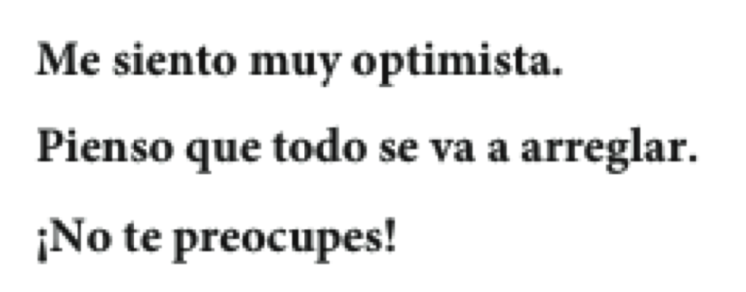
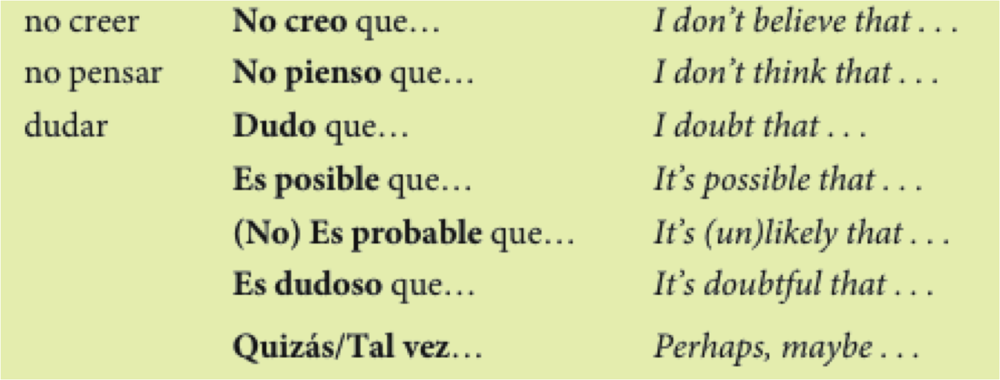
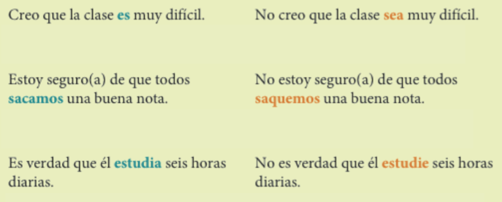
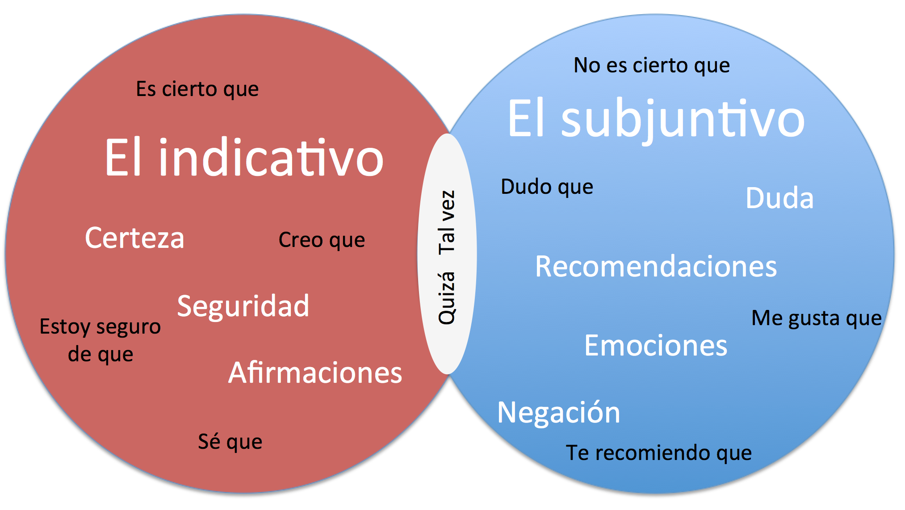
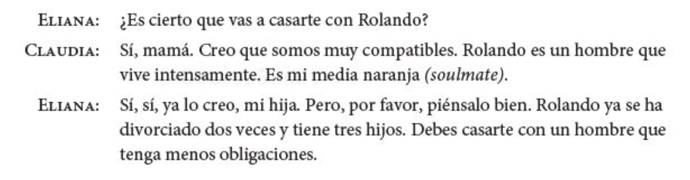

```{r setup, include=FALSE, cache=FALSE}
options(htmltools.dir.version = FALSE)
library("tidyverse")
```


```{r}
#| label: xaringan-extra-all-the-things
#| echo: false
xaringanExtra::use_xaringan_extra(
  c("tile_view", "freezeframe")
)
```

class: inverse, center, middle
count: false

# Descarga en formato PDF [aquí](https://www.midd.jvcasillas.com/slides/6/index.pdf)

<!--
pagedown::chrome_print(
  input = here::here("6", "index.html"), 
  output = here::here("6", "index.pdf")
  )
--> 

---
count: false
class: center, middle
background-color: #2f5cb4

<iframe src="https://wall.sli.do/event/d6aXbQFnkHui9rX9hVdm3A?section=7c74fb24-a075-4d64-beef-0421960090b9" width="1000" height="600" style="border:none;"></iframe>

---
exclude: false

<iframe src="https://play.kahoot.it/v2/?quizId=93313c7b-2046-44ae-bc94-9f2163033272" width="1000" height="600" style="border:none;"></iframe>


---

# Cuenta, cuenta, cuenta

### Cuéntale a tu vecino algo que hiciste durante el fin de semana pasado

### Incluye lo siguiente:

- 1 oración que contenga acciones que ocurren al mismo tiempo
- 1 o más acciones que ocurran en secuencia
- 1 ejemplo de una acción que interrumpe otra
- ~~1 oración en la que enfatices que una acción ocurre antes que la otra~~

---

background-image: url(./assets/img/subjlogico.jpg)
background-position: 95% 30%
background-size: 400px

# Repasito

### ¿Cómo formamos el subjuntivo en el presente?

--

- **forma "yo"** > **quitar la "o"** > **añadir la vocal opuesta**

--

### ¿Qué tiene en común con los mandatos formales?

--

- **Se forma de la misma manera**

--

### ¿En qué se diferencia de los mandatos formales?

--

- **Los pronombres se colocan antes del verbo conjugado**

---

# Para dar consejos

<div align="center">
    

  
</div>

---

# Las expresiones de influencia

<div align="center">
  
</div>

---

# El subjuntivo: 

- Cómo influir sobre los demás

<div align="center">
  
</div>

---

# Para formar el subjuntivo:

</br>

<!-- <div align="center">
  
</div> -->

| El presente del subjuntivo |    |      -ar      |    |    -er    |    |    -ir     |
| :------------------------- | :- | :------------ | :- | :-------- | :- | :--------- |
|                            |    | **descansar** |    | **hacer** |    | **salir**  |
|                            |    | (yo descans-) |    | (yo hag-) |    | (yo salg-) |
| que yo                     |    | descanse      |    | haga      |    | salga      |
| que tú                     |    | descanses     |    | hagas     |    | salgas     |
| que el/ella/Ud.            |    | descanse      |    | haga      |    | salga      |
| que nosotros               |    | descansemos   |    | hagamos   |    | salgamos   |
| que vosotros               |    | descanséis    |    | hagáis    |    | salgáis    |
| que ellos/ellas/Uds.       |    | descansen     |    | hagan     |    | salgan     |
| | &nbsp; &nbsp; | | &nbsp; &nbsp; | | &nbsp; &nbsp; | |

---

# Los cambios ortográficos en el presente del subjuntivo

<div align="center">
  
</div>

---

# Los verbos irregulares en el presente del subjuntivo

<!-- <div align="center">
  
</div>
 -->

</br>

|                      |    |    ir   |    |  ser   |    |  estar  |    |  saber  |    |  dar  |
| :------------------- | :- | :------ | :- | :----- | :- | :------ | :- | :------ | :- | :---- |
| que yo               |    | vaya    |    | sea    |    | esté    |    | sepa    |    | dé    |
| que tú               |    | vayas   |    | seas   |    | estés   |    | sepas   |    | des   |
| que él/ella/Ud.      |    | vaya    |    | sea    |    | esté    |    | sepa    |    | dé    |
| que nosotros(as)     |    | vayamos |    | seamos |    | estemos |    | sepamos |    | demos |
| que vosotros(as)     |    | vayáis  |    | seáis  |    | estéis  |    | sepáis  |    | deis  |
| que ellos/ellas/Uds. |    | vayan   |    | sean   |    | estén   |    | sepan   |    | den   |
| | &nbsp; &nbsp; || &nbsp; &nbsp; || &nbsp; &nbsp; || &nbsp; &nbsp; || &nbsp; &nbsp; || 

---

# ¡No te confundas con los mandatos!

|                   |     |   Mandato informal  |     | Mandato formal |     | subjuntivo |
| :---------------- | :-- | :------------------ | :-- | :------------- | :-- | :--------- |
| yo                |     | --                  |     | --             |     | hable      |
| tú                |     | habla (no hables)   |     | --             |     | hables     |
| él/ella/usted     |     | --                  |     | hable (no hable)          |     | hable      |
| nosotros          |     | --                  |     | --             |     | hablemos   |
| vosotros          |     | hablad (no habléis) |     | --             |     | habléis    |
| ellos/ellas/usted |     | --                  |     | hablen (no hablen)        |     | hablen     |
| | &nbsp; &nbsp; | | &nbsp; &nbsp; | | &nbsp; &nbsp; | |

--

- ¡**OJO**! Los mandatos informales negativos tienen la misma forma que el subjuntivo 

---

# ¡No te confundas con los mandatos!

|                   |     |   Mandato informal  |     | Mandato formal |     | subjuntivo |
| :---------------- | :-- | :------------------ | :-- | :------------- | :-- | :--------- |
| yo                |     | --                  |     | --             |     | coma       |
| tú                |     | come (no comas)     |     | --             |     | comas      |
| él/ella/usted     |     | --                  |     | coma (no coma)          |     | coma       |
| nosotros          |     | --                  |     | --             |     | comamos    |
| vosotros          |     | comed (no comáis)   |     | --             |     | comáis     |
| ellos/ellas/usted |     | --                  |     | coman (no coman)         |     | coman      |
| | &nbsp; &nbsp; | | &nbsp; &nbsp; | | &nbsp; &nbsp; | |

--

- ¡**OJO**! Los mandatos informales negativos tienen la misma forma que el subjuntivo 

---

# ¡No te confundas con los mandatos!

|                   |     |   Mandato informal  |     | Mandato formal |     | subjuntivo |
| :---------------- | :-- | :------------------ | :-- | :------------- | :-- | :--------- |
| yo                |     | --                  |     | --             |     | abra       |
| tú                |     | abre (no abras)     |     | --             |     | abras      |
| él/ella/usted     |     | --                  |     | abra (no abra)          |     | abra       |
| nosotros          |     | --                  |     | --             |     | abramos    |
| vosotros          |     | abrid (no abráis)   |     | --             |     | abráis     |
| ellos/ellas/usted |     | --                  |     | abran (no abran)         |     | abran      |
| | &nbsp; &nbsp; | | &nbsp; &nbsp; | | &nbsp; &nbsp; | |

--

- ¡**OJO**! Los mandatos informales negativos tienen la misma forma que el subjuntivo 
---

# Los verbos de comunicación

.Large[

- aconsejar
- recomendar
- pedir
- sugerir
- prohibir

]

--

### Denles consejos a los futuros estudiantes de nivel 1.5 usando los verbos de comunicación

---

# Las vicisitudes del estudiante

<div align="center">
  
</div>

--

- ¿Qué vicisitudes tienes como estudiante en Middlebury?
- ¿Son diferentes fuera de Middlebury? ¿Cómo?

---

# Algunas quejas comunes

<div align="center">
  
</div>

</br>

--

- ¿Qué quejas tienes? Cuéntaselas a tu compañero
- ¿Qué consejos tienes para que se queje menos?

---
exclude: true

# Ejercicios

- 11-9, p. 388

- 11-13, p. 393 

- 2, p. 395

- 11-17, p. 396

- 11-19, p. 399

---


class: inverse, middle, center

# El condicional

---

# El condicional

- La forma **condicional** se utiliza para hablar de acciones hipotéticas o posibles
- Leed el siguiente párrafo e identificad los verbos en la forma condicional

<div align="center">
  
</div>

---

# El condicional

### La forma condicional describe lo que las personas ***harían*** o ***podrían*** hacer bajo ciertas circunstancias

.Large[
- Si tuviera mucho dinero, **compraría** un coche nuevo.
]

--

.Large[
- También, **iría** a las bahamas de vacaciones.
]

---

# El condicional

### La forma condicional se usa para indicar cortesía, sobre todo con los verbos **gustar**, **poder** y **deber**.

.Large[

- **Me gustaría** informarme sobre programas de estudios en Argentina.

- ¿**Podría** usted ayudarme?

- **Deberías** buscar la información por internet.

]

---

# El condicional

### La forma condicional se usa para indicar **probabilidad** o **duda** en el pasado

.Large[

- ¿Por qué no fue Paco a clase hoy?  
No sé. **Estaría** enfermo. 

]

---

# El condicional

|      forma       |    | terminación |    |      llegar     |    |      volver     |    |     vivir      |
| :--------------- | :- | :---------- | :- | :-------------- | :- | :-------------- | :- | :------------- |
| yo               |    | **ía**      |    | llegar**ía**    |    | volver**ía**    |    | vivir**ía**    |
| tú               |    | **ías**     |    | llegar**ías**   |    | volver**ías**   |    | vivir**ías**   |
| usted/él/ella    |    | **ía**      |    | llegar**ía**    |    | volver**ía**    |    | vivir**ía**    |
| nosotros         |    | **íamos**   |    | llegar**íamos** |    | volver**íamos** |    | vivir**íamos** |
| vosotros         |    | **íais**    |    | llegar**íais**  |    | volver**íais**  |    | vivir**íais**  |
| uds./ellos/ellas |    | **ían**     |    | llegar**ían**   |    | volver**ían**   |    | vivir**ían**   |
| | &nbsp; &nbsp; | | &nbsp; &nbsp; | | &nbsp; &nbsp; | | &nbsp; &nbsp; | | 

---

# Formas irregulares

| Verbo  |    | raíz irregular |    |       Ejemplos      |
| :----- | :- | :------------- | :- | :------------------ |
| decir  |    | dir-           |    | Yo diría            |
| hacer  |    | har-           |    | Tú harías           |
| tener  |    | tendr-         |    | Nosotros tendríamos |
| poner  |    | pondr-         |    | Vosotros pondríais  |
| venir  |    | vendr-         |    | Usteden vendrían    |
| salir  |    | saldr-         |    | Yo saldría          |
| saber  |    | sabr-          |    | Tú sabrías          |
| querer |    | querr-         |    | Ella querría        |
| poder  |    | podr-          |    | Él podría           |
| | &nbsp; &nbsp; | | &nbsp; &nbsp; | |

--

### ¿Qué harías si te tocara la lotería?

---


class: inverse, center, middle

# Más subjuntivo

---

# El subjuntivo: Las expresiones de emoción

<div align="center">
    
</div>

---

# Las expresiones de emoción

### **esperar**

- Esperamos que tu hermana **encuentre** empleo pronto.

--

### **sentir**

- Sentimos mucho que Uds. no **puedan** ir a la boda.

--

### **estar + adjetivo de emoción + de**

- Ramona está muy orgullosa de que su hijo **se gradúe**.

---

# Más expresiones de emoción

### **tener miedo de**

- Tengo miedo de que mi novia ya no me **quiera**.

--

### **ojalá**

- Ojalá (que) **sean** muy felices.

--

### **Es + adjetivo o sustantivo de emoción**

- Es ridículo que Sara no **piense** asistir a la boda.

---

# Los verbos como gustar en las expresiones de emoción

### **gustar**

- No nos gusta que no **se casen** por la iglesia.

--

### **alegrar**

- A mi padre le alegra que yo **siga** con mis estudios.

--

### **preocupar**

- Me preocupa que mis padres **se separen**.

---

# Los verbos como gustar en las expresiones de emoción

### **sorprender**

- ¿Te sorprende que **se comprometan**?

--

### **molestar**

- Les molesta que no **haya** una fiesta para celebrar la graduación.

--

### **enfadar**

- Me enfada que no **inviten** a mi novio a la fiesta.

---

# Los verbos con cambios en la raíz en el presente del subjuntivo

<!-- <div align="center">
    
</div> -->

|         -ar          |    e > ie   |      o > ue     |
| :------------------- | :---------- | :-------------- |
|                      | **pensar**  | **acostarse**   |
| que yo               | p**ie**nse  | me ac**ue**ste  |
| que tú               | p**ie**nses | te ac**ue**stes |
| que Ud./él/ella      | p**ie**nse  | se ac**ue**ste  |
| que nosotros(as)     | pensemos    | nos acostemos   |
| que vosotros(as)     | penséis     | os acostéis     |
| que Uds./ellos/ellas | p**ie**nsen | se ac**ue**sten |

</br>

- **e** > **ie**: despertarse, empezar, pensar, merendar, recomendar
- **o** > **ue**: acostarse, almorzar, contar, encontrar, jugar (u > ue), probar

---

# Los verbos con cambios en la raíz en el presente del subjuntivo

<!-- <div align="center">
    
  
</div> -->

|         -er          |     e > ie    |    o > ue   |
| :------------------- | :------------ | :---------- |
|                      | **entender**  | **volver**  |
| que yo               | ent**ie**nda  | v**ue**lva  |
| que tú               | ent**ie**ndas | v**ue**lvas |
| que Ud./él/ella      | ent**ie**nda  | v**ue**lva  |
| que nosotros(as)     | entendamos    | volvamos    |
| que vosotros(as)     | entendáis     | volváis     |
| que Uds./ellos/ellas | ent**ie**ndan | v**ue**lvan |

</br>

- **e** > **ie**: atender, entender, perder, querer
- **o** > **ue**: poder, volver

---

# Los verbos con cambios en la raíz en el presente del subjuntivo

<!-- <div align="center">
    
</div>
 -->

|         -ir          |   e > ie/i   |   o > ue/u   |   e > i/i    |
| :------------------- | :----------- | :----------- | :----------- |
|                      | **sentir**   | **dormir**   | **servir**   |
| que yo               | s**ie**nta   | d**ue**rma   | s**i**rva    |
| que tú               | s**ie**ntas  | d**ue**rmas  | s**i**rvas   |
| que Ud./él/ella      | s**ie**nta   | d**ue**rma   | s**i**rva    |
| que nosotros(as)     | s**i**ntamos | d**u**rmamos | s**i**rvamos |
| que vosotros(as)     | s**i**ntáis  | d**u**rmáis  | s**i**rváis  |
| que Uds./ellos/ellas | s**ie**ntan  | d**ue**rman  | s**i**rvan   |

\* ¡OJO! Los verbos -ir tienen cambios en la forma **nosotros** y **vosotros**.

- **e** > **ie**/**i**: divertirse, preferir, sentir, sentirse
- **o** > **ue**/**u**: dormir, morir
- **o** > **i**/**i**: pedir, repetir, seguir, servir, vestirse

---

# Para expresar grados de certeza o duda, el optimismo, el pesimismo

<div align="center">
    
  
  
</div>

---

# Cuando damos opiniones, expresamos la certeza y la duda.

<div align="center">
    
</div>

---

# Las expresiones de certeza

<div align="center">
    
</div>

- Se usa el indicativo con estas expresiones.
    - Creo que me van a ofrecer el puesto. (el presente)
    - Creo que le dieron el puesto. (el pasado)

---

# El subjuntivo con la duda y la negación

### La duda:

- Dudo que ella **esté** embarazada.

### La negación:

- No es verdad que ella **esté** embarazada.

---

# Las expresiones de duda

<div align="center">
    
</div>

### Se usa el subjuntivo con estas expresiones.

- No creo que me **vayan** a ofrecer el puesto.

---

# Las expresiones de negación

<div align="center">
    
</div>

</br>

### Se usa el subjuntivo con estas expresiones.

- No es posible que ella **esté** embarazada.

---

# El subjuntivo vs. el indicativo

.pull-left[

### <blue>El indicativo</blue>

- la certeza
- la afirmación  

]

.pull-right[

### **El subjuntivo**

- la duda
- la negación


<div align="center">
    
</div>

]

---

# Las cláusulas

- El subjuntivo suele aparecer en una cláusula subordinada
    - Recomiendo **que te vayas**
    - Es necesario **que me cuentes la verdad**
    - Dudan **que podamos lograrlo**

- Suele haber un cambio de sujeto entre la cláusula principal y la subordinada
    - **El profesor** *quiere* que <blue>ellos</blue> *sepan* la respuesta.
    - **El profesor** *quiere* *saber* la respuesta.

---

# Repaso

<div align="center">
  
</div>

---

# Las cláusulas adjetivales

<div align="center">
  
</div>

---

# Las cláusulas adjetivales

### La cláusula subordinada describe al antecedente de la cláusula principal.
### Funciona como un adjetivo. 

- Ronaldo es un hombre **que vive intensamente**
- Paco es un profesor **que toca el piano**
- Tengo un perro **que ladra mucho**
- ¿Conoces al profesor **que enseña el subjuntivo**?

---

# Las cláusulas adjetivales

- Se usa el indicativo si la subordinada se refiere a algo/alguien específico o conocido por el hablante

- Tenemos una secretaria **que habla francés y alemán**
- Aquí hay dos anuncios para puestos **que ofrecen buenos beneficios**
- Tenéis una profesora **que nunca sonríe**
- Escribid 3 oraciones que contengan cláusulas adjetivales

---

# Las cláusulas adjetivales

- Se usa el subjuntivo si la cláusula adjetival describe algo no existente o si se duda de su existencia

- Claudia debe casarse con un hombre **que tenga menos obligaciones**
- Necesitamos una secretaria **que hable japonés**
- Quiero encontrar un puesto **que ofrezca oportunidades para viajar**
- No hay nadie **que trabaje tanto como Elisondo**
- Escribid 3 oraciones que contengan cláusulas adjetivales en el subjuntivo

---
class: inverse, center, middle

# Overview

---

# Lo que hemos visto

- Sustantivos y artículos 

- Pronombres personales 

- Estar, ser, tener, ir 

- Posesión

- Verbos regulares 

- Verbos como “gustar”

- Cómo hacer preguntas

- El presente progresivo 

- Verbos de cambio radical

---

# Lo que hemos visto

- Verbos irregulares 

- El futuro 

- Adjetivos comparativos 

- Ser y estar 

- Verbos reflexivos

- El participio pasado 

---

# Lo que hemos visto

- Complemento directo 

- Complemento indirecto 

- Dos complementos juntos

- El presente perfecto 

- Los verbos “encantar” y “interesar”

- El futuro 

- El pretérito 

---

# Lo que hemos visto

- Pretérito irregular 

- El condicional 

- Los adjetivos

- Más verbos como gustar 

- Las palabras indefinidas 

- Las palabras negativas 
- Por y para 

---

# Lo que hemos visto

- El imperfecto 

- Pretérito vs. Imperfecto 

- El pluscuamperfecto 

- El “se” pasivo

- El “se” impersonal

- Los mandatos formales

- El subjuntivo 

- El indicativo vs. el subjuntivo 

- El subjuntivo en cláusulas adjetivales 

---
background-image: url("./assets/img/resumen1.png")
background-size: contain

---
background-image: url("./assets/img/resumen2.png")
background-size: contain

---
background-image: url("./assets/img/resumen3.png")
background-size: contain

---
background-image: url("./assets/img/resumen4.png")
background-size: contain

---
background-image: url("./assets/img/resumen5.png")
background-size: contain

---
background-image: url("./assets/img/resumen6.png")
background-size: contain

---
background-image: url("./assets/img/resumen7.png")
background-size: contain

---
background-image: url("./assets/img/resumen8.png")
background-size: contain

---
background-image: url("./assets/img/resumen9.png")
background-size: contain

---
background-image: url("./assets/img/resumen10.png")
background-size: contain

---
background-image: url("./assets/img/resumen11.png")
background-size: contain

---
background-image: url("./assets/img/resumen12.png")
background-size: contain

---
background-image: url("./assets/img/resumen13.png")
background-size: contain

---
background-image: url("./assets/img/resumen14.png")
background-size: contain

---
background-image: url("./assets/img/resumen15.png")
background-size: contain

---
background-image: url("./assets/img/resumen16.png")
background-size: contain

---
background-image: url("./assets/img/resumen17.png")
background-size: contain

---
background-image: url("./assets/img/resumen18.png")
background-size: contain

---
background-image: url("./assets/img/resumen19.png")
background-size: contain

---
background-image: url("./assets/img/resumen20.png")
background-size: contain

---
background-image: url("./assets/img/resumen21.png")
background-size: contain

---
background-image: url("./assets/img/resumen22.png")
background-size: contain
background-color: black

---
exclude: true

<div align="center">
<iframe src="https://play.kahoot.it/#/k/4e6c1957-f67a-4ad6-a560-5de23d73a7df" width="1000" height="600" style="border:none;overflow:hidden" scrolling="no" frameborder="0" allowTransparency="true" allowFullScreen="true"></iframe>
</div>


---
class: center, middle

<iframe src="https://jeopardylabs.com/play/repaso-7253?embed=1" frameborder="0" width="100%" height="500"></iframe><a target="_blank" href="https://jeopardylabs.com" style="color:#8791de; font-size:12px;">

.footnote[https://jeopardylabs.com/play/repaso-7253]


