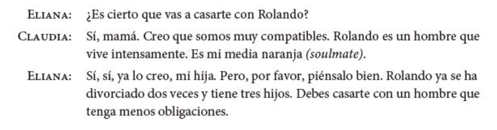

```{r setup, include=FALSE, cache=FALSE}
options(htmltools.dir.version = FALSE)
library("tidyverse")
```


```{r}
#| label: xaringan-extra-all-the-things
#| echo: false
xaringanExtra::use_xaringan_extra(
  c("tile_view", "freezeframe")
)
```

class: inverse, center, middle
count: false

# Descarga en formato PDF [aquí](https://www.midd.jvcasillas.com/slides/7/index.pdf)

<!--
pagedown::chrome_print(
  input = here::here("7", "index.html"), 
  output = here::here("7", "index.pdf")
  )
--> 

---
count: false
class: center, middle
background-color: #2f5cb4

<iframe src="https://wall.sli.do/event/d6aXbQFnkHui9rX9hVdm3A?section=7c74fb24-a075-4d64-beef-0421960090b9" width="1000" height="600" style="border:none;"></iframe>

---
exclude: false

<iframe src="https://play.kahoot.it/v2/?quizId=268840bf-a6d4-4b1c-9e98-0c023ace2609" width="1000" height="600" style="border:none;"></iframe>


---

# Cuenta, cuenta, cuenta

### Cuéntale a tu vecino algo que hiciste durante el fin de semana pasado

### Incluye lo siguiente:

- 1 oración que contenga acciones que ocurren al mismo tiempo
- 1 o más acciones que ocurran en secuencia
- 1 ejemplo de una acción que interrumpe otra
- ~~1 oración en la que enfatices que una acción ocurre antes que la otra~~

---


background-image: url(./assets/img/tyra.PNG)
background-size: contain

---


class: inverse, middle, center

# El pluscuamperfecto

---

# El pluscuamperfecto

### Se utiliza para hablar de una acción terminada que ocurre **antes** de otra acción en el pasado.

--

- Cuando Jaime llegó, Susana ya **había abierto** sus regalos. 

---
background-image: url("./assets/img/pluscuamperfecto1a.png")
background-size: contain

---
background-image: url("./assets/img/pluscuamperfecto1b.png")
background-size: contain

---
background-image: url("./assets/img/pluscuamperfecto1c.png")
background-size: contain

---

# El pluscuamperfecto

### Se utiliza para hablar de una acción terminada que ocurre **antes** de otra acción en el pasado.

- Cuando Jaime llegó, Susana ya **había abierto** sus regalos. 

- Marisol ya **había salido** cuando llamaste.

---
background-image: url("./assets/img/pluscuamperfecto2a.png")
background-size: contain

---
background-image: url("./assets/img/pluscuamperfecto2b.png")
background-size: contain

---
background-image: url("./assets/img/pluscuamperfecto2c.png")
background-size: contain

---
background-image: url(./assets/img/pluscuamperfecto3.png)
background-size: 450px
background-position: 100% 50%

# El pluscuamperfecto

- Se forma exactamente como el presente perfecto

- La excepción es que el verbo **haber** se conjuga en el imperfecto

--

### haber (presente) + participio pasado = presente perfecto

- Ya he hecho la tarea.

--

### haber (imperfecto) + participio pasado = pluscuamperfecto

- Ya había hecho la tarea cuando llegaste.

---

# El pluscuamperfecto

### **¡OJO!**

- Sigue habiendo formas irregulares del participio pasado.

<div align="center">
  
</div>

---

# Yo nunca había...

- En grupos de 3-5, jugad una ronda completa de "Yo nunca he..."
- Para poder usar el pluscuamperfecto, utiliza el siguiente contexto:  

</br>

### Antes de venir a Middlebury, yo nunca había...

---

# A practicar

### Conjuga los verbos y dibuja la situación

.Large[
1. La policía (llegar) 5 minutos después, pero ya era demasiado tarde. El ladrón ya (escaparse). 

2. El profesor ya (empezar) la clase cuando M@&#*& (entrar). 

3. Antes de (venir) a Middlebury, nunca (estudiar) tanto.

4. Nosotros ya (comer) la pizza cuando (darnos) las bebidas.

5. Cuando nosotros (volver) a casa, ya (aprender) el subjuntivo.\*
]

---


background-image: url(./assets/img/subjlogico.jpg)
background-position: 95% 30%
background-size: 400px

# Repasito

### ¿Cómo formamos el subjuntivo en el presente?

--

- **forma "yo"** > **quitar la "o"** > **añadir la vocal opuesta**

--

### ¿Qué tiene en común con los mandatos formales?

--

- **Se forma de la misma manera**

--

### ¿En qué se diferencia de los mandatos formales?

--

- **Los pronombres se colocan antes del verbo conjugado**

---

class: inverse, center, middle

# ¿Queréis más?

---

# Las cláusulas adjetivales

<div align="center">
  
</div>

---

# Las cláusulas adjetivales

### La cláusula subordinada describe al antecedente de la cláusula principal.
### Funciona como un adjetivo. 

.Large[
- Ronaldo es un hombre **que vive intensamente**
- Paco es un profesor **que toca el piano**
- Tengo un perro **que ladra mucho**
- ¿Conoces al profesor **que enseña el subjuntivo**?
]

---

# Las cláusulas adjetivales

.Large[
Se usa el indicativo si la subordinada se refiere a algo/alguien específico o conocido por el hablante
]

.Large[
- Tenemos una secretaria **que habla francés y alemán**
- Aquí hay dos anuncios para puestos **que ofrecen buenos beneficios**
- Tenéis una profesora **que nunca sonríe**
- Escribid 3 oraciones que contengan cláusulas adjetivales
]

---

# Las cláusulas adjetivales

.Large[
Se usa el subjuntivo si la cláusula adjetival describe algo no existente o si se duda de su existencia
]

.Large[
- Claudia debe casarse con un hombre **que tenga menos obligaciones**
- Necesitamos una secretaria **que hable japonés**
- Quiero encontrar un puesto **que ofrezca oportunidades para viajar**
- No hay nadie **que trabaje tanto como Elisondo**
- Escribid 3 oraciones que contengan cláusulas adjetivales en el subjuntivo
]


---


---
class: inverse, center, middle

# Overview

---

# Lo que hemos visto

.pull-left[
.Large[
- Sustantivos y artículos 
- Pronombres personales 
- Estar, ser, tener, ir 
- Posesión
- Verbos regulares (el presente)
- Verbos como "gustar"
- Cómo hacer preguntas
- El presente progresivo 
- Verbos irregulares/de cambio radical
- Adjetivos comparativos 
- Ser y estar 
- Por y para
]
]

--

.pull-right[
.Large[
- Verbos reflexivos
- Complemento directo 
- Complemento indirecto 
- Dos complementos juntos
- Verbos como *gustar* (encantar, interesar, etc.)
- El "se" pasivo
- El "se" impersonal
- Los mandatos informales
- Los mandatos formales
- El pretérito
- Pretérito irregular
- El imperfecto 
]
]

---

# Lo que hemos visto

.Large[
- Pretérito vs. Imperfecto
- El participio pasado/los adjetivos
- El presente perfecto 
- El futuro 
- El condicional
- El pluscuamperfecto 
- El subjuntivo (influir, emociones, duda, negación)
- El indicativo vs. el subjuntivo 
- El subjuntivo en cláusulas adjetivales 
]

---
background-image: url("./assets/img/resumen1.png")
background-size: contain

---
background-image: url("./assets/img/resumen2.png")
background-size: contain

---
background-image: url("./assets/img/resumen3.png")
background-size: contain

---
background-image: url("./assets/img/resumen4.png")
background-size: contain

---
background-image: url("./assets/img/resumen5.png")
background-size: contain

---
background-image: url("./assets/img/resumen6.png")
background-size: contain

---
background-image: url("./assets/img/resumen7.png")
background-size: contain

---
background-image: url("./assets/img/resumen8.png")
background-size: contain

---
background-image: url("./assets/img/resumen9.png")
background-size: contain

---
background-image: url("./assets/img/resumen10.png")
background-size: contain

---
background-image: url("./assets/img/resumen11.png")
background-size: contain

---
background-image: url("./assets/img/resumen12.png")
background-size: contain

---
background-image: url("./assets/img/resumen13.png")
background-size: contain

---
background-image: url("./assets/img/resumen14.png")
background-size: contain

---
background-image: url("./assets/img/resumen15.png")
background-size: contain

---
background-image: url("./assets/img/resumen16.png")
background-size: contain

---
background-image: url("./assets/img/resumen17.png")
background-size: contain

---
background-image: url("./assets/img/resumen18.png")
background-size: contain

---
background-image: url("./assets/img/resumen19.png")
background-size: contain

---
background-image: url("./assets/img/resumen20.png")
background-size: contain

---
background-image: url("./assets/img/resumen21.png")
background-size: contain

---
background-image: url("./assets/img/resumen22.png")
background-size: contain
background-color: black

---
class: center, middle

<iframe src="https://jeopardylabs.com/play/repaso-7253?embed=1" frameborder="0" width="100%" height="500"></iframe><a target="_blank" href="https://jeopardylabs.com" style="color:#8791de; font-size:12px;">

.footnote[https://jeopardylabs.com/play/repaso-7253]


