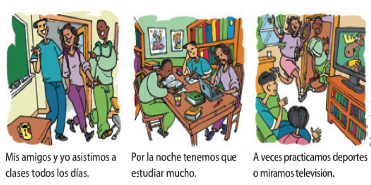

```{r setup, include=FALSE, cache=FALSE}
options(htmltools.dir.version = FALSE)
```

class: inverse, center, middle

# Repaso

---

background-image: url(./assets/img/abc.png)
background-size: contain
background-position: 120%
class: title-slide-section-blue

# El abecedario

---
background-image: url(./assets/img/sala1.png)
background-size: 750px
background-position: 50% 80%

# ¿Qué es esto? ¿Cómo se escribe?

---
background-image: url(./assets/img/ahorcado.gif)
background-size: contain
background-position: 120%
class: title-slide-section-blue

# El ahorcado

---
background-image: url(./assets/img/estados.png)
background-size: 650px
background-position: 100% 70%

# ¿Cómo estás?: Los estados y el verbo estar

**Yo estoy \_\_\_\_**  

Ej. Yo estoy cansado(a)

---

# Los pronombres personales

</br>

|    |    |  Singular      |    | Plural              |
|:---| :- | :--------------| :- | :------------------ |
| 1a |    |  yo            |    | nosotros/as         |
| 2a |    |  tú            |    | vosotros/as         |
| 3a |    |  él/ella/usted |    | ellos/ellas/ustedes |
| | &nbsp; &nbsp; &nbsp; | | &nbsp; &nbsp; &nbsp; | |

--

Pronombres no binarios: elle, elles, nosotres, vosotres

---

# El verbo estar

</br>

|    |    |  Singular              |    | Plural                        |
|:---| :- | :--------------------- | :- | :---------------------------- |
| 1a |    | yo **estoy**           |    | nosotros/as **estamos**       |
| 2a |    | tú **estás**           |    | vosotros/as **estáis**        |
| 3a |    | él/ella/usted **está** |    | ellos/ellas/ustedes **están** |
| | &nbsp; &nbsp; &nbsp; | | &nbsp; &nbsp; &nbsp; | |

---
background-image: url(https://raw.githubusercontent.com/jvcasillas/media/master/teaching/gifs/confused.gif)
background-size: contain
background-position: 110% 50%

# ¿Cómo está(n)?

---
background-image: url(./assets/img/esta1.png)
background-size: 600px
background-position: 50% 60%

# ¿Cómo está(n)?

---
background-image: url(./assets/img/esta2.png)
background-size: 600px
background-position: 50% 70%

# ¿Cómo está(n)?

---
background-image: url(./assets/img/esta3.png)
background-size: contain
background-position: 100%

# ¿Cómo está(n)?

---
background-image: url(./assets/img/esta4.png)
background-size: contain
background-position: 100%

# ¿Cómo está(n)?

---
background-image: url(./assets/img/esta5.png)
background-size: contain
background-position: 100%

# ¿Cómo está(n)?

---
background-image: url(./assets/img/esta6.png)
background-size: contain
background-position: 100%

# ¿Cómo está(n)?

---
background-image: url(./assets/img/esta7.png)
background-size: contain
background-position: 100%

# ¿Cómo está(n)?

---
background-image: url(./assets/img/esta8.png)
background-size: contain
background-position: 100%

# ¿Cómo está(n)?


---
class: inverse, center, middle

# Los interrogativos

---

# Las preguntas

- de sí/no
- de información

---

# Preguntas de sí/no

- Inversión del sujeto/verbo

| Verbo        | Sujeto            | Otros elementos      |
|:------------ |:----------------- |:---------------------|
| ¿**Vive**    | .RUred[Martín]     | en Madrid?           |
| ¿**Comes**   | (.RUred[tú])       | fruta todos los días?|
| ¿**Tenemos** | (.RUred[nosotros]) | tarea?               |


</br>

- Sí, .RUred[Martín] **vive** en Madrid.

--

- Sí, .RUred[yo] **como** fruta todos los días.

--

- No, .RUred[nosotros] no **tenemos** tarea.

---

# Preguntas de información

- Requieren una expressión interrogativa

| Expression interrogativa | Verbo    |  Sujeto     |
|:-------------------------|:---------|:------------|
| ¿Dónde                   | vive     | Martín?     |
| ¿Qué                     | comes    | (tú)?       |
| ¿Cuándo                  | es       | la reunión? |

---

# Con un compañero

<div align="center">
  
</div>

</br>

- Haced una lista de 4 preguntas (2 sí/no, 2 de información)
- Tened en cuenta la entonación

---
class: title-slide-section-grey, middle

# .white[Un poco sobre la concordancia]

---

# Los sustantivos

- **Los sustantivos** son personas, lugares o cosas.

- En español tienen **género** y **número**

- ¿Puedes pensar en algunos sustantivos?

<div align="center">


</div>

---
background-image: url(https://raw.githubusercontent.com/jvcasillas/media/master/teaching/img/frustration.png)
background-size: 300px
background-position: 95% 50%

# Género

Normalmente...

- **el** libr**o**
- **la** mes**a**

--

Pero a veces...

- **el/la** estudiant**e**
- **el** pupitr**e**
- **la** clas**e**
- **el** relo**j**

---
background-image: url(https://raw.githubusercontent.com/jvcasillas/media/master/teaching/img/happy.png)
background-size: 300px
background-position: 95% 50%

# Número

- el libro/los libros
- la mesa/las mesas

**¡Es FÁCIL!**

---
background-image: url(https://raw.githubusercontent.com/jvcasillas/media/master/teaching/img/confused.png)
background-size: 300px
background-position: 95% 50%

# Los artículos

- Los sustantivos tienen **artículos**.
- Hay dos tipos:
  - Definidos
  - Indefinidos

---
background-image: url(https://raw.githubusercontent.com/jvcasillas/media/master/teaching/img/happy.png)
background-size: 300px
background-position: 95% 50%

# Los artículos definidos

- **el** libro, **los** libros
- **la** página, **las** páginas
- **la** mochila, **las** mochilas
- **el** cuaderno, **los** cuadernos

---
background-image: url(https://raw.githubusercontent.com/jvcasillas/media/master/teaching/img/happy2.png)
background-size: 300px
background-position: 95% 50%

# Los artículos indefinidos

- **un** mapa, **unos** mapas
- **una** mesa, **unas** mesas
- **un** pupitre, **unos** pupitres
- **un**(a) estudiante **unos**(as) estudiantes

---
background-image: url(https://raw.githubusercontent.com/jvcasillas/media/master/teaching/gifs/partner.gif)
background-size: 300px
background-position: 95% 50%

# Con un compañero...

1. Hay (un/una) profesora. Es (el/la) señora Martínez.
2. (Los/Las) estudiantes están en (el/la) clase de español.
3. Hay (una/unas) ventana en (el/la) puerta.
4. Hay (un/una) mapa de España en (el/la) sala de clase.
5. (Un/Una) estudiante usa (el/la) teléfono celular.
6. Hay (unos/unas) borradores en (el/la) silla.
7. (Un/Una) estudiante escribe mensajes de texto en (el/la) teléfono celular.
8. Hay (un/una) libro en (el/la) mesa de la profesora.

<!-- > - Haced el ejercicio P-1 de la página 4 -->
<!-- > - Haced el ejercicio P-2 de la página 4 -->

---
background-image: url(https://raw.githubusercontent.com/jvcasillas/media/master/teaching/gifs/partner.gif)
background-size: 300px
background-position: 95% 50%

# Con un compañero...

1. Hay **una** profesora. Es **la** señora Martínez.
2. **Los**/**Las** estudiantes están en **la** clase de español.
3. Hay **una** ventana en **la** puerta.
4. Hay **un** mapa de España en **la** sala de clase.
5. **Un** estudiante usa **el** teléfono celular.
6. Hay **unos** borradores en **la** silla.
7. **Un** estudiante escribe mensajes de texto en **el** teléfono celular.
8. Hay **un** libro en **la** mesa de la profesora.

---

# Con un compañero...

Completa la tabla con el singular y plural de las palabras.

|     Singular     |       Plural       |
| :--------------- | :----------------- |
| **la profesora** |                    |
|                  | **los bolígrafos** |
|                  | **los pupitres**   |
| **el papel**     |                    |
|                  | **unas mochilas**  |
| **una ventana**  |                    |
| **un reloj**     |                    |
|                  | **unos carteles**  |

---

# Con un compañero...

Completa la tabla con el singular y plural de las palabras.


|          Singular         |            Plural           |
| :------------------------ | :-------------------------- |
| **la profesora**          | <blue>las profesoras</blue> |
| <blue>el bolígrafo</blue> | **los bolígrafos**          |
| <blue>el pupitre</blue>   | **los pupitres**            |
| **el papel**              | <blue>los papeles</blue>    |
| <blue>una mochila</blue>  | **unas mochilas**           |
| **una ventana**           | <blue>unas ventanas</blue>  |
| **un reloj**              | <blue>unos relojes</blue>   |
| <blue>un cartel</blue>    | **unos carteles**           |

---
class: title-slide-section-grey, middle

# .white[Los verbos regulares]

---

# Los verbos regulares

### Estamos muy ocupados entre semana.

<div align="center">
  
</div>

---

# Los verbos regulares

### Paso la semana en la universidad.

<div align="center">
  
</div>

---

# ¿Cómo es tu rutina?

.pull-left[

</br>
</br>
</br>

- Normalmente yo...  

- A veces yo... 

]

.pull-right[

</br>

- paso mucho tiempo en el facebook.

- voy al gimnasio por la mañana/por la tarde.

- escucho música/mi iPod.

- limpio el cuarto/el apartamento.

- preparo la comida.

- tomo café con mis amigos.

]

---

<!-- act 1-26 -->
<div align="center">
  
</div>

---

# El tiempo presente expresa...

</br>

### ...una rutina

--

- Estudio en la biblioteca todos los días.

--

### ...una acción continua

--

- Mi amiga vive en una residencia este semestre.

--

### ...una acción en el futuro

--

- Mis compañeros van a una fiesta mañana.

---

# Los verbos regulares

### Hay tres tipos de infinitivos: -ar, -er, -ir

|                     |    | -ar         |    | -er         |    | -ir           |
| :------------------ | :- | :---------- | :- | :---------- | :- | :------------ |
|                     |    | **tomar**   |    | **comer**   |    | **asistir**   |
| yo                  |    | tom**o**    |    | com**o**    |    | asist**o**    |
| tú                  |    | tom**as**   |    | com**es**   |    | asist**es**   |
| él/ella/usted       |    | tom**a**    |    | com**e**    |    | asist**e**    |
| nosotro(as)         |    | tom**amos** |    | com**emos** |    | asist**imos** |
| vosotros(as)        |    | tom**áis**  |    | com**éis**  |    | asist**ís**   |
| ellos/ellas/ustedes |    | tom**an**   |    | com**en**   |    | asist**en**   |
| | &nbsp; &nbsp; &nbsp; | | &nbsp; &nbsp; &nbsp; | | &nbsp; &nbsp; &nbsp; | |

---

# A practicar

### Usa los verbos en el presente para hablar de...

1. tu rutina  
.grey[Normalmente desayuno a las 8, voy al gimnasio a las 9, trabajo a las 10, etc.]

--

2. una acción continua  
.grey[Veo la televisión todos los días.]

--

3. una acción en el futuro (ir a + inf.)  
.grey[Mañana voy a viajar.]

---

# Algunos verbos regulares

.pull-left[

  **-ar**  
  Adivinar  
  Gastar  
  Amar  
  Apagar  
  Ayudar  
  Invitar  
  Bailar  
  Jugar  
  Besar  
  Lavar  
  Cambiar  
  Levantar  
  Despertar  
  Pasear  

]

.pull-right[

  Dibujar  
  Pensar  
  Disfrutar  
  Pintar  
  Durar  
  Practicar  
  Echar  
  Preguntar  
  Empezar  
  Prestar  

]

---

# Algunos verbos regulares

.pull-left[

  **-er**  
  Agradecer  
  Llover  
  Beber  
  Nacer  
  Caber  
  Ofrecer  
  Caer  
  Perder  
  Comer  
  Prometer  
  Comprender   

]

.pull-right[

  **-ir**  
  Abrir  
  Partir  
  Construir  
  Pedir  
  Corregir  
  Prohibir  
  Decidir  
  Recibir  
  Despedir  
  Seguir  
  Discutir  

]

---

# Estrategias para la comunicación oral  

### ¿Cómo se hace una presentación?

--

- ¡Ensayar! ¡Ensayar! ¡Ensayar!

--

- Hablar lentamente

--

- Vocales puras

--

- Tensión bucal

--

- Practicad palabras largas por sílabas

--

### Más información en Canvas

- Cómo hacer una entrevista
- La elaboración de un discurso

---


# Más descripción

### ¿Quién es?

- Con un compañero escribid una lista 6-8 expresiones para describir a las 
personas

- Podéis hablar la apariencia física (altura, pelo, color de ojos) y la 
personalidad (tímido, divertido, extrovertido)

--

- Escoge una persona de la clase (¡sin decir quién!) y descríbela para que 
los demás adivinen quién es

---
background-image: url(https://media2.giphy.com/media/XfBtsIAbXUJIk/giphy.gif)
background-size: 500px

# Hablemos de metas

---
class: inverse, center, middle

# Repaso

---

# Repasemos

### Hemos visto

- Los saludos y las despedidas (cómo presentarse)

--

- El verbo ser

--

- El verbo estar

--

- Los pronombres personales

--

- Los interrogativos (de sí/no, de información)

--

- Los sustantivos (artículos, concordancia de número/género)


### Tarea

- Usar **estar**, **ser** en conversaciones reales (en Proctor o en alguna actividad co-curricular)
- Estudiar el vocabulario

