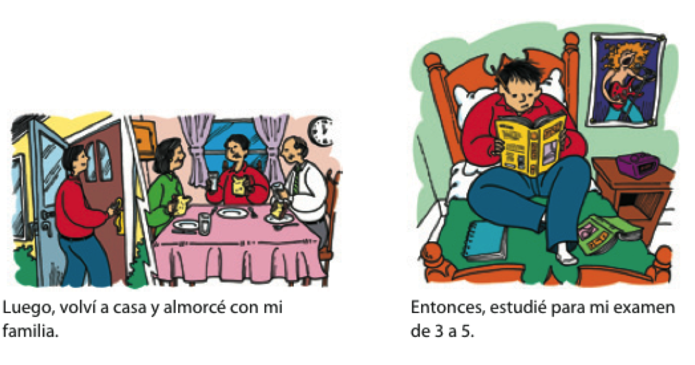

```{r setup, include=FALSE, cache=FALSE}
options(htmltools.dir.version = FALSE)
```

class: inverse, middle, center

# Complemento indirecto

---

# Los complementos indirectos

### Expresan ¿a quién? o ¿para quién?

Siempre **les** sirvo *vino* **a mis invitados**.

--

### ¿Qué sirvo? 

- *El vino*  
(el complemento directo)

--

### ¿A quién sirvo? 

- **A mis invitados**  
(el complemento indirecto)

---
background-image: url("https://www.wpclipart.com/signs_symbol/arrows/BW_arrows/arrow_BW_thin_left.png")
background-position: 47% 38%
background-size: 60px

# Los complementos indirectos

|  Singular         |    |        |    |  Plural               |    |         |
| :---------------- | :- | :----- | :- | :-------------------- | :- | :------ |
| yo                |    | **me** |    | nosotros              |    | **nos** |
| tú                |    | **te** |    | vosotros              |    | **os**  |
| usted, él, ella   |    | <blue>le</blue> |    | ustedes, ellos, ellas |    | <blue>les</blue> |
| | &nbsp; | | &nbsp; &nbsp; &nbsp; | | &nbsp; | |

</br>

- ¿**Me** puede traer una cuchara?

- Siempre **les** preparo las galletas.

---

# Los complementos indirectos

### La posición de los complementos indirectos pronominales depende de la forma verbal

--

#### Con un verbo conjugado

- ¿Cuánto **le** debo?

--

#### Con un verbo conjugado y un infinitivo

- ¿**Me** puede traer un tenedor?
- ¿Puede traer**me** un tenedor?

---

# Los complementos indirectos

### Muchas veces el complemento indirecto <blue>y</blue> el pronombre de complemento indirecto aparecen en la misma oración para evitar la confusión

- Siempre **le** sirvo platos vegetarianos **a María**.

- **Les** voy a servir una sopa **a mis invitados**.

---
class: inverse-title-slide-grey, middle

# Dos complementos...

---

# Dos complementos: directo e indirecto

.pull-left[

### <blue>CD</blue>

|        |    | singular |    |  plural  |
| :----- | :- | :------- | :- | :------- |
| 1a     |    | me       |    | nos      |
| 2a     |    | te       |    | os       |
| 3a     |    | lo, la   |    | los, las |
| | &nbsp; &nbsp; | | &nbsp; &nbsp; |

]

.pull-right[

### **CI**

|        |   | singular |    | plural |
| :----- |:- | :------- | :- | :----- |
| 1a     |   | me       |    | nos    |
| 2a     |   | te       |    | os     |
| 3a     |   | le       |    | les    |
| | &nbsp; &nbsp; | | &nbsp; &nbsp; |

]

---

# Dos complementos: directo e indirecto

</br></br></br>

.center[

### Mami, ¿**me** haces <blue>unas galletas</blue>?

]

--

.center[

### Sí, **te** <blue>las</blue> hago esta tarde.

]

---

# Dos complementos: directo e indirecto

### Mami, ¿**me** haces <blue>unas galletas</blue>?

- ¿Qué haces?  
  - unas galletas (el complemento directo)
- ¿A quién o para quién?  
  - a mí (me) (el complemento indirecto)

--

### Sí, **te** <blue>las</blue> hago esta tarde.

- Te = para ti
- las = las galletas

---

# A veces "le" y "les" cambian a "se"

</br></br>

<div align="center">
  
</div>

</br>

--

- ¿Me puede traer un menú?
- Ahora **se** lo traigo. 

---

# ¿Qué pasa?

<div align="center">
  
</div>

--

.pull-left[

### El perro come *las pelotas de tenis*

]

--

.pull-right[

### *Las* come. 

]

---

# ¿Qué pasa?

<div align="center">
  
</div>

--

.pull-left[

### Ari **le** da .RUred[una manzana] **a la maestra**.

]

--

.pull-right[

### **Se** .RUred[la] da.

]

---

# ¿Qué pasa?

<div align="center">
  
</div>

--

.pull-left[

### Jing **le** da .RUred[uvas] **a Kim**.

]

--

.pull-right[

### **Se** .RUred[las] da.

]

---

# ¿Qué pasa?

<div align="center">
  
</div>

--

.pull-left[

### El niño **le** va a regalar .RUred[una sorpresa] **a la niña**.

]

--

.pull-right[

### **Se** .RUred[la] va a regalar.  
### Va a regalár**se**.RUred[la].

]

---

# ¿Qué pasa?

<div align="center">
  
</div>

---

# ¿Qué pasa?

<div align="center">
  
</div>

---


class: inverse, middle, center

# El pretérito

---

# ¿Qué hiciste ayer?: el pasado

<div align="center">
  
</div>

---

# ¿Qué hiciste ayer?: el pasado

<div align="center">
  
</div>

---

# ¿Qué hiciste ayer?: el pasado

<div align="center">
  
</div>

---

# El pretérito expresa el pasado con una referencia a un tiempo particular

- Salí con unos compañeros de clase **anoche**.

--

- **Ayer** fuimos a Dos Hermanos.

--

- **La semana pasada** corrimos dos millas.

--

- Me bañé en el mar **el año pasado**. 

---

# El pretérito

|                  |    |     tomar     |    |     volver     |    |     salir     |
| :--------------- | :- | :------------ | :- | :------------- | :- | :------------ |
| yo               |    | tom**é**      |    | volv**í**      |    | sal**í**      |
| tú               |    | tom**aste**   |    | volv**iste**   |    | sal**iste**   |
| Ud./él/ella      |    | tom**ó**      |    | volv**ió**     |    | sal**ió**     |
| nosotros(as)     |    | tom**amos**   |    | volv**imos**   |    | sal**imos**   |
| vosotros(as)     |    | tom**asteis** |    | volv**isteis** |    | sal**isteis** |
| Uds./ellos/ellas |    | tom**aron**   |    | volv**ieron**  |    | sal**ieron**  |
| | &#160; &#160; | | &#160; &#160; | | &#160; &#160; | |

--

**¡OJO!**

-  Los verbos reflexivos requieren el pronombre reflexivo.
- **Me desperté** a las ocho ayer.

--

<p></p>

-  El verbo gustar solo usa dos formas en el pretérito.
- **Me gustó** el concierto. No **me gustaron** esas dos películas.

---

# ¿Qué hiciste la semana pasada?

- Piensa en algunas cosas que hiciste la semana pasada

- Forma 3 oraciones usando el préterito y cuéntaselas a tu grupo

- Responde a las oraciones de tus compañeros/as con más preguntas en el pasado

</br>
</br>

<!--

### Encuentra a alguien que...

.pull-left[

1. nadó en el lago.

2. cenó en el pueblo. 

3. rompió la palabra de honor.

4. miró juego de tronos.

5. bebió demasiado.

6. estudió todo el fin de semana. 

7. salió de Middlebury.

8. tomó comida de Proctor.


]

-->

--

.small[

|                  |    |     tomar     |    |     volver     |    |     salir     |
| :--------------- | :- | :------------ | :- | :------------- | :- | :------------ |
| yo               |    | tom**é**      |    | volv**í**      |    | sal**í**      |
| tú               |    | tom**aste**   |    | volv**iste**   |    | sal**iste**   |
| Ud./él/ella      |    | tom**ó**      |    | volv**ió**     |    | sal**ió**     |
| nosotros(as)     |    | tom**amos**   |    | volv**imos**   |    | sal**imos**   |
| vosotros(as)     |    | tom**asteis** |    | volv**isteis** |    | sal**isteis** |
| Uds./ellos/ellas |    | tom**aron**   |    | volv**ieron**  |    | sal**ieron**  |
| | &#160; &#160; | | &#160; &#160; | | &#160; &#160; | |

]

---

# Más sobre el pretérito 

### Expresa un momento particular en el pasado.

**Palabras importantes: ayer, anoche, la semana pasada**  

</br>

- Anoche miramos la televisión.
- Mi abuela me visitó hace dos semanas.

---

# El pretérito 

### Expresa un evento que ocurrió varias veces

**Palabras importantes: una vez, dos veces, varias veces**

</br>

- Fuimos a la piscina dos veces la semana pasada.

---

# El pretérito 

### Expresa cuánto tiempo duró un evento.

**Palabras importantes: por veinte minutos, por dos días**

</br>

- Arturo habló por teléfono por quince minutos.

---

# El pretérito

### Resume una experiencia (al principio o al final de una historia)

</br>

- Ayer fue un día fantástico en la uni. Primero...

---

# Mi experiencia en Midd

Querida mamá,  

Ya \_\_\_\_\_\_\_\_\_\_ (llevar, presente) 5 semanas en el programa de 
Middlebury. 
\_\_\_\_\_\_\_\_\_\_ (ser/estar, presente) muy bien, creo, pero yo siempre 
\_\_\_\_\_\_\_\_\_\_ (ser/estar, presente) cansadx y tengo mucha tarea. 
La semana pasada \_\_\_\_\_\_\_\_\_\_ (escribir) 6 ensayos para mi clase de 
escritura. 
¡No \_\_\_\_\_\_\_\_\_\_ (dormir) nada! 
\_\_\_\_\_\_\_\_\_\_ (estudiar) muchísimo y todos mis amigos 
\_\_\_\_\_\_\_\_\_\_ (salir) al lago para festejar sin mí. 
Ellos lo \_\_\_\_\_\_\_\_\_\_ (pasar) muy bien y yo \_\_\_\_\_\_\_\_\_\_ 
(ensayar) mi presentación oral para la clase de Joseph. 
Cuando \_\_\_\_\_\_\_\_\_\_ (ellos volver) me dijeron "¡te lo 
\_\_\_\_\_\_\_\_\_\_ (tú perder)! Fue el día más divertido desde que 
\_\_\_\_\_\_\_\_\_\_ (empezar) el coronavirus". 
Yo \_\_\_\_\_\_\_\_\_\_ (sentir) FOMO, pero al menos \_\_\_\_\_\_\_\_\_\_ 
(trabajar) más con los complementos directos e indirectos y 
\_\_\_\_\_\_\_\_\_\_ (mirar) 4 películas en español. 
Bueno, te dejo, que tengo que trabajar en mi proyecto de cultura.  

Un beso,  
Triste estudiante de nivel 1.5 😭

---

# Mi experiencia en Midd

Querida mamá,  

Ya **llevo** 5 semanas en el programa de Middlebury.
**Estoy** muy bien, creo, pero yo siempre **estoy** cansadx y tengo mucha tarea. 
La semana pasada **escribí** 6 ensayos para mi clase de escritura.
¡No **dormí** nada! 
**Estudié** muchísimo y todos mis amigos **salieron** al lago para festejar 
sin mí. 
Ellos lo **pasaron** muy bien y yo **ensayé** mi presentación oral para la 
clase de Joseph. 
Cuando **volvieron** me dijeron "¡te lo **perdiste**! Fue el día más divertido 
desde que **empezó** el coronavirus". 
Yo **sentí** FOMO, pero al menos **trabajé** más con los complementos directos 
e indirectos y **miré** 4 películas en español. 
Bueno, te dejo, que tengo que trabajar más en mi proyecto de cultura.  

Un beso,  
Triste estudiante de nivel 1.5 😭
